# Project Overview

The `edna-analyzer` project is an AI-powered discovery engine for environmental DNA (eDNA). It aims to revolutionize how we analyze eDNA data by moving beyond traditional database-matching methods. The system leverages a DNA foundation model to classify known species with high confidence and, crucially, to identify and characterize novel taxa within the "unassigned" sequence reads—a significant portion of data often discarded in conventional pipelines.

The primary goal is to enable confident classification of known species by understanding the semantic similarity of DNA sequences, not just exact matches. Simultaneously, it provides a systematic approach to discovering new species by clustering unassigned reads, transforming potential noise into valuable biological insights.

## The Problem Addressed

Traditional eDNA analysis pipelines often struggle with incomplete reference databases, particularly for under-explored environments like the deep sea. This results in a large percentage of sequencing reads being categorized as "unassigned," representing a missed opportunity for biodiversity discovery. `edna-analyzer` tackles this by learning the underlying patterns of DNA sequences, enabling it to infer relationships and identify novel organisms.

## Core Functionality and Workflow

The `edna-analyzer` follows a structured workflow designed for efficient and accurate eDNA analysis:

```mermaid
graph LR
    A["Input Reads (FASTQ/FASTA)"] --> B{"1. Preprocessing"};
    B --> C["Cleaned Reads"];
    C --> D{"2. Embedding"};
    D -- Nucleotide Transformer --> E["Sequence Vectors"];
    E --> F{"3. Similarity Search"};
    F -- FAISS ANN Search --> G{"Similarity Threshold (τ)"};
    G -- Yes --> H["✅ Assigned Taxon"];
    G -- No --> I["❓ Unassigned Reads"];
    I --> J{"4. Novelty Clustering"};
    J -- HDBSCAN --> K["🔬 Candidate Novel Taxa"];
    H & K --> L{"5. Reporting"};
    L --> M["📊 Abundance, Diversity & Visualizations"];
```





This workflow involves several key stages:
1.  **Preprocessing**: Cleaning raw sequencing reads.
2.  **Embedding**: Converting DNA sequences into numerical vectors using a foundation model.
3.  **Search**: Efficiently searching these vectors against a reference index using FAISS.
4.  **Clustering**: Applying HDBSCAN to group unassigned sequences into potential novel taxa.
5.  **Reporting**: Generating comprehensive outputs including abundance, diversity metrics, and visualizations.

## Key Features

*   **AI-Powered Classification**: Utilizes `Nucleotide-Transformer` embeddings for a deeper understanding of sequence context, offering more robust classification than traditional alignment methods.
*   **High-Speed Vector Search**: Employs FAISS (`IVF-PQ`) for approximate nearest neighbor search, enabling rapid comparison of millions of reads.
*   **Automated Novelty Discovery**: Leverages HDBSCAN for density-based clustering of unassigned sequences, identifying high-confidence candidates for new taxa.
*   **Actionable Outputs**: Produces publication-ready data formats including `.csv` for read assignments, `.json` for biodiversity metrics, and interactive `.html` reports.
*   **Reproducible and Accessible**: Fully containerized with Docker and accessible via a FastAPI backend and a user-friendly web interface.

## Technical Stack

The project is structured into backend and frontend components:

### Backend

The backend is built using **FastAPI** and integrates with **Supabase** for potential data management and authentication needs. Key functionalities include handling API requests, orchestrating the analysis pipeline, and managing model interactions.

Example backend setup:

```bash
# Setup instructions from backend/README.md
cp .env.example .env
# Fill values in .env
npm i
npm run dev
```

### Frontend

The frontend is developed with **React** and uses **Vite** for a fast development experience. It provides a user interface for interacting with the `edna-analyzer` and visualizing results.

```bash
# Setup instructions from frontend/README.md
# Install dependencies (typically via npm or yarn)
npm install
# Start the development server
npm run dev
```

## Inputs and Outputs

The analyzer accepts standard sequencing data formats and generates a suite of valuable outputs:

| File Type        | Description                                                                        |
| ---------------- | ---------------------------------------------------------------------------------- |
| **Input**        | `FASTQ` / `FASTA` files (gzipped `.gz` accepted) for 18S or COI amplicons.         |
| **Output Files** |                                                                                    |
| `results.csv`    | Per-read results: assigned taxon, similarity score, or novel cluster ID.         |
| `clusters.csv`   | Novel cluster summary: size, exemplar sequence, nearest known relative.            |
| `abundance.csv`  | Counts and relative abundance matrix (samples vs. taxa/clusters).                  |
| `diversity.json` | Key metrics: Shannon, Simpson (Alpha), Bray-Curtis (Beta).                         |
| `report.html`    | Interactive summary report with plots and charts.                                  |
| `summary.json`   | Run parameters, file checksums, and versions for full reproducibility.             |

## Configuration

Key parameters allow users to tune the analysis:

| Flag                 | Description                                       | Default    |
| -------------------- | ------------------------------------------------- | ---------- |
| `--input`            | Path to input FASTQ/FASTA file.                   | `None`     |
| `--out`              | Output directory for results.                     | `results/` |
| `--tau`              | Similarity threshold for classification.          | `0.20`     |
| `--min-cluster-size` | HDBSCAN parameter for minimum cluster size.       | `10`       |

## Key Takeaways

`edna-analyzer` offers a novel, AI-driven approach to eDNA analysis, empowering researchers to identify known species with greater accuracy and to systematically discover previously unknown taxa. Its modular design, containerization, and comprehensive outputs make it a powerful and accessible tool for biodiversity research.