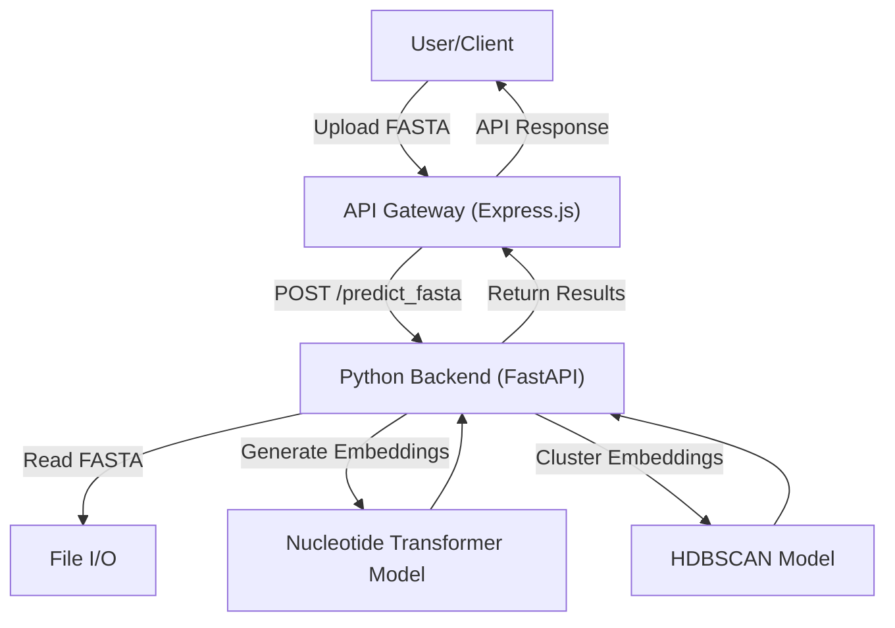

# API Endpoints

This section details the available API endpoints for the backend functionality of the edna-analyzer, covering authentication, file uploads, and sequence analysis.

## Authentication Endpoints

These endpoints manage user authentication, allowing for signup, login, and logout operations.

### POST `/auth/signup`

Registers a new user with the provided email and password.

**Request Body:**

```json
{
  "email": "user@example.com",
  "password": "securepassword"
}
```

**Response:**

```json
{
  "user": {
    "id": "user-uuid",
    "email": "user@example.com"
  }
}
```

### POST `/auth/login`

Authenticates an existing user with their email and password.

**Request Body:**

```json
{
  "email": "user@example.com",
  "password": "securepassword"
}
```

**Response:**

```json
{
  "session": {
    "access_token": "your-access-token",
    "refresh_token": "your-refresh-token"
  },
  "user": {
    "id": "user-uuid",
    "email": "user@example.com"
  }
}
```

### POST `/auth/logout`

Logs out the currently authenticated user using their access token.

**Request Body:**

```json
{
  "access_token": "your-access-token"
}
```

**Response:**

```json
{
  "success": true
}
```

## Upload Endpoints

These endpoints facilitate the uploading of files, retrieval of upload history, and deletion of uploads.

### POST `/upload`

Handles the upload of a single file. The file should be sent as `multipart/form-data` with the field name `file`.

**Example Request (using `curl`):**

```bash
curl -X POST -F "file=@your_sequence_file.fasta" http://localhost:3000/upload
```

### GET `/upload`

Retrieves a list of all previously uploaded files.

### DELETE `/:id`

Deletes a specific upload identified by its unique ID.

**Example Request (using `curl`):**

```bash
curl -X DELETE http://localhost:3000/upload/your-upload-id
```

## Sequence Analysis Endpoint

This endpoint is responsible for analyzing DNA sequences provided in a FASTA file.

### POST `/predict_fasta`

Receives a FASTA file, processes the DNA sequences within it, and returns clustering results and confidence scores.

**Request Body:**

A FASTA file uploaded as `multipart/form-data`.

**Response:**

```json
{
  "overall_silhouette": 0.75,
  "results": [
    {
      "id": "seq1",
      "cluster": 0,
      "confidence": 0.98,
      "silhouette": 0.82,
      "note": "Potential novel/unknown sequence"
    },
    {
      "id": "seq2",
      "cluster": 1,
      "confidence": 0.95,
      "silhouette": 0.78
    }
  ]
}
```

**Underlying Logic (Python):**

The backend uses a Nucleotide Transformer model for generating embeddings and HDBSCAN for clustering.

```python
@app.post("/predict_fasta")
async def predict_fasta(file: UploadFile = File(...)):
    try:
        content = await file.read()
        fasta_io = io.StringIO(content.decode("utf-8", errors="ignore"))
        sequences = []
        ids = []
        for record in SeqIO.parse(fasta_io, "fasta"):
            ids.append(record.id)
            sequences.append(str(record.seq))
        
        # ... embedding and clustering logic ...

        return {
            "overall_silhouette": round(float(silhouette_avg), 3) if silhouette_avg else None,
            "results": results
        }
    except Exception as e:
        traceback.print_exc()
        raise HTTPException(500, f"Server error: {str(e)}")

```

## Architecture Diagram

This diagram illustrates the basic flow of the sequence analysis endpoint.





## Key Takeaways

The API provides robust endpoints for user authentication and DNA sequence analysis. The sequence analysis leverages advanced machine learning models to cluster genetic sequences, offering insights into their relationships and potential novelty. The use of FASTA file format ensures compatibility with common bioinformatics tools.