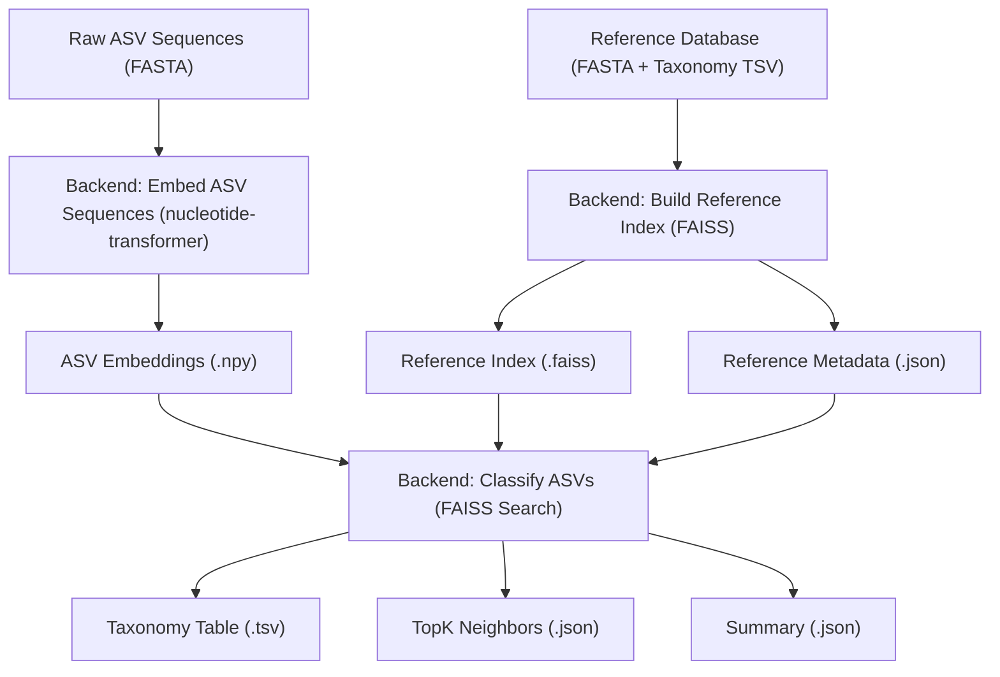

# Data Processing and Classification

This section details the backend's approach to processing raw DNA sequence data and assigning taxonomic classifications, focusing on the underlying Python scripts responsible for these operations. The process involves loading taxonomic information, embedding sequence data into a high-dimensional space, and then classifying these embeddings against a reference database.

## Taxonomic Classification Pipeline

The backend utilizes a pipeline to enrich DNA sequence data with taxonomic information, specifically phylum and class. This is primarily handled by the `create_phylum_class.py` script, which leverages a local taxonomic database.

The core logic involves:
1.  **Loading Taxonomic Nodes**: Reading a `nodes.dmp` file to build a hierarchical representation of taxonomic relationships. Each node contains its parent's taxid and its own rank.
2.  **Loading Scientific Names**: Parsing a `names.dmp` file to map taxids to their corresponding scientific names.
3.  **Climbing the Taxonomy Tree**: A function `climb` traverses the node hierarchy upwards from a given taxid until a specified `target_rank` (e.g., "phylum", "class") is found.
4.  **Annotating Sequences**: The `annotate` function reads an input TSV file containing sequence identifiers and their associated taxids. For each sequence, it climbs the tree to find phylum and class, then looks up their scientific names from the loaded data. The results are written to an output TSV file.

```python
# backend/dna/rs/create_phylum_class.py
def annotate(id_tax_tsv, out_tsv, nodes, names):
    with open(id_tax_tsv,"r",encoding="utf-8") as f, open(out_tsv,"w",newline="",encoding="utf-8") as out:
        r=csv.reader(f,delimiter="\t"); w=csv.writer(out,delimiter="\t")
        w.writerow(["accession","taxid","scientific_name","phylum","class"])
        header_skipped=False
        for row in r:
            if not row: continue
            if not header_skipped and row[0].lower().startswith("accession"):
                header_skipped=True; continue
            acc,taxid=row[0],row[1]; sci=row[2] if len(row)>2 else ""
            try: t=int(taxid)
            except: w.writerow([acc,taxid,sci,"NA","NA"]); continue
            phy_id=climb(nodes,t,"phylum"); cls_id=climb(nodes,t,"class")
            phy=names.get(phy_id,"NA") if phy_id else "NA"
            cls=names.get(cls_id,"NA") if cls_id else "NA"
            w.writerow([acc,taxid,sci,phy,cls])
```

## Sequence Embedding and Classification

The `embed_asv_with_classification.py` script handles the more complex task of converting DNA Amplicon Sequence Variants (ASVs) into numerical embeddings and classifying them using a pre-built reference index. This leverages a nucleotide transformer model for generating embeddings and FAISS for efficient similarity search.

The process involves:
1.  **Loading Model and Tokenizer**: Initializes a `nucleotide-transformer` model and its corresponding tokenizer.
2.  **Embedding ASV Sequences**: Reads a FASTA file containing ASVs, tokenizes them, and passes them through the transformer model to generate fixed-size vector embeddings. These embeddings are stored in `asv_embeddings.npy`.
3.  **Loading Reference Index**: Loads a pre-built FAISS index (`ref_index.faiss`) and its associated metadata (`ref_meta.json`) which contains reference sequence IDs and their taxonomic labels.
4.  **Similarity Search**: Performs a k-Nearest Neighbors (k-NN) search using the ASV embeddings against the reference index to find the most similar reference sequences.
5.  **Classification and Rejection**: Based on the similarity scores and taxonomic labels of the top k neighbors, each ASV is assigned a phylum and class. A `tau` threshold determines if an ASV is considered "known" or "rejected" (i.e., if its top match meets a minimum similarity and has valid taxonomic information).

```python
# backend/dna/rs/embed_asv_with_classification.py
def embed_fasta(fa: Path, tok, mdl, device: str, batch: int, use_fp16: bool):
    ids, buf, embs = [], [], []

    def flush():
        if not buf:
            return
        x = tok(buf, return_tensors="pt", padding=True, truncation=True, max_length=MAXLEN)
        x = {k: v.to(device) for k, v in x.items()}
        out = mdl(**x)
        h = out.hidden_states[-1]
        mask = x["attention_mask"].unsqueeze(-1).to(h.dtype)
        pooled = (h * mask).sum(1) / mask.sum(1).clamp_min(1)
        embs.append(pooled.detach().cpu().numpy().astype("float32"))
        buf.clear()

    total = sum(1 for _ in SeqIO.parse(str(fa), "fasta"))
    for rec in tqdm(SeqIO.parse(str(fa), "fasta"), total=total, desc="Embed ASVs"):
        ids.append(rec.id.split()[0])
        buf.append(str(rec.seq).upper().replace("U", "T"))
        if len(buf) >= batch:
            flush()
    flush()
    X = np.vstack(embs) if embs else np.zeros((0, 768), dtype="float32")
    return ids, X
```

The `ref.py` script demonstrates the process of building the reference index itself. It embeds a set of reference sequences and then constructs a FAISS index for efficient searching.

```python
# backend/dna/rs/ref.py
def build_index(x, nlist=2048, m=16, codebits=8, add_batch=5000):
    d = x.shape[1]
    base = faiss.IndexFlatL2(d)
    idx = faiss.IndexIVFPQ(base, d, nlist, m, codebits)

    print("Training index ")
    idx.train(x)

    print("Adding vectors ")
    for i in tqdm(range(0, len(x), add_batch), desc="FAISS add"):
        idx.add(x[i:i+add_batch])

    idx.nprobe = 16
    return idx
```

## Data Flow for Classification

The overall data flow for processing and classifying DNA data can be visualized as follows:





## Key Takeaways

*   Taxonomic annotation is achieved by traversing a hierarchical node structure derived from `nodes.dmp` and `names.dmp` files.
*   Sequence classification relies on converting ASVs into dense vector embeddings using a pre-trained nucleotide transformer.
*   FAISS is employed for efficient similarity searching against a pre-computed index of reference sequence embeddings.
*   A similarity threshold (`tau`) and the quality of matches determine whether an ASV is confidently classified or marked for rejection.
*   The process generates detailed output including a taxonomy table, top k neighbors, and a summary of classification results.