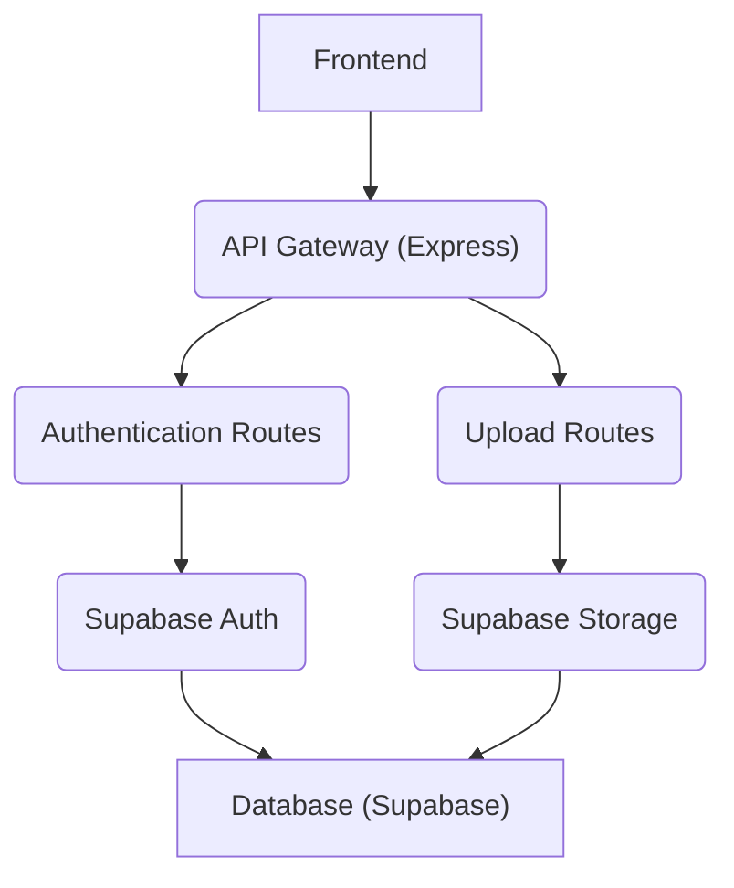

# Backend Architecture

This section details the structure and key components of the backend service for the edna-analyzer project.

## Core Components and Setup

The backend is an Express.js application responsible for handling API requests, user authentication, and file uploads. It leverages several essential Node.js packages and external services.

The server setup involves initializing an Express app, enabling CORS for cross-origin requests, and parsing JSON request bodies.

```javascript
import express from 'express';
import cors from 'cors';
import dotenv from 'dotenv';
import authRoutes from './routes/auth.routes.js';
import { PORT } from './config/env.js';
import multer from 'multer';
import { supabase } from './config/supabase.js';
import uploadRoutes from './routes/upload.routes.js';

dotenv.config();

const app = express();

app.use(cors());
app.use(express.json());

const upload = multer({storage: multer.memoryStorage()});

app.use('/api/auth', authRoutes);
app.use('/api/uploads', uploadRoutes);

app.listen(PORT, () => {
  console.log(`Server running on http://localhost:${PORT}`);
});
```

## Configuration

Environment variables are managed using `dotenv` to configure the application, including the port and Supabase credentials.

```javascript
import dotenv from 'dotenv';

dotenv.config();

const PORT = process.env.PORT || 3000;
const SUPABASE_URL = process.env.SUPABASE_PROJECT_URL;
const SUPABASE_ANON_KEY = process.env.SUPABASE_ANON_KEY;
const SUPABASE_SERVICE_ROLE_KEY = process.env.SUPABASE_SERVICE_ROLE_KEY;

if (!SUPABASE_URL || !SUPABASE_ANON_KEY || !SUPABASE_SERVICE_ROLE_KEY) {
  console.error('Missing SUPABASE_URL, SUPABASE_ANON_KEY, or SUPABASE_SERVICE_ROLE_KEY. Please set them in .env');
}

export { PORT, SUPABASE_URL, SUPABASE_ANON_KEY, SUPABASE_SERVICE_ROLE_KEY };
```

## Database Integration (Supabase)

Supabase is used as the primary database and backend-as-a-service. The backend integrates with Supabase using the `@supabase/supabase-js` library. The `supabase.js` configuration file initializes the Supabase client using the service role key for administrative access.

```javascript
import { createClient } from '@supabase/supabase-js';
import { SUPABASE_URL, SUPABASE_ANON_KEY, SUPABASE_SERVICE_ROLE_KEY } from './env.js';

if (!SUPABASE_URL || !SUPABASE_SERVICE_ROLE_KEY) {
  console.error('Missing SUPABASE_URL or SUPABASE_ANON_KEY. Please set them in .env');
}

export const supabase = createClient(SUPABASE_URL, SUPABASE_SERVICE_ROLE_KEY);
```

## API Routes

The backend exposes several API routes for different functionalities:

*   `/api/auth`: Handles user authentication (e.g., signup, login).
*   `/api/uploads`: Manages file uploads, likely to Supabase Storage.

```json
{
  "name": "backend",
  "version": "1.0.0",
  "main": "index.js",
  "scripts": {
    "test": "echo \"Error: no test specified\" && exit 1",
    "start": "node src/server.js",
    "dev": "nodemon src/server.js"
  },
  "dependencies": {
    "@supabase/supabase-js": "^2.57.4",
    "axios": "^1.12.2",
    "cors": "^2.8.5",
    "dotenv": "^17.2.2",
    "express": "^5.1.0",
    "multer": "^2.0.2",
    "node-fetch": "^3.3.2",
    "uuid": "^13.0.0"
  },
  "type": "module",
  "devDependencies": {
    "nodemon": "^3.1.10"
  }
}
```

## Architecture Overview

The backend service acts as the central hub for processing requests from the frontend and interacting with the Supabase database.





## Key Takeaways

The backend architecture is designed to be modular and scalable, with clear separation of concerns. Key aspects include:

*   **Express.js Framework**: Provides a robust foundation for building the web server and API.
*   **Environment Variable Management**: Ensures secure and flexible configuration through `.env` files.
*   **Supabase Integration**: Leverages Supabase for authentication and data storage, simplifying backend development.
*   **Multer for File Uploads**: Efficiently handles file uploads in memory before potentially transferring them to cloud storage.
*   **RESTful API Design**: Follows standard REST principles for defining API endpoints.