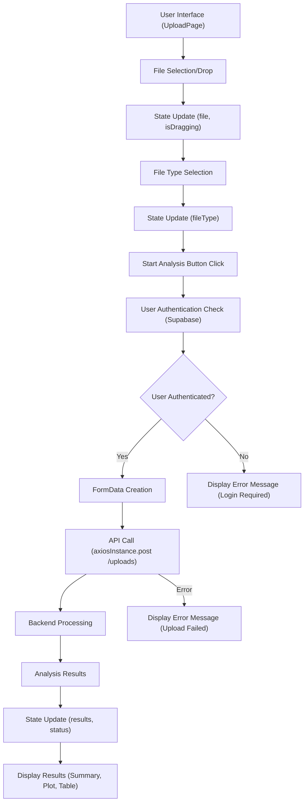

# User Interface Components

This section details the reusable UI components that form the foundation of the edna-analyzer frontend. These components are designed for clarity, ease of use, and a consistent user experience across the application.

## Navbar

The `Navbar` component provides consistent site navigation and user authentication status display. It includes the application logo, user greeting, and sign-in/sign-up or sign-out buttons.

```jsx
import React from "react";
import { Link, useNavigate } from "react-router-dom";
import { supabase } from "../lib/supabase.js";
import { toast } from "react-hot-toast";

export default function Navbar({ user, setUser }) {
  const navigate = useNavigate();

  const handleSignOut = async () => {
    const { error } = await supabase.auth.signOut();
    if (error) toast.error(error.message);
    else {
      toast.success("Signed out!");
      setUser(null);
      navigate("/");
    }
  };

  return (
    <nav className="bg-[#f0f4ff] backdrop-blur-md shadow-sm border-b border-gray-200">
      <div className="max-w-7xl mx-auto px-4 sm:px-6 lg:px-8">
        <div className="flex justify-between h-16 items-center">
          {/* Left: Logo */}
          <Link to="/" className="flex items-center space-x-2">
            <span className="text-2xl">🧬</span>
            <span className="font-bold text-blue-900 text-xl tracking-wide">
                BioTrace
            </span>
          </Link>

          {/* Right: User Actions */}
          <div className="flex items-center space-x-4">
            {user ? (
              <>
                <span className="text-blue-800 hidden sm:block">
                  Hello, {user.email}
                </span>
                <button
                  onClick={handleSignOut}
                  className="px-4 py-2 rounded-full bg-red-500 hover:bg-red-600 text-white font-medium transition"
                >
                  Sign Out
                </button>
              </>
            ) : (
              <>
                <Link
                  to="/signin"
                  className="px-4 py-2 rounded-full bg-blue-600 hover:bg-blue-700 text-white font-medium transition"
                >
                  Sign In
                </Link>
                <Link
                  to="/signup"
                  className="px-4 py-2 rounded-full bg-green-600 hover:bg-green-700 text-white font-medium transition"
                >
                  Sign Up
                </Link>
              </>
            )}
          </div>
        </div>
      </div>
    </nav>
  );
}
```

## UploadPage Components

The `UploadPage` component is central to the analysis workflow, featuring a drag-and-drop interface for file uploads, file type selection, and a dynamic display of analysis results, including visualizations and detailed tables.

### File Input and Drag-and-Drop Area

This section handles user file selection via a standard input or a more interactive drag-and-drop zone. It provides visual feedback on file selection and drag status.

```jsx
          <div
            onDragOver={handleDragOver}
            onDragLeave={handleDragLeave}
            onDrop={handleDrop}
            style={{
              border: `2px dashed ${isDragging ? '#2563eb' : file ? '#059669' : '#94a3b8'}`,
              borderRadius: '12px',
              padding: '48px',
              textAlign: 'center',
              background: isDragging ? '#eff6ff' : file ? '#f0fdf4' : '#f8fafc',
              transition: 'all 0.3s ease',
              cursor: 'pointer'
            }}
          >
            <input
              type="file"
              accept=".fasta,.fastq,.csv"
              onChange={handleFileSelect}
              style={{ display: 'none' }}
              id="file-input"
            />
            <label htmlFor="file-input" style={{ cursor: 'pointer' }}>
              {file ? (
                <div>
                  <p style={{ fontSize: '24px', fontWeight: '600', color: '#059669', marginBottom: '8px' }}>
                    File Selected Successfully
                  </p>
                  <p style={{ fontSize: '18px', color: '#374151', fontWeight: '500' }}>{file.name}</p>
                  <p style={{ fontSize: '14px', color: '#6b7280', marginTop: '8px' }}>
                    Click or drag another file to replace
                  </p>
                </div>
              ) : (
                <div>
                  <p style={{ fontSize: '24px', fontWeight: '600', color: '#374151', marginBottom: '8px' }}>
                    Select or Drop Genomic Data File
                  </p>
                  <p style={{ fontSize: '16px', color: '#6b7280' }}>
                    Click to browse files or drag and drop
                  </p>
                  <p style={{ fontSize: '14px', color: '#9ca3af', marginTop: '16px' }}>
                    Supported formats: .fasta, .fastq, .csv
                  </p>
                </div>
              )}
            </label>
          </div>
```

### Analysis Results Display

This section dynamically renders the results of the eDNA analysis. It includes a summary overview, a scatter plot for visualizing cluster distribution, and a detailed table of classification results.

```jsx
            {/* Scatter Plot */}
            <div style={{
              background: '#f8fafc',
              borderRadius: '12px',
              padding: '24px',
              marginBottom: '32px',
              border: '1px solid #e2e8f0'
            }}>
              <h4 style={{ fontSize: '20px', fontWeight: '600', color: '#374151', marginBottom: '20px' }}>
                Cluster Distribution Analysis
              </h4>
              <ResponsiveContainer width="100%" height={400}>
                <ScatterChart margin={{ top: 20, right: 20, bottom: 20, left: 20 }}>
                  <CartesianGrid strokeDasharray="3 3" stroke="#d1d5db" />
                  <XAxis 
                    type="number" 
                    dataKey="cluster" 
                    name="Cluster"
                    stroke="#6b7280"
                    style={{ fontSize: '12px' }}
                  />
                  <YAxis 
                    type="number" 
                    dataKey="silhouette" 
                    name="Silhouette"
                    stroke="#6b7280"
                    style={{ fontSize: '12px' }}
                    />
                  <Tooltip content={<CustomTooltip />} />
                  <Legend />
                  <Scatter name="Sequences" data={scatterData} fill="#2563eb">
                    {scatterData.map((entry, index) => (
                      <Cell key={`cell-${index}`} fill={colors[entry.cluster % colors.length]} />
                    ))}
                  </Scatter>
                </ScatterChart>
              </ResponsiveContainer>
            </div>
```

## Mermaid Diagram: Upload Page Component Flow

This diagram illustrates the primary data flow within the `UploadPage` component, from user interaction to data processing and result display.





## Key Takeaways

*   **Modularity**: Components like `Navbar` are isolated and reusable across different views.
*   **Interactivity**: Components utilize state management and event handlers to provide dynamic user experiences, especially evident in the `UploadPage`.
*   **Data Visualization**: Libraries like `recharts` are integrated to present complex analysis results in an accessible visual format.
*   **User Feedback**: Consistent use of status messages and visual cues (e.g., drag-and-drop feedback) enhances usability.
*   **Authentication Integration**: Components seamlessly integrate with authentication services (Supabase) to manage user sessions and access control.