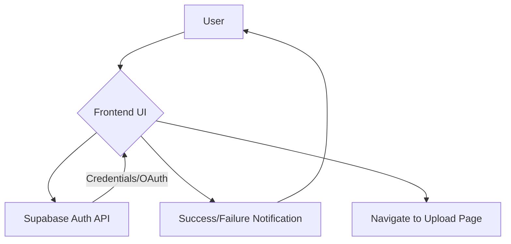

# State Management and API Interaction

This section details how the `edna-analyzer` frontend manages its state and interacts with backend services, primarily focusing on authentication and data fetching.

## Authentication Flow

The frontend utilizes Supabase for user authentication, allowing for both traditional email/password sign-in and OAuth with Google.

### Sign-In Component (`SignInPage.jsx`)

The `SignInPage.jsx` component handles user authentication. It manages local state for email and password inputs and provides handlers for both email/password and Google sign-in.

```tsx
import React, { useState } from "react";
import { supabase } from "../lib/supabase.js";
import toast from "react-hot-toast";
import { useNavigate, Link } from "react-router-dom";
import { motion } from "framer-motion";

export default function Signin() {
  const [email, setEmail] = useState("");
  const [password, setPassword] = useState("");
  const navigate = useNavigate();

  const handleSignin = async (e) => {
    e.preventDefault();
    const { error } = await supabase.auth.signInWithPassword({ email, password });

    if (error) toast.error(error.message);
    else {
      toast.success("Signin successful!");
      navigate("/upload");
    }
  };

  const handleGoogleSignin = async () => {
    const { data, error } = await supabase.auth.signInWithOAuth({
      provider: "google",
      options: { redirectTo: `${window.location.origin}/upload` },
    });

    if (error) toast.error(error.message);
    else {
      toast.success("Redirecting to Google...");
      window.location.href = data.url;
    }
  };

  return (
    // ... JSX for the sign-in form
    <form className="w-full flex flex-col gap-4" onSubmit={handleSignin}>
      {/* Email and Password inputs */}
      <motion.input
        type="email"
        placeholder="Email"
        className="p-3 rounded-xl border border-indigo-300 focus:border-indigo-500 focus:ring-1 focus:ring-indigo-400 text-gray-800"
        value={email}
        onChange={(e) => setEmail(e.target.value)}
        whileFocus={{ scale: 1.02 }}
      />
      <motion.input
        type="password"
        placeholder="Password"
        className="p-3 rounded-xl border border-indigo-300 focus:border-indigo-500 focus:ring-1 focus:ring-1 focus:ring-indigo-400 text-gray-800"
        value={password}
        onChange={(e) => setPassword(e.target.value)}
        whileFocus={{ scale: 1.02 }}
      />
      <motion.button
        type="submit"
        className="bg-indigo-600 hover:bg-indigo-700 text-white py-3 rounded-xl shadow-lg font-semibold transition-all duration-300"
        whileHover={{ scale: 1.05 }}
        whileTap={{ scale: 0.95 }}
      >
        Sign-in
      </motion.button>
    </form>
    // ... Google sign-in button and signup link
  );
}
```

### Supabase Client (`supabase.js`)

The `supabase.js` module initializes and exports the Supabase client, making it available for use throughout the application. It reads Supabase URL and anon key from environment variables.

```js
import { createClient } from '@supabase/supabase-js';

const SUPABASE_URL = import.meta.env.VITE_PUBLIC_SUPABASE_URL;
const SUPABASE_ANON_KEY = import.meta.env.VITE_PUBLIC_SUPABASE_ANON_KEY;

if (!SUPABASE_URL || !SUPABASE_ANON_KEY) {
  console.error('Missing SUPABASE_URL or SUPABASE_ANON_KEY. Please set them in .env');
}

export const supabase = createClient(SUPABASE_URL, SUPABASE_ANON_KEY);
```

## API Interaction

The application also interacts with a custom backend API for certain operations.

### Axios Instance (`axios.js`)

A configured Axios instance is provided for making HTTP requests to the backend API. It includes a base URL for all requests.

```javascript
import axios from "axios";

const axiosInstance = axios.create({
  baseURL: "http://localhost:3000/api",
});

export default axiosInstance;
```

### Authentication Flow Diagram

The following diagram illustrates the user authentication flow:





## Key Takeaways

*   **Supabase for Authentication**: Supabase is the primary service for handling user authentication, supporting both email/password and OAuth providers.
*   **Environment Variables**: Sensitive Supabase credentials are managed via environment variables for security.
*   **Axios for API Calls**: A dedicated Axios instance simplifies making requests to the backend API.
*   **State Management**: Local component state (e.g., `useState` in `SignInPage.jsx`) manages UI-specific data like form inputs.
*   **Routing**: `react-router-dom` is used to handle navigation after successful authentication.