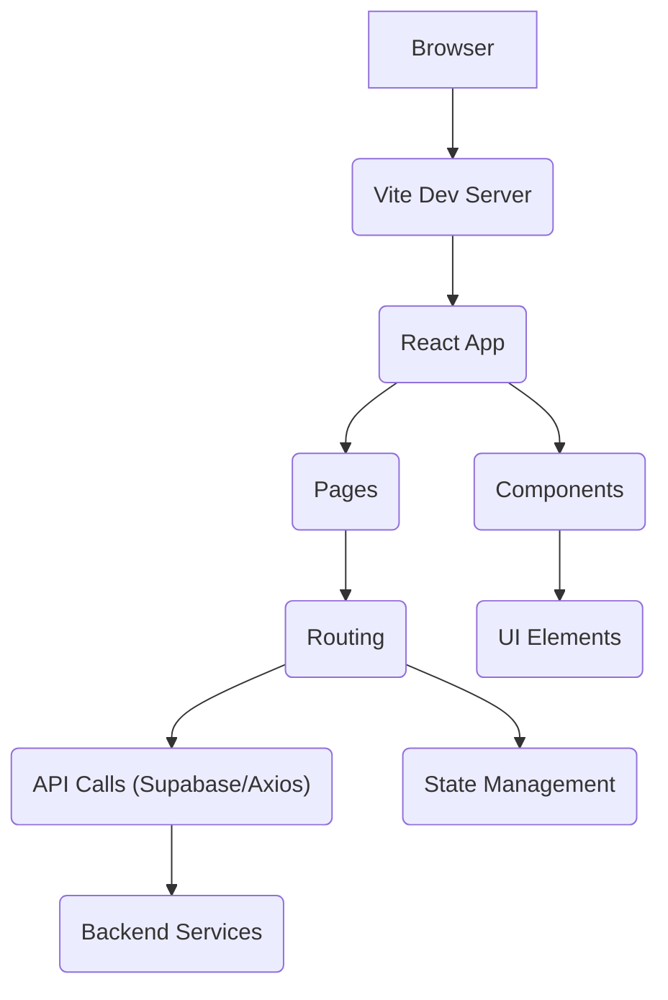

# Frontend Structure

This section outlines the organization and main components of the frontend application, built with React and Vite.

## Application Entry Point

The application's entry point is `frontend/src/main.jsx`. This file sets up the React environment, renders the main `App` component, and integrates `react-hot-toast` for user notifications.

```jsx
import { StrictMode } from 'react'
import { createRoot } from 'react-dom/client'
import './index.css'
import App from './App.jsx'
import {Toaster} from 'react-hot-toast'

createRoot(document.getElementById('root')).render(
  <StrictMode>
    <App />
    <Toaster position="top-right" toastOptions={{ duration: 3000 }} />
  </StrictMode>,
)
```

## Core Application Component (`App.jsx`)

The `App.jsx` file serves as the root component of the React application. It sets up client-side routing using `react-router-dom`, defining the navigation structure and mapping different URL paths to their respective page components.

```jsx
import React, { useEffect, useState } from "react";
import { BrowserRouter as Router, Routes, Route, Link } from "react-router-dom";
import { supabase } from "./lib/supabase.js";
import { toast } from "react-hot-toast";

import Home from "./pages/HomePage";
import SignUp from "./pages/SignUpPage";
import SignIn from "./pages/SigninPage";
import UploadPage from "./pages/UploadPage";
import LandingPage from "./pages/LandingPage.jsx";
import Navbar from "./components/Navbar.jsx";

export default function App() {
  return (
    <Router>
      <Routes>
        <Route path="/" element={<LandingPage />} />
        <Route path="/upload" element={<UploadPage />} />
        <Route path="/signup" element={<SignUp />} />
        <Route path="/signin" element={<SignIn />} />
      </Routes>
    </Router>
  );
}
```

## Project Dependencies

The `package.json` file lists all the dependencies required for the frontend application. Key libraries include:

*   `react` and `react-dom` for building the user interface.
*   `react-router-dom` for client-side routing.
*   `@supabase/supabase-js` for interacting with Supabase backend services.
*   `axios` for making HTTP requests.
*   `recharts` for data visualization.
*   `framer-motion` for animations.
*   `react-hot-toast` for displaying user notifications.
*   `vite` as the build tool.

```json
{
  "name": "frontend",
  "private": true,
  "version": "0.0.0",
  "type": "module",
  "scripts": {
    "dev": "vite",
    "build": "vite build",
    "lint": "eslint .",
    "preview": "vite preview"
  },
  "dependencies": {
    "@supabase/supabase-js": "^2.57.4",
    "axios": "^1.12.2",
    "framer-motion": "^12.23.19",
    "react": "^19.1.1",
    "react-dom": "^19.1.1",
    "react-hot-toast": "^2.6.0",
    "react-router-dom": "^7.9.1",
    "recharts": "^3.2.1"
  },
  "devDependencies": {
    "@vitejs/plugin-react": "^5.0.3",
    "autoprefixer": "^10.4.21",
    "postcss": "^8.5.6",
    "tailwindcss": "^3.4.17",
    "vite": "^7.1.7"
  }
}
```

## Frontend Architecture

The frontend follows a standard Single Page Application (SPA) architecture, leveraging React for component-based UI development and Vite for a fast development experience. Routing is handled client-side, allowing for seamless transitions between different views without full page reloads.





## Key Takeaways

*   The application uses `react-router-dom` for declarative routing.
*   `react-hot-toast` provides a user-friendly way to display feedback.
*   Dependencies are managed via `npm` and listed in `package.json`.
*   Vite is utilized for efficient development and building.
*   The structure prioritizes modularity with separate pages and components.