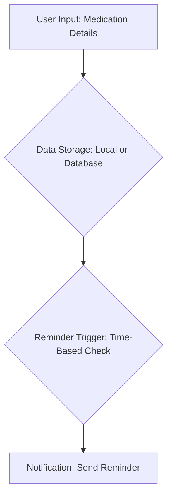
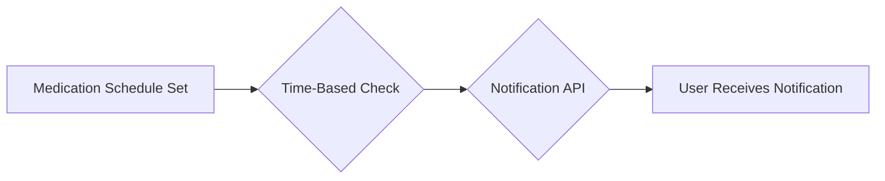

# Project Overview

This document provides an overview of the "med-reminder" application, a web application designed to help users manage their medication schedules.  The project leverages modern web technologies to create a user-friendly and reliable system for tracking and receiving reminders for medications. The primary focus of the application is to improve medication adherence and simplify the process of remembering to take pills on time.

## Features

*   **Medication Scheduling:**  Users can input details about their medications, including name, dosage, frequency, and time.
*   **Reminder System:** The application sends timely reminders to users based on their set schedules.
*   **User Interface:**  A clean and intuitive user interface built with React provides easy access to features.
*   **Responsive Design:** The application is designed to be accessible and usable across various devices (desktops, tablets, and smartphones).

## Technologies

The project utilizes a combination of frontend and backend technologies to deliver its features.

*   **Frontend:**
    *   **React:** The core of the frontend, providing a component-based architecture for building the UI.
    *   **TypeScript:**  Used for type-safe development, improving code maintainability and reducing errors.
    *   **Tailwind CSS:**  A utility-first CSS framework for styling and layout.
    *   **Radix UI:** For accessible and unstyled UI components.
    *   **Framer Motion:** For creating animations.
*   **Project Management:**
    *   **Vite:** A fast build tool for modern web development.

```javascript
// View on GitHub: https://github.com/santrupt29/med_reminder/blob/main/src/App.tsx
import React from 'react';
import { BrowserRouter as Router, Routes, Route } from 'react-router-dom';
import { HomePage } from './pages/HomePage';

function App() {
  return (
    <Router>
      <Routes>
        <Route path="/" element={<HomePage />} />
      </Routes>
    </Router>
  );
}

export default App;

```

This snippet demonstrates the basic setup of the React application's `App.tsx` component.  It uses `react-router-dom` for navigation, establishing routes to different pages within the application. Currently, the main route leads to the `HomePage` component.

## Key Integration Points

### User Flow

The core user flow involves:

1.  **User Input:** Entering medication details (name, dosage, schedule).
2.  **Data Storage:** Persisting medication data (local storage or a database, depending on the implementation).
3.  **Reminder Trigger:** The system checks the schedule at the scheduled time.
4.  **Notification:** Sending the reminder (browser notifications or other mechanisms).

### Mermaid Diagram: User Flow





### Stack Breakdown

The application's frontend architecture is primarily built upon React, and Tailwind CSS, and Radix UI, and is managed by Vite. This structure allows for modularity, reusability, and ease of styling and component management.

##  Frontend (React) Components

React components are at the heart of the frontend, encapsulating specific pieces of functionality and UI elements.

### Example: Alert Dialog

```javascript
// View on GitHub: https://github.com/santrupt29/med_reminder/blob/main/src/components/AlertDialog.tsx
import * as React from "react"
import * as AlertDialogPrimitive from "@radix-ui/react-alert-dialog"
import { styled } from "@stitches/react"

const AlertDialogOverlay = styled(AlertDialogPrimitive.Overlay, {
  backgroundColor: "rgba(0, 0, 0, 0.4)",
  position: "fixed",
  inset: 0,
  animation: "overlayShow 150ms cubic-bezier(0.16, 1, 0.3, 1)",
  "@keyframes overlayShow": {
    from: { opacity: 0 },
    to: { opacity: 1 },
  },
});

const AlertDialogContent = styled(AlertDialogPrimitive.Content, {
  backgroundColor: "white",
  borderRadius: "6px",
  boxShadow: "hsl(206 22% 7% / 35%) 0px 10px 38px -10px, hsl(206 22% 7% / 20%) 0px 10px 20px -15px",
  position: "fixed",
  top: "50%",
  left: "50%",
  transform: "translate(-50%, -50%)",
  width: "90vw",
  maxWidth: "500px",
  maxHeight: "85vh",
  padding: "25px",
  animation: "contentShow 150ms cubic-bezier(0.16, 1, 0.3, 1)",
  "@keyframes contentShow": {
    from: { opacity: 0, transform: "translate(-50%, -48%) scale(0.96)" },
    to: { opacity: 1, transform: "translate(-50%, -50%) scale(1)" },
  },
  ":focus": { outline: 'none' },
});

const AlertDialogHeader = styled("div", {
  marginBottom: "15px",
});
const AlertDialogFooter = styled("div", {
  marginTop: "15px",
});

const AlertDialog = AlertDialogPrimitive.Root;
const AlertDialogTrigger = AlertDialogPrimitive.Trigger;
const AlertDialogTitle = AlertDialogPrimitive.Title;
const AlertDialogDescription = AlertDialogPrimitive.Description;
const AlertDialogAction = AlertDialogPrimitive.Action;
const AlertDialogCancel = AlertDialogPrimitive.Cancel;

export {
  AlertDialog,
  AlertDialogTrigger,
  AlertDialogContent,
  AlertDialogOverlay,
  AlertDialogTitle,
  AlertDialogDescription,
  AlertDialogAction,
  AlertDialogCancel,
  AlertDialogHeader,
  AlertDialogFooter,
  AlertDialogPrimitive
}

```

This code snippet is a React component that uses Radix UI's `AlertDialog` primitive to create a modal dialog for user interaction. It includes styled components for the overlay, content, header, and footer.

### Backend (Conceptual)

While the provided code does not contain a backend implementation, the backend would likely handle data storage (e.g., using a database like PostgreSQL, MongoDB, or a local storage solution).  It would also likely manage the reminder logic, potentially utilizing background tasks or services to trigger notifications at the scheduled times.

```javascript
// View on GitHub: https://github.com/santrupt29/med_reminder/blob/main/src/components/MedicationForm.tsx
import React, { useState } from 'react';

function MedicationForm() {
  const [medicationName, setMedicationName] = useState('');
  const [dosage, setDosage] = useState('');

  const handleSubmit = (event: React.FormEvent) => {
    event.preventDefault();
    console.log('Medication submitted:', medicationName, dosage);
    // Add logic to save the medication data
  };

  return (
    <form onSubmit={handleSubmit}>
      <input
        type="text"
        value={medicationName}
        onChange={(e) => setMedicationName(e.target.value)}
        placeholder="Medication Name"
      />
      <input
        type="text"
        value={dosage}
        onChange={(e) => setDosage(e.target.value)}
        placeholder="Dosage"
      />
      <button type="submit">Add Medication</button>
    </form>
  );
}

export default MedicationForm;
```

This snippet shows a `MedicationForm` component. It showcases the use of React's `useState` hook for managing form inputs and a basic `handleSubmit` function to handle form submissions. The GitHub link is provided for a more complete view of the component.

### CSS Styling (Tailwind CSS)

Tailwind CSS is extensively used for styling the UI elements.

```plaintext
// Example: Tailwind CSS
<button className="bg-blue-500 hover:bg-blue-700 text-white font-bold py-2 px-4 rounded">
  Add Medication
</button>
```

This is a typical Tailwind CSS example showing how to style a button. It sets background color, hover effects, text color, font, padding, and rounded corners.

## Key Integration Points (insights on flows, best practices)

### Data Flow and State Management

The application's data flow and state management are critical for smooth user experience.  The React components would manage their state (e.g., using `useState`) to store and update medication details.  More complex state management solutions like Redux or Zustand could be used as the application grows, providing a central store and optimized updates.

### Notification System

The application’s notification system is central.  The implementation would likely rely on the `Notification` API available in web browsers. This API allows for sending push notifications to the user even when the app is not actively in use (provided the user has granted permission).

### Mermaid Diagram: Notification Flow





### Best Practices

*   **Component-Based Architecture:** This design allows for component reuse and makes the code easier to understand and maintain.
*   **Type Safety with TypeScript:** Improves the quality of the code and reduces errors.
*   **Accessibility:**  Focus on making the application usable by everyone.  This means using semantic HTML and ensuring appropriate contrast ratios and keyboard navigation. The use of RadixUI helps here.
*   **Error Handling and Validation:** Implementing robust error handling and input validation is important for ensuring the application's reliability.

By combining a well-structured frontend with clear backend logic, the "med-reminder" application has a solid foundation for helping users manage their medication schedules.  The project is built with a focus on usability and features.
```