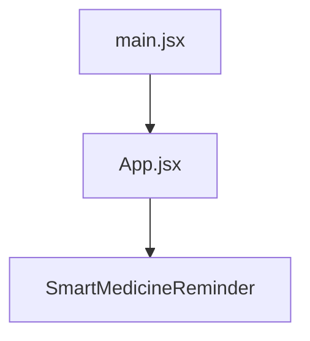

# Application Structure

This section details the high-level architecture and organization of the `med_reminder` application. The application, built with React, is designed to provide users with timely medication reminders. The structure is designed for modularity and ease of maintenance. The core components are the `App` component, which serves as the main entry point, and the `SmartMedicineReminder` component, which likely handles the reminder logic and user interface elements.

## Core Components and File Structure

The application's structure is centered around a few key files. The entry point is `src/main.jsx`, which bootstraps the React application and renders the main `App` component. The `src/app.jsx` component then serves as a container, rendering the `SmartMedicineReminder` component. Styling is handled via `src/index.css` and `src/app.css` (although `app.css` isn't included in the provided content).

### `src/main.jsx` - Application Entry Point

This file sets up the React application and renders the root component, `<App />`.

```javascript
// File: src/main.jsx
import React from 'react'
import ReactDOM from 'react-dom/client'
import './index.css'
import App from './app.jsx'
import './index.css';

ReactDOM.createRoot(document.getElementById('root')).render(
  <React.StrictMode>
    <App />
  </React.StrictMode>
)
```
[View on GitHub](https://github.com/santrupt29/med_reminder/blob/main/src/main.jsx)

This code initializes the React application by:
1.  Importing necessary modules: `React`, `ReactDOM`, and the root CSS file.
2.  Importing the main `App` component.
3.  Using `ReactDOM.createRoot` to render the `App` component inside the DOM element with the ID "root". The `<React.StrictMode>` component is used for highlighting potential problems in the application.

### `src/app.jsx` - Root Component

This component serves as a wrapper for the `SmartMedicineReminder` component, which presumably handles the core reminder functionality.

```javascript
// File: src/app.jsx
import React from 'react'
import SmartMedicineReminder from './MainPage'
import './app.css'

export function App() {
  return (
    <div>
  <SmartMedicineReminder/>
  </div>
)
}

export default App;
```
[View on GitHub](https://github.com/santrupt29/med_reminder/blob/main/src/app.jsx)

The `App` component's primary function is to render the `<SmartMedicineReminder />` component. This structure promotes a clear separation of concerns, where the `App` component handles the overall application structure and layout, while `SmartMedicineReminder` focuses on the reminder logic and user interface.

### `src/index.css` - Global Styles

This file houses global styling rules for the application. It leverages the Tailwind CSS framework, indicated by the `@tailwind` directives.

```css
// File: src/index.css
@tailwind base;
@tailwind components;
@tailwind utilities;

:root {
  font-family: Inter, system-ui, Avenir, Helvetica, Arial, sans-serif;
  line-height: 1.5;
  font-weight: 400;

  color-scheme: light dark;
  color: rgba(255, 255, 255, 0.87);
  background-color: #242424;

  font-synthesis: none;
  text-rendering: optimizeLegibility;
  -webkit-font-smoothing: antialiased;
  -moz-osx-font-smoothing: grayscale;
}

// ... other styles
```
[View on GitHub](https://github.com/santrupt29/med_reminder/blob/main/src/index.css)

This CSS file:
1.  Imports Tailwind CSS base styles, components, and utility classes.
2.  Defines global styling variables, like font family, line height, and color scheme.
3.  Includes basic styles for elements like `a`, `body`, `h1`, and `button`.
4.  Provides styling adjustments for light and dark color schemes.

## Component Interaction

The application follows a straightforward component hierarchy: `main.jsx` renders `App`, which in turn renders `SmartMedicineReminder`. This structure is illustrated below.





## Key Integration Points

The application's core logic likely resides within the `SmartMedicineReminder` component (file not provided). This component would handle the following key features:

*   **Data Management:** Managing medication data, likely involving states or data fetching from a backend.
*   **Scheduling and Reminders:** Implementing logic to schedule and trigger reminders at specific times.
*   **User Interface:** Rendering the user interface, including displays for medications, reminder times, and any configuration options.
*   **User Interaction:** Handling user interactions such as setting up medications, dismissing reminders, and configuring reminder settings.

### Best Practices & Insights

*   **Modularity:** The component-based architecture (App, SmartMedicineReminder) allows for easy maintenance and scalability.
*   **Styling with Tailwind CSS:**  The use of Tailwind CSS promotes a consistent and customizable design system.
*   **Separation of Concerns:** Clearly separating the application logic from the presentation layer.

## Future Enhancements

Potential areas for improvement and expansion could include:

*   **State Management:** Implementing a state management solution (e.g., React Context, Redux, or Zustand) for managing application data more effectively, especially as the application grows.
*   **Backend Integration:** Adding a backend to store and retrieve user data and medication information. This would likely involve API calls within the `SmartMedicineReminder` component.
*   **Advanced Features:** Expanding functionality to include features such as medication tracking, reporting, and integration with external health services.