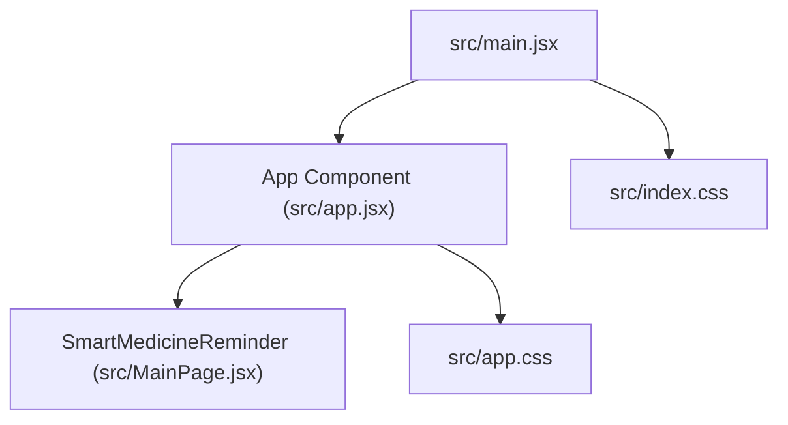

# Application Structure

This section details the structure and organization of the `med_reminder` React application. It outlines the key files, their roles, and how they contribute to the overall functionality of the application. The application follows a component-based architecture, with a clear separation of concerns to enhance maintainability and scalability.

## Core Components and Files

The application's core functionality is encapsulated within a few key files. The entry point of the application, the styling, and the main application logic are all managed efficiently.

*   **`src/app.jsx`**: This file serves as the main application component, responsible for rendering the `SmartMedicineReminder` component. It also imports the global stylesheet `src/app.css`.

    ```javascript
    // File: src/app.jsx
    import React from 'react'
    import SmartMedicineReminder from './MainPage'
    import './app.css'

    export function App() {
      return (
        <div>
      <SmartMedicineReminder/>
      </div>
    )
    }

    export default App;
    ```

    [View on GitHub](https://github.com/santrupt29/med_reminder/blob/main/src/app.jsx)

    The `App` component acts as a container, rendering the `SmartMedicineReminder` component within a `div`. This structure is fundamental for managing the layout and presentation of the entire application.

*   **`src/main.jsx`**: This is the entry point for the React application. It uses `ReactDOM.createRoot` to render the `App` component into the DOM, specifically targeting the element with the ID "root". It also imports the global stylesheet `src/index.css`.

    ```javascript
    // File: src/main.jsx
    import React from 'react'
    import ReactDOM from 'react-dom/client'
    import './index.css'
    import App from './app.jsx'
    import './index.css';

    ReactDOM.createRoot(document.getElementById('root')).render(
      <React.StrictMode>
        <App />
      </React.StrictMode>
    )
    ```

    [View on GitHub](https://github.com/santrupt29/med_reminder/blob/main/src/main.jsx)

    The use of `React.StrictMode` helps in identifying potential problems in the application during development.

*   **`src/index.css`**: This file contains the global styles for the application, including basic styling for the body, headings, and buttons. It also handles light and dark mode theming using CSS variables and `@media` queries. This file imports `tailwind base`, `tailwind components`, and `tailwind utilities` which indicates that the project is using the Tailwind CSS framework for styling.

    ```css
    /* File: src/index.css */
    @tailwind base;
    @tailwind components;
    @tailwind utilities;

    :root {
      font-family: Inter, system-ui, Avenir, Helvetica, Arial, sans-serif;
      line-height: 1.5;
      font-weight: 400;

      color-scheme: light dark;
      color: rgba(255, 255, 255, 0.87);
      background-color: #242424;

      font-synthesis: none;
      text-rendering: optimizeLegibility;
      -webkit-font-smoothing: antialiased;
      -moz-osx-font-smoothing: grayscale;
    }

    // ... (rest of the css)
    ```

    [View on GitHub](https://github.com/santrupt29/med_reminder/blob/main/src/index.css)

## Application Flow

The application starts with `src/main.jsx`, which renders the `App` component. The `App` component then renders the core `SmartMedicineReminder` component, which likely handles the logic for managing and displaying medicine reminders. The application utilizes a simple component structure, making it easy to understand the core functionality.





## Key Integration Points

The application's structure emphasizes a clear separation of concerns. `src/main.jsx` sets up the React environment and renders the main application component, while `src/app.jsx` acts as a container, importing the necessary stylesheets and rendering the primary application logic, encapsulated in `SmartMedicineReminder`. The use of Tailwind CSS in `src/index.css` simplifies styling. The application's design allows for future expansion and easier maintenance.

The simplicity of the structure enables efficient development and easy integration of new features, like:

*   **Adding new components:** New UI elements related to medicine reminders can be easily created and integrated into the `SmartMedicineReminder` component.
*   **Data management:** The application can be extended to integrate with a data source (API or local storage) to manage the reminder data.

```javascript
// Example of a hypothetical component import
import MedicineList from './MedicineList';

function SmartMedicineReminder() {
  return (
    <div>
      {/* Other UI elements */}
      <MedicineList />
    </div>
  );
}

export default SmartMedicineReminder;
```

[View on GitHub (Hypothetical Integration)](https://github.com/santrupt29/med_reminder)

This modular approach ensures that the application remains manageable as its functionality grows. The use of Tailwind CSS promotes a consistent and responsive design across all components.