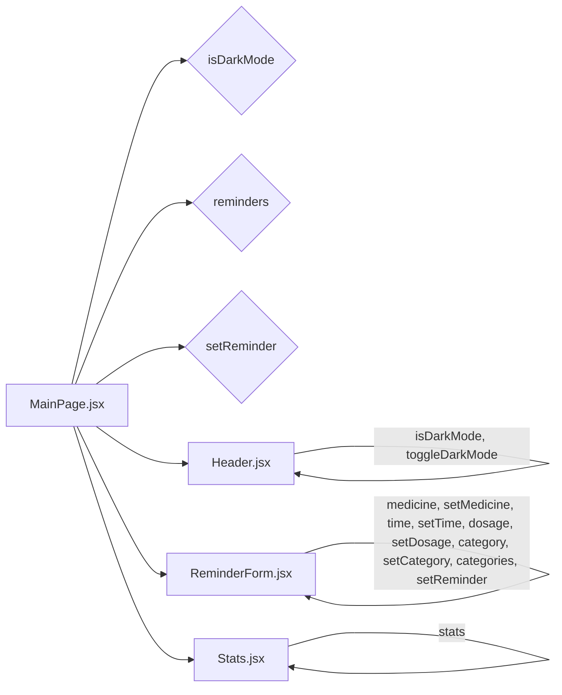

# Frontend Components

## Description

This section details the React components that constitute the user interface of the `med_reminder` application. These components are designed to manage reminders, display statistics, and provide a user-friendly interface for interacting with the application's core functionality.

## Components

### `MainPage.jsx`

The `MainPage.jsx` component serves as the primary container and orchestrator for the entire application's frontend. It manages state related to reminders, user input, dark mode, and filtering.

*   **Functionality:** Handles the display of the header, statistics, the form for adding reminders, and the list of upcoming reminders. It also manages dark mode toggling.
*   **State Management:** Uses React's `useState` hook to manage the state of the application. The state includes:
    *   `medicine`: The name of the medicine.
    *   `time`: The time for the reminder.
    *   `category`: The reminder category (daily, weekly, monthly, as-needed).
    *   `dosage`: The medicine dosage.
    *   `reminders`: An array of reminder objects.
    *   `isDarkMode`: A boolean indicating whether dark mode is enabled.
    *   `searchTerm`: The search term for filtering reminders.
    *   `filterCategory`: The category for filtering reminders.

```javascript
// src/MainPage.jsx
import React, { useState } from "react";
import { Bell, Plus, Trash2, Moon, Sun, Calendar, PieChart, Clock, Activity, Search, Filter } from "lucide-react";

const SmartMedicineReminder = () => {
  const [medicine, setMedicine] = useState("");
  const [time, setTime] = useState("");
  // ... other state variables and methods ...
  return (
    // ... JSX for the entire application UI ...
  );
};

export default SmartMedicineReminder;
```

[View on GitHub](https://github.com/santrupt29/med_reminder/blob/main/src/MainPage.jsx)

### `Header.jsx`

The `Header.jsx` component is responsible for displaying the application header, including the title and a dark mode toggle button.

*   **Functionality:** Renders the application title and a button that, when clicked, toggles the dark mode. It receives the `isDarkMode` and `toggleDarkMode` props from `MainPage`.
*   **Styling:** The component uses conditional styling to change the appearance based on the `isDarkMode` state.

```javascript
// src/components/Header.jsx
import { Bell, Calendar, Moon, Sun } from "lucide-react";

const Header = ({ isDarkMode, toggleDarkMode }) => (
    <header className={`max-w-6xl mx-auto rounded-lg shadow-md p-4 mb-6 transition-colors duration-200 ${
        isDarkMode 
          ? 'bg-gray-800' 
          : 'bg-white/80 backdrop-blur-sm border border-slate-200'
      }`}>
        {/* ... Header content ... */}
    </header>
);

export default Header;
```

[View on GitHub](https://github.com/santrupt29/med_reminder/blob/main/src/components/Header.jsx)

### `ReminderForm.jsx`

The `ReminderForm.jsx` component provides the form for adding new reminders.

*   **Functionality:** Renders input fields for the medicine name, time, dosage, and category. It uses these values to create a new reminder.
*   **Props:** Receives props for `medicine`, `setMedicine`, `time`, `setTime`, `dosage`, `setDosage`, `category`, `setCategory`, `categories`, and `setReminder` to manage the form's state and submission.
*   **Styling:**  Conditionally styles the form elements based on the `isDarkMode` state, passed down from the `MainPage`.

```javascript
// src/components/ReminderForm.jsx
const ReminderForm = ({ medicine, setMedicine, time, setTime, dosage, setDosage, category, setCategory, categories, setReminder }) => (
  // ... Form content ...
);

export default ReminderForm;
```

[View on GitHub](https://github.com/santrupt29/med_reminder/blob/main/src/components/ReminderForm.jsx)

### `Stats.jsx`

The `Stats.jsx` component displays key statistics about the user's reminders.

*   **Functionality:** Renders a grid of statistical information, such as total reminders, daily reminders, completion rate, and current streak.
*   **Props:** Receives a `stats` prop, which is an object containing the statistical data.
*   **Dynamic Rendering:** Uses `Object.entries` and `map` to dynamically render the statistics based on the data provided in the `stats` prop.

```javascript
// src/components/Stats.jsx
const Stats = ({ stats }) => (
    <div className="max-w-6xl mx-auto mb-6">
      <div className="grid grid-cols-1 md:grid-cols-4 gap-4 p-4 rounded-lg shadow-md bg-gray-800">
        {Object.entries(stats).map(([key, value]) => (
          <div key={key} className="p-4 rounded-md bg-blue-50 border border-blue-100">
            <h3 className="font-medium text-slate-700">{key.charAt(0).toUpperCase() + key.slice(1)}</h3>
            <p className="text-2xl font-semibold text-blue-600">{value}</p>
          </div>
        ))}
      </div>
    </div>
  );

  export default Stats;
```

[View on GitHub](https://github.com/santrupt29/med_reminder/blob/main/src/components/Stats.jsx)

## Key Integration Points

The core functionality of the application is driven by the interaction between `MainPage.jsx` and the other components. `MainPage.jsx` manages the overall state and passes the necessary data and handlers to the child components.  The `Header`, `ReminderForm`, and `Stats` components receive props from `MainPage` and render based on those props, contributing to the user interface.

Mermaid Diagram illustrating the data flow:





### Data Flow

1.  **User Interaction:**  The user interacts with the UI (e.g., enters medicine name in `ReminderForm`).
2.  **State Update:** The `onChange` handlers in `ReminderForm` update the state in `MainPage` using `setMedicine`, `setTime`, etc.
3.  **Reminder Creation:**  When the user submits the form, `setReminder` (passed from `MainPage`) adds a new reminder to the `reminders` array.
4.  **Display Update:**  The `MainPage` re-renders, and the updated `reminders` are used to display the upcoming reminders.  The `Stats` component also updates to reflect the new reminder.
5.  **Dark Mode Toggle:** When the toggle button in the `Header` is clicked the `toggleDarkMode` function is triggered, which updates the `isDarkMode` state. This change is then propagated to all components.