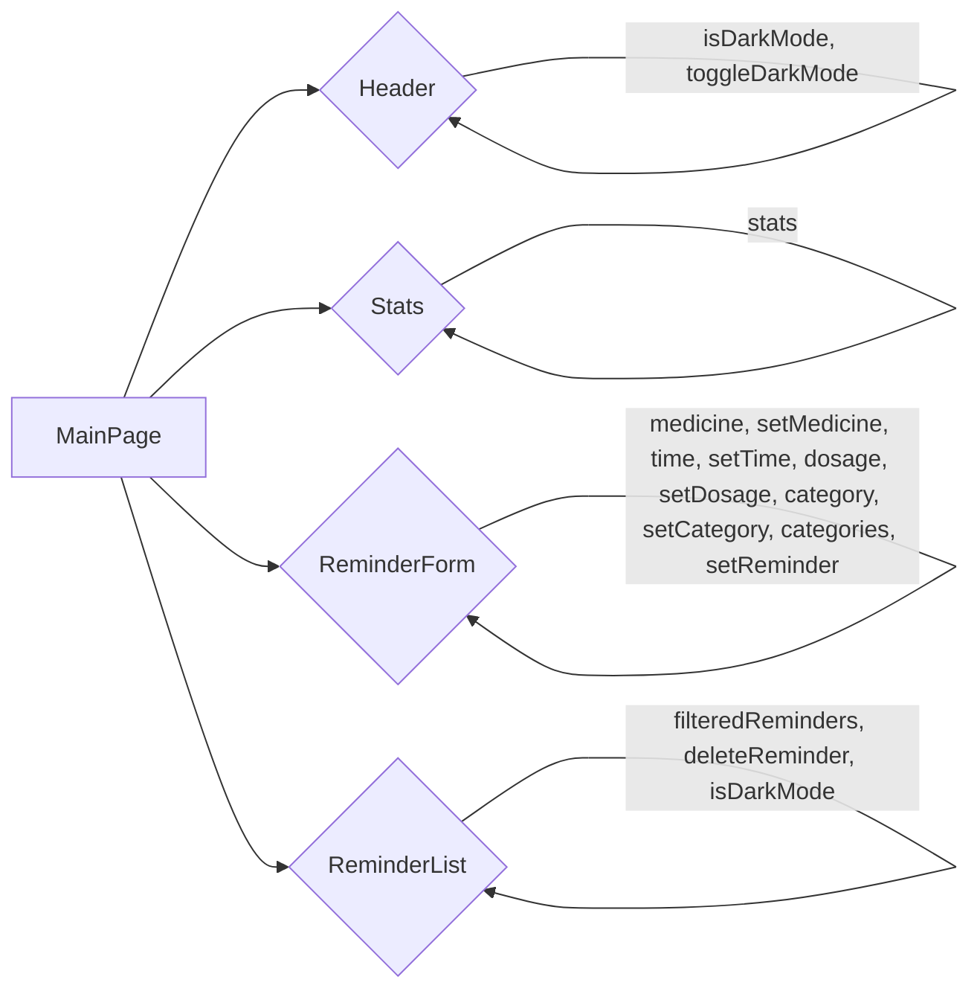

# User Interface Components

This section details the React components that form the user interface (UI) of the "Medi Remind Pro" application, focusing on their structure, functionality, and integration within the application. The application utilizes a component-based architecture for a modular and maintainable UI.

## Components Overview

The application is built using several key React components: `Header`, `ReminderForm`, `Stats`, and the main component, `MainPage`. Each component serves a specific purpose, contributing to the overall functionality and user experience.

### Header Component

The `Header` component ( [View on GitHub](https://github.com/santrupt29/med_reminder/blob/main/src/components/Header.jsx) ) is responsible for displaying the application's title, a bell icon (representing notifications), a calendar icon, and a dark/light mode toggle.

```jsx
// src/components/Header.jsx
import { Bell, Calendar, Moon, Sun } from "lucide-react";

const Header = ({ isDarkMode, toggleDarkMode }) => (
    <header className={`max-w-6xl mx-auto rounded-lg shadow-md p-4 mb-6 transition-colors duration-200 ${
        isDarkMode
          ? 'bg-gray-800'
          : 'bg-white/80 backdrop-blur-sm border border-slate-200'
      }`}>
        <div className="flex items-center justify-between">
          <div className="flex items-center gap-3">
            <Bell className={`h-6 w-6 ${isDarkMode ? 'text-blue-400' : 'text-blue-500'}`} />
            <h1 className={`text-2xl font-semibold ${isDarkMode ? 'text-white' : 'text-slate-700'}`}>
              Medi Remind Pro
            </h1>
          </div>
          <div className="flex items-center gap-4">
            <Calendar className={`h-5 w-5 ${isDarkMode ? 'text-gray-400' : 'text-slate-500'}`} />
            <button
              onClick={toggleDarkMode}
              className={`p-2 rounded-full transition-colors duration-200 ${
                isDarkMode
                  ? 'bg-gray-700 hover:bg-gray-600'
                  : 'bg-slate-100 hover:bg-slate-200 border border-slate-200'
              }`}
            >
              {isDarkMode ? (
                <Sun className="h-5 w-5 text-yellow-400" />
              ) : (
                <Moon className="h-5 w-5 text-slate-600" />
              )}
            </button>
          </div>
        </div>
      </header>
);

export default Header;
```

**Key Features:**

*   **Dark/Light Mode Toggle:** The `toggleDarkMode` function (passed as a prop) allows users to switch between light and dark themes. The component dynamically changes its appearance based on the `isDarkMode` prop, providing a consistent visual experience.
*   **Responsiveness:**  Uses Tailwind CSS classes for responsive design, ensuring the header adapts to different screen sizes.
*   **Visual Consistency:** Maintains a consistent look and feel across different application states using conditional styling based on `isDarkMode`.

### ReminderForm Component

The `ReminderForm` component ( [View on GitHub](https://github.com/santrupt29/med_reminder/blob/main/src/components/ReminderForm.jsx) ) is responsible for rendering the form used to add new medication reminders.  It includes input fields for medicine name, time, dosage, and a category selection dropdown.

```jsx
// src/components/ReminderForm.jsx
const ReminderForm = ({ medicine, setMedicine, time, setTime, dosage, setDosage, category, setCategory, categories, setReminder }) => (
    <div className="rounded-lg shadow-md bg-gray-800">
      <div className="p-4 border-b border-gray-700">
        <h2 className="text-lg font-medium text-white">Add Reminder</h2>
      </div>
      <div className="p-4 space-y-4">
        <input
          type="text"
          value={medicine}
          onChange={(e) => setMedicine(e.target.value)}
          placeholder="Medicine Name"
          className="w-full p-2 rounded-md bg-gray-700 text-white"
        />
        <input
          type="time"
          value={time}
          onChange={(e) => setTime(e.target.value)}
          className="w-full p-2 rounded-md bg-gray-700 text-white"
        />
        <input
          type="text"
          value={dosage}
          onChange={(e) => setDosage(e.target.value)}
          placeholder="Dosage"
          className="w-full p-2 rounded-md bg-gray-700 text-white"
        />
        <select
          value={category}
          onChange={(e) => setCategory(e.target.value)}
          className="w-full p-2 rounded-md bg-gray-700 text-white"
        >
          {categories.map((cat) => (
            <option key={cat} value={cat}>{cat}</option>
          ))}
        </select>
        <button
          onClick={setReminder}
          className="w-full bg-blue-500 text-white py-2 px-4 rounded-md"
        >
          Add Reminder
        </button>
      </div>
    </div>
  );

  export default ReminderForm;
```

**Key Features:**

*   **Controlled Inputs:** Uses controlled components for each input field (medicine, time, dosage), ensuring that the component's state reflects the input values.  `onChange` events update the state variables managed by the `MainPage` component.
*   **Category Selection:** Provides a `<select>` element to choose the reminder category (e.g., daily, weekly, monthly, as-needed). The available categories are passed as a prop from `MainPage`.
*   **Form Submission:** Includes a button that triggers the `setReminder` function (passed as a prop) to add a new reminder to the list.

### Stats Component

The `Stats` component ( [View on GitHub](https://github.com/santrupt29/med_reminder/blob/main/src/components/Stats.jsx) ) displays key statistics related to the user's reminders, such as the total number of reminders, the number of daily reminders, and completion rate.

```jsx
// src/components/Stats.jsx
const Stats = ({ stats }) => (
    <div className="max-w-6xl mx-auto mb-6">
      <div className="grid grid-cols-1 md:grid-cols-4 gap-4 p-4 rounded-lg shadow-md bg-gray-800">
        {Object.entries(stats).map(([key, value]) => (
          <div key={key} className="p-4 rounded-md bg-blue-50 border border-blue-100">
            <h3 className="font-medium text-slate-700">{key.charAt(0).toUpperCase() + key.slice(1)}</h3>
            <p className="text-2xl font-semibold text-blue-600">{value}</p>
          </div>
        ))}
      </div>
    </div>
  );

  export default Stats;
```

**Key Features:**

*   **Dynamic Data Display:**  Renders statistical information received as a `stats` prop. This allows the component to be easily updated with new data.
*   **Modular Design:** Uses `Object.entries()` to iterate over the stats object, dynamically generating the display for each statistic, enhancing reusability.
*   **Visual Presentation:** Uses Tailwind CSS to provide a visually appealing layout for the statistics.

### MainPage Component

The `MainPage` component ( [View on GitHub](https://github.com/santrupt29/med_reminder/blob/main/src/MainPage.jsx) ) serves as the main container for the application's UI, integrating all other components and managing the application's state.

```jsx
// src/MainPage.jsx
import React, { useState } from "react";
import { Bell, Plus, Trash2, Moon, Sun, Calendar, PieChart, Clock, Activity, Search, Filter } from "lucide-react";

const SmartMedicineReminder = () => {
  const [medicine, setMedicine] = useState("");
  const [time, setTime] = useState("");
  const [category, setCategory] = useState("daily");
  const [dosage, setDosage] = useState("");
  const [reminders, setReminders] = useState([]);
  const [isDarkMode, setIsDarkMode] = useState(true);
  const [searchTerm, setSearchTerm] = useState("");
  const [filterCategory, setFilterCategory] = useState("all");

  const categories = ["daily", "weekly", "monthly", "as-needed"];

  const stats = {
    total: reminders.length,
    daily: reminders.filter(r => r.category === "daily").length,
    completion: "85%",
    streak: "5 days"
  };

  const setReminder = () => {
    if (medicine === "" || time === "" || dosage === "") {
      alert("Please fill in all fields.");
      return;
    }
    setReminders([...reminders, { medicine, time, category, dosage, completed: false }]);
    setMedicine("");
    setTime("");
    setDosage("");
  };

  const deleteReminder = (index) => {
    setReminders(reminders.filter((_, i) => i !== index));
  };

  const toggleDarkMode = () => {
    setIsDarkMode(!isDarkMode);
  };

  const filteredReminders = reminders
    .filter(r => r.medicine.toLowerCase().includes(searchTerm.toLowerCase()))
    .filter(r => filterCategory === "all" ? true : r.category === filterCategory);

  return (
    <div className={`min-h-screen w-screen p-6 transition-colors duration-200 ${
      isDarkMode
        ? 'bg-gray-900'
        : 'bg-gradient-to-b from-slate-50 to-blue-50'
    }`}>
      {/* Header */}
      <header className={`max-w-6xl mx-auto rounded-lg shadow-md p-4 mb-6 transition-colors duration-200 ${
        isDarkMode
          ? 'bg-gray-800'
          : 'bg-white/80 backdrop-blur-sm border border-slate-200'
      }`}>
        <div className="flex items-center justify-between">
          <div className="flex items-center gap-3">
            <Bell className={`h-6 w-6 ${isDarkMode ? 'text-blue-400' : 'text-blue-500'}`} />
            <h1 className={`text-2xl font-semibold ${isDarkMode ? 'text-white' : 'text-slate-700'}`}>
              Medi Remind Pro
            </h1>
          </div>
          <div className="flex items-center gap-4">
            <Calendar className={`h-5 w-5 ${isDarkMode ? 'text-gray-400' : 'text-slate-500'}`} />
            <button
              onClick={toggleDarkMode}
              className={`p-2 rounded-full transition-colors duration-200 ${
                isDarkMode
                  ? 'bg-gray-700 hover:bg-gray-600'
                  : 'bg-slate-100 hover:bg-slate-200 border border-slate-200'
              }`}
            >
              {isDarkMode ? (
                <Sun className="h-5 w-5 text-yellow-400" />
              ) : (
                <Moon className="h-5 w-5 text-slate-600" />
              )}
            </button>
          </div>
        </div>
      </header>

      {/* Statistics Section */}
      <div className="max-w-6xl mx-auto mb-6">
        <div className={`grid grid-cols-1 md:grid-cols-4 gap-4 p-4 rounded-lg shadow-md ${
          isDarkMode
            ? 'bg-gray-800'
            : 'bg-white/80 backdrop-blur-sm border border-slate-200'
        }`}>
          <div className="p-4 rounded-md bg-blue-50 border border-blue-100">
            <div className="flex items-center gap-2 mb-2">
              <PieChart className="h-5 w-5 text-blue-500" />
              <h3 className="font-medium text-slate-700">Total Reminders</h3>
            </div>
            <p className="text-2xl font-semibold text-blue-600">{stats.total}</p>
          </div>
          <div className="p-4 rounded-md bg-green-50 border border-green-100">
            <div className="flex items-center gap-2 mb-2">
              <Activity className="h-5 w-5 text-green-500" />
              <h3 className="font-medium text-slate-700">Daily Medicines</h3>
            </div>
            <p className="text-2xl font-semibold text-green-600">{stats.daily}</p>
          </div>
          <div className="p-4 rounded-md bg-purple-50 border border-purple-100">
            <div className="flex items-center gap-2 mb-2">
              <Clock className="h-5 w-5 text-purple-500" />
              <h3 className="font-medium text-slate-700">Completion Rate</h3>
            </div>
            <p className="text-2xl font-semibold text-purple-600">{stats.completion}</p>
          </div>
          <div className="p-4 rounded-md bg-orange-50 border border-orange-100">
            <div className="flex items-center gap-2 mb-2">
              <Activity className="h-5 w-5 text-orange-500" />
              <h3 className="font-medium text-slate-700">Current Streak</h3>
            </div>
            <p className="text-2xl font-semibold text-orange-600">{stats.streak}</p>
          </div>
        </div>
      </div>

      {/* Main Content */}
      <div className="max-w-6xl mx-auto grid grid-cols-1 md:grid-cols-3 gap-6">
        {/* Add Reminder Form */}
        <div className={`rounded-lg shadow-md transition-colors duration-200 ${
          isDarkMode
            ? 'bg-gray-800'
            : 'bg-white/80 backdrop-blur-sm border border-slate-200'
        }`}>
          <div className={`p-4 border-b ${isDarkMode ? 'border-gray-700' : 'border-slate-200'}`}>
            <h2 className={`text-lg font-medium ${isDarkMode ? 'text-white' : 'text-slate-700'}`}>
              Add Reminder
            </h2>
          </div>
          <div className="p-4 space-y-4">
            <input
              type="text"
              value={medicine}
              onChange={(e) => setMedicine(e.target.value)}
              placeholder="Medicine Name"
              className={`w-full p-2 rounded-md focus:outline-none focus:ring-2 focus:ring-blue-400 transition-colors duration-200 ${
                isDarkMode
                  ? 'bg-gray-700 border-gray-600 text-white placeholder-gray-400'
                  : 'bg-slate-50 border border-slate-200 text-slate-600 placeholder-slate-400'
              }`}
            />
            <input
              type="time"
              value={time}
              onChange={(e) => setTime(e.target.value)}
              className={`w-full p-2 rounded-md focus:outline-none focus:ring-2 focus:ring-blue-400 transition-colors duration-200 ${
                isDarkMode
                  ? 'bg-gray-700 border-gray-600 text-white'
                  : 'bg-slate-50 border border-slate-200 text-slate-600'
              }`}
            />
            <input
              type="text"
              value={dosage}
              onChange={(e) => setDosage(e.target.value)}
              placeholder="Dosage (e.g., 1 pill)"
              className={`w-full p-2 rounded-md focus:outline-none focus:ring-2 focus:ring-blue-400 transition-colors duration-200 ${
                isDarkMode
                  ? 'bg-gray-700 border-gray-600 text-white placeholder-gray-400'
                  : 'bg-slate-50 border border-slate-200 text-slate-600 placeholder-slate-400'
              }`}
            />
            <select
              value={category}
              onChange={(e) => setCategory(e.target.value)}
              className={`w-full p-2 rounded-md focus:outline-none focus:ring-2 focus:ring-blue-400 transition-colors duration-200 ${
                isDarkMode
                  ? 'bg-gray-700 border-gray-600 text-white'
                  : 'bg-slate-50 border border-slate-200 text-slate-600'
              }`}
            >
              {categories.map(cat => (
                <option key={cat} value={cat}>
                  {cat.charAt(0).toUpperCase() + cat.slice(1)}
                </option>
              ))}
            </select>
            <button
              onClick={setReminder}
              className="w-full bg-blue-500 hover:bg-blue-600 text-white py-2 px-4 rounded-md transition-colors duration-200 flex items-center justify-center gap-2 shadow-sm"
            >
              <Plus className="h-5 w-5" />
              Add Reminder
            </button>
          </div>
        </div>

        {/* Reminder List */}
        <div className={`md:col-span-2 rounded-lg shadow-md transition-colors duration-200 ${
          isDarkMode
            ? 'bg-gray-800'
            : 'bg-white/80 backdrop-blur-sm border border-slate-200'
        }`}>
          <div className={`p-4 border-b ${isDarkMode ? 'border-gray-700' : 'border-slate-200'}`}>
            <h2 className={`text-lg font-medium mb-4 ${isDarkMode ? 'text-white' : 'text-slate-700'}`}>
              Upcoming Reminders
            </h2>
            <div className="flex gap-4 mb-4">
              <div className="flex-1 relative">
                <input
                  type="text"
                  value={searchTerm}
                  onChange={(e) => setSearchTerm(e.target.value)}
                  placeholder="Search medicines..."
                  className={`w-full p-2 pl-10 rounded-md focus:outline-none focus:ring-2 focus:ring-blue-400 transition-colors duration-200 ${
                    isDarkMode
                      ? 'bg-gray-700 border-gray-600 text-white placeholder-gray-400'
                      : 'bg-slate-50 border border-slate-200 text-slate-600 placeholder-slate-400'
                  }`}
                />
                <Search className={`h-5 w-5 absolute left-3 top-2.5 ${
                  isDarkMode ? 'text-gray-400' : 'text-slate-400'
                }`} />
              </div>
              <select
                value={filterCategory}
                onChange={(e) => setFilterCategory(e.target.value)}
                className={`p-2 rounded-md focus:outline-none focus:ring-2 focus:ring-blue-400 transition-colors duration-200 ${
                  isDarkMode
                    ? 'bg-gray-700 border-gray-600 text-white'
                    : 'bg-slate-50 border border-slate-200 text-slate-600'
                }`}
              >
                <option value="all">All Categories</option>
                {categories.map(cat => (
                  <option key={cat} value={cat}>
                    {cat.charAt(0).toUpperCase() + cat.slice(1)}
                  </option>
                ))}
              </select>
            </div>
          </div>
          <div className="p-4">
            <div className="space-y-3">
              {filteredReminders.length === 0 ? (
                <p className={`${isDarkMode ? 'text-gray-400' : 'text-slate-500'}`}>
                  No reminders found.
                </p>
              ) : (
                filteredReminders.map((reminder, index) => (
                  <div
                    key={index}
                    className={`flex justify-between items-center p-3 rounded-md transition-colors duration-200 ${
                      isDarkMode
                        ? 'bg-gray-700 border-gray-600'
                        : 'bg-slate-50 border border-slate-200 hover:border-slate-300'
                    }`}
                  >
                    <div className="flex items-center gap-3">
                      <Bell className={`h-4 w-4 ${isDarkMode ? 'text-blue-400' : 'text-blue-500'}`} />
                      <div>
                        <span className={isDarkMode ? 'text-gray-200' : 'text-slate-600'}>
                          {reminder.medicine} - {reminder.time}
                        </span>
                        <div className={`text-sm ${isDarkMode ? 'text-gray-400' : 'text-slate-500'}`}>
                          {reminder.dosage} • {reminder.category}
                        </div>
                      </div>
                    </div>
                    <button
                      onClick={() => deleteReminder(index)}
                      className={`transition-colors duration-200 ${
                        isDarkMode
                          ? 'text-gray-400 hover:text-red-400'
                          : 'text-slate-400 hover:text-red-500'
                      }`}
                    >
                      <Trash2 className="h-5 w-5" />
                    </button>
                  </div>
                ))
              )}
            </div>
          </div>
        </div>
      </div>
    </div>
  );
};

export default SmartMedicineReminder;
```

**Key Features:**

*   **State Management:** Manages the application's state using the `useState` hook.  This includes the medication name, time, dosage, category, reminders array, dark mode setting, search term, and filter category.
*   **Integration:** Integrates all other components, passing necessary props and handling interactions. It renders the `Header`, `Stats`, `ReminderForm` and displays a list of reminders.
*   **Event Handling:**  Handles user interactions such as adding new reminders (`setReminder`), deleting reminders (`deleteReminder`), and toggling dark mode (`toggleDarkMode`).
*   **Filtering and Searching:** Implements filtering and searching of reminders based on medicine name and category, providing better usability.
*   **Conditional Rendering:**  Dynamically renders UI elements based on the application's state, such as displaying the "No reminders found" message when the reminder list is empty.





## Key Integration Points

The application's UI is designed with a clear separation of concerns, where each component has a specific responsibility.  The `MainPage` component acts as the central hub, managing state and orchestrating the interactions between other components.  This design promotes code reusability and maintainability.

*   **Data Flow:** Data flows primarily from `MainPage` to the other components.  `MainPage` holds the application's state, which is then passed as props to the components.
*   **Event Handling:** User interactions (e.g., entering information in the form, clicking the dark mode toggle) trigger events handled by the `MainPage` component, which then updates the state and re-renders the UI accordingly.
*   **Component Composition:**  The UI is assembled through component composition, where smaller components are combined to create larger, more complex structures.  For example, the `MainPage` component includes the `Header`, `ReminderForm`, and a list of reminders.

## Styling and Themes

The application makes extensive use of Tailwind CSS for styling, offering flexibility and maintainability. The styling is also designed to support dark mode, enhancing the user experience.  The `MainPage` component controls the overall theme based on the `isDarkMode` state.

## Conclusion

The user interface of "Medi Remind Pro" is built using a well-structured and modular architecture based on React components. Each component is responsible for specific functionality and interacts through props and event handling.  The use of Tailwind CSS facilitates easy styling and customization, enhancing the overall user experience. The `MainPage` component acts as a central point, managing application state and integrating all other components, ensuring a cohesive and maintainable UI.
```