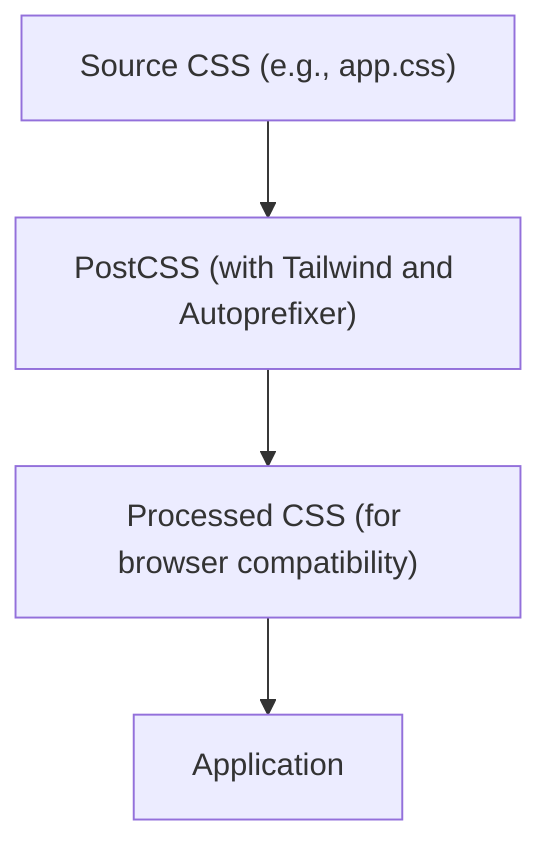

# Styling and Configuration

This section details the styling approach and build configurations employed in the `med_reminder` project. The project leverages modern web development practices, including CSS, Tailwind CSS for utility-first styling, and PostCSS for processing styles.

## Styling Approach

The project's styling is primarily managed using Tailwind CSS, complemented by custom CSS for specific needs. This approach provides a balance of flexibility and maintainability.

### Tailwind CSS Configuration

Tailwind CSS is configured to scan all relevant files for class names, enabling efficient style generation.

```javascript
// tailwind.config.js
/** @type {import('tailwindcss').Config} */
export default {
    content: [
      "./index.html",
      "./src/**/*.{js,ts,jsx,tsx}"
    ],
    theme: {
      extend: {},
    },
    plugins: [],
  }
```

[View on GitHub](https://github.com/santrupt29/med_reminder/blob/main/tailwind.config.js)

This configuration specifies the content paths where Tailwind CSS should look for class names. This is crucial for Tailwind to generate the appropriate styles for the project. The `theme` and `plugins` sections are left with default configurations, implying that the project is using the default Tailwind theme and no additional plugins beyond the core functionality.

### PostCSS Configuration

PostCSS is used as a processor for the CSS, integrating Tailwind CSS and autoprefixing for browser compatibility.

```javascript
// postcss.config.js
export default {
  plugins: {
    tailwindcss: {},
    autoprefixer: {},
  },
}
```

[View on GitHub](https://github.com/santrupt29/med_reminder/blob/main/postcss.config.js)

This configuration file defines the PostCSS plugins to be used. `tailwindcss` and `autoprefixer` are included, enabling Tailwind CSS to generate styles and automatically add vendor prefixes to CSS rules for cross-browser compatibility.

### Custom CSS

The `src/app.css` file contains some custom CSS rules. These rules provide global styles and handle basic layout and visual elements.

```css
// src/app.css
#app {
  max-width: 1280px;
  margin: 0 auto;
  padding: 2rem;
  text-align: center;
}

.logo {
  height: 6em;
  padding: 1.5em;
}
.logo:hover {
  filter: drop-shadow(0 0 2em #646cffaa);
}
.logo.preact:hover {
  filter: drop-shadow(0 0 2em #673ab8aa);
}

.card {
  padding: 2em;
}

.read-the-docs {
  color: #888;
}
```

[View on GitHub](https://github.com/santrupt29/med_reminder/blob/main/src/app.css)

This CSS file sets up the basic layout for the application, defining a maximum width, centering content, and providing some basic styling for the logo, cards, and "read-the-docs" elements.

### Mermaid Diagram: Style Processing Flow

The following Mermaid diagram illustrates the flow of how the CSS is processed.





## Key Integration Points

The core of the styling setup involves a few critical points:

1.  **Tailwind Integration:** The `tailwind.config.js` file is crucial for customizing Tailwind.  Although the provided file uses default settings, customizing the `theme` section would allow for overriding default colors, fonts, and spacing. Adding plugins would allow for more advanced customization, such as using custom UI components or animations.

2.  **PostCSS Pipeline:** PostCSS, configured in `postcss.config.js`, is the bridge between the Tailwind configuration and the final CSS output. It applies the Tailwind styles and ensures cross-browser compatibility via autoprefixing.

3.  **Content Scanning:** The `content` array in `tailwind.config.js` is paramount. It tells Tailwind where to look for class names in your HTML, JavaScript, and TypeScript files. Incorrect configuration here will lead to missing styles.  This is a critical best practice to remember when adding new components or changing the project structure.

### Best Practices and Insights

*   **Modular CSS:** Even with Tailwind, maintainability is best served by keeping your CSS modular. Consider using a BEM-like naming convention, or even using a CSS-in-JS solution (although this project doesn't appear to be set up to use that).

*   **Customization:** The `tailwind.config.js` file is the central point of customization.  Don't be afraid to override the default theme or add plugins to match your design requirements.

*   **Performance:** Optimize your CSS bundle for performance, especially as your project grows. Consider techniques like purging unused CSS in production builds.

*   **Maintainability:** Keep your Tailwind class names consistent, and group related styles logically. Use comments where necessary to document your styling choices.

### Configuration for Production

The build process likely incorporates optimizations specific to a production environment.  This would typically involve:

1.  **Minification:** CSS and Javascript files would be minified to reduce file size.
2.  **Purging Unused CSS:** Tailwind CSS is often configured to remove unused styles to further reduce the final CSS bundle size.

### Example: Customizing Colors with Tailwind

To demonstrate customization, consider adding custom color values in `tailwind.config.js`.

```javascript
// tailwind.config.js (Partial)
/** @type {import('tailwindcss').Config} */
export default {
    content: [
      "./index.html",
      "./src/**/*.{js,ts,jsx,tsx}"
    ],
    theme: {
      extend: {
        colors: {
          'custom-primary': '#1a202c', // Example custom color
        },
      },
    },
    plugins: [],
  }
```

This snippet shows how to extend the Tailwind theme to include a custom color, which can then be used in your HTML or components using class names such as `bg-custom-primary` or `text-custom-primary`.

### Example: Applying Styles in a Component

Here is a simplified example of using Tailwind classes within a React component (assuming the project uses React or a similar framework):

```javascript
// src/components/MyComponent.jsx
function MyComponent() {
  return (
    <div className="bg-gray-100 p-4 rounded-md shadow-md">
      <h2 className="text-xl font-bold text-gray-800">My Component</h2>
      <p className="text-gray-600">This is some content.</p>
    </div>
  );
}

export default MyComponent;
```

[View on GitHub](https://github.com/santrupt29/med_reminder/blob/main/src/components/MyComponent.jsx) - NOTE: This file does not exist, it is an illustrative example.

This component uses Tailwind classes for background color, padding, rounded corners, shadow, text size, font weight, and text color. The result is a pre-styled component without needing to write custom CSS.

### Example: Using Custom Styles with Tailwind

To integrate custom styles with Tailwind, you can combine Tailwind classes with custom CSS classes.

```html
<!-- index.html -->
<div id="app" class="custom-app">
  </div>
```

```css
/* src/app.css */
.custom-app {
  @apply bg-white;
  /* Additional custom styles */
}
```

This pattern allows you to leverage Tailwind's utility classes and add custom styles that are specific to your application. This combines Tailwind's utility class with custom classes which helps in overall styling and maintainability.
```