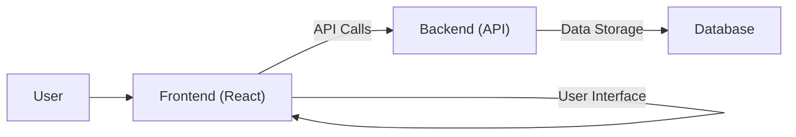

# Building and Running the Application

This section details the process of building and running the "med-reminder" application. It covers the necessary steps to get the project up and running, including installing dependencies, building the application, and running it in development and production environments.

## Prerequisites

Before building and running the application, ensure you have the following installed on your system:

*   **Node.js and npm/yarn/pnpm:** These are essential for managing project dependencies and running build scripts. You can download and install them from the official Node.js website ([https://nodejs.org/](https://nodejs.org/)).

## Installation and Setup

1.  **Clone the Repository:** First, clone the "med-reminder" repository to your local machine:

    ```bash
    git clone [repository-url]  # Replace [repository-url] with the actual repository URL.
    cd med-reminder
    ```

2.  **Install Dependencies:** Navigate to the project directory and install the project dependencies using npm, yarn, or pnpm. This command will read the `package.json` file to identify and install all required packages.

    ```bash
    npm install  # or yarn install or pnpm install
    ```

## Build Process

The build process transforms the source code into optimized files that can be deployed to a production environment. This typically involves tasks like:

*   **Transpilation:** Converting modern JavaScript (ES modules, JSX) to code that older browsers can understand.
*   **Bundling:** Combining multiple JavaScript and CSS files into fewer files to reduce the number of HTTP requests.
*   **Minification:** Reducing the size of the JavaScript and CSS files by removing whitespace and shortening variable names.

The `build` script defined in the `package.json` file handles the build process.

### Understanding `package.json`

The `package.json` file ([View on GitHub](https://github.com/santrupt29/med_reminder/blob/main/package.json)) is the heart of the project. It contains metadata about the project, including the project name, version, dependencies, and scripts.

```json
{
  "name": "med-reminder",
  "private": true,
  "version": "0.0.0",
  "type": "module",
  "scripts": {
    "dev": "vite",
    "build": "vite build",
    "preview": "vite preview"
  },
  "dependencies": {
    "@radix-ui/react-alert-dialog": "^1.0.5",
    "@radix-ui/react-slot": "^1.0.2",
    "class-variance-authority": "^0.7.0",
    "clsx": "^2.1.0",
    "framer-motion": "^12.4.0",
    "lucide-react": "^0.263.1",
    "react": "^18.2.0",
    "react-dom": "^18.2.0",
    "tailwind-merge": "^2.2.0",
    "tailwindcss-animate": "^1.0.7"
  },
  "devDependencies": {
    "@types/react": "^18.2.48",
    "@types/react-dom": "^18.2.18",
    "@vitejs/plugin-react": "^4.2.1",
    "autoprefixer": "^10.4.20",
    "postcss": "^8.5.1",
    "tailwindcss": "^3.4.17",
    "vite": "^6.1.0"
  }
}
```

*   **`scripts`**:  The `scripts` section defines commands that can be executed using `npm run <script-name>`.
    *   `dev`: Starts the development server.
    *   `build`: Builds the application for production.
    *   `preview`: Serves the built application for previewing the production build.
*   **`dependencies`**: Lists the packages required for the application to function.
*   **`devDependencies`**: Lists the packages needed for development (e.g., testing, building).

### Running the Build Script

To build the application, use the following command:

```bash
npm run build  # or yarn build or pnpm build
```

This command will execute the `build` script defined in `package.json`, which, in this case, uses Vite to build the project. The output of the build process will typically be located in a `dist` directory.

## Running the Application

There are two main ways to run the application: in development mode and in production mode.

### Development Mode

Development mode is used during the development phase, providing features like hot module replacement (HMR), which automatically updates the browser when code changes.

1.  **Start the Development Server:**  Use the following command to start the development server:

    ```bash
    npm run dev  # or yarn dev or pnpm dev
    ```

    This command will execute the `dev` script in `package.json`, which uses Vite to start a development server. The server will usually be accessible at `http://localhost:5173/` (or a similar port).

2.  **Access the Application:** Open your web browser and navigate to the address provided by the development server (e.g., `http://localhost:5173/`).

### Production Mode

Production mode is used for deploying the application to a live server.  It serves the optimized build generated by the `build` script.

1.  **Build the Application:** Ensure you have built the application using `npm run build` as described above.
2.  **Preview the Production Build:**  To preview the production build locally before deploying, you can use the `preview` script:

    ```bash
    npm run preview  # or yarn preview or pnpm preview
    ```

    This will start a local server that serves the contents of the `dist` directory, allowing you to test the production build locally.
3.  **Deployment:** Deploy the contents of the `dist` directory to a web server or hosting platform.  The specific deployment process will depend on your chosen platform.

## Configuration

The build process is configured using `vite.config.js`.

### Understanding `vite.config.js`

The `vite.config.js` file ([View on GitHub](https://github.com/santrupt29/med_reminder/blob/main/vite.config.js)) configures Vite, the build tool used by this project.

```javascript
// vite.config.js
import { defineConfig } from 'vite'
import react from '@vitejs/plugin-react'

export default defineConfig({
  plugins: [react()],
})
```

*   **`import { defineConfig } from 'vite'`**: Imports the `defineConfig` function, which is used to configure Vite.
*   **`import react from '@vitejs/plugin-react'`**: Imports the `@vitejs/plugin-react` plugin, which enables React support.
*   **`export default defineConfig({ ... })`**: Exports the Vite configuration object.
    *   `plugins`: An array of Vite plugins. In this case, it includes the `react()` plugin to handle React code.

## Example: Basic Component Usage

Here's an example of how you might use a React component within the application:

```javascript
// src/components/MyComponent.jsx (example, not in the original repo)
import React from 'react';

function MyComponent() {
  return (
    <div>
      <h1>Hello, Med Reminder!</h1>
      <p>This is a basic example component.</p>
    </div>
  );
}

export default MyComponent;
```

```javascript
// src/App.jsx (example, not in the original repo)
import React from 'react';
import MyComponent from './components/MyComponent';

function App() {
  return (
    <div>
      <MyComponent />
    </div>
  );
}

export default App;
```

These snippets are hypothetical and are provided to show a basic example of the react component and its usage.

## Mermaid Diagrams





```mermaid
flowchart LR
    A["npm run dev"] --> B{Vite Development Server}
    B --> C[Hot Module Replacement]
    B --> D[Browser (http://localhost:5173/)]
    A --> E["npm run build"]
    E --> F[Vite Bundling & Optimization]
    F --> G[dist/ directory]
    G --> H[Production Deployment]
```


## Key Integration Points

*   **Dependency Management:** The `package.json` file is crucial for managing project dependencies. Ensure that all necessary dependencies are listed and up-to-date. Regularly update dependencies to benefit from bug fixes and security patches.
*   **Build Process Optimization:**  Leverage Vite's features to optimize the build process.  Consider using code splitting, lazy loading, and other optimization techniques to improve the application's performance.
*   **Environment Variables:** For sensitive information (API keys, database credentials), use environment variables. This keeps sensitive data out of your codebase and allows you to configure different settings for different environments (development, production). You can access environment variables using `import.meta.env` in your React components.
*   **Deployment Strategies:** Choose a deployment strategy that suits your needs. Consider using a platform like Netlify, Vercel, or a traditional web server.  Ensure your deployment process correctly deploys the contents of the `dist` directory.