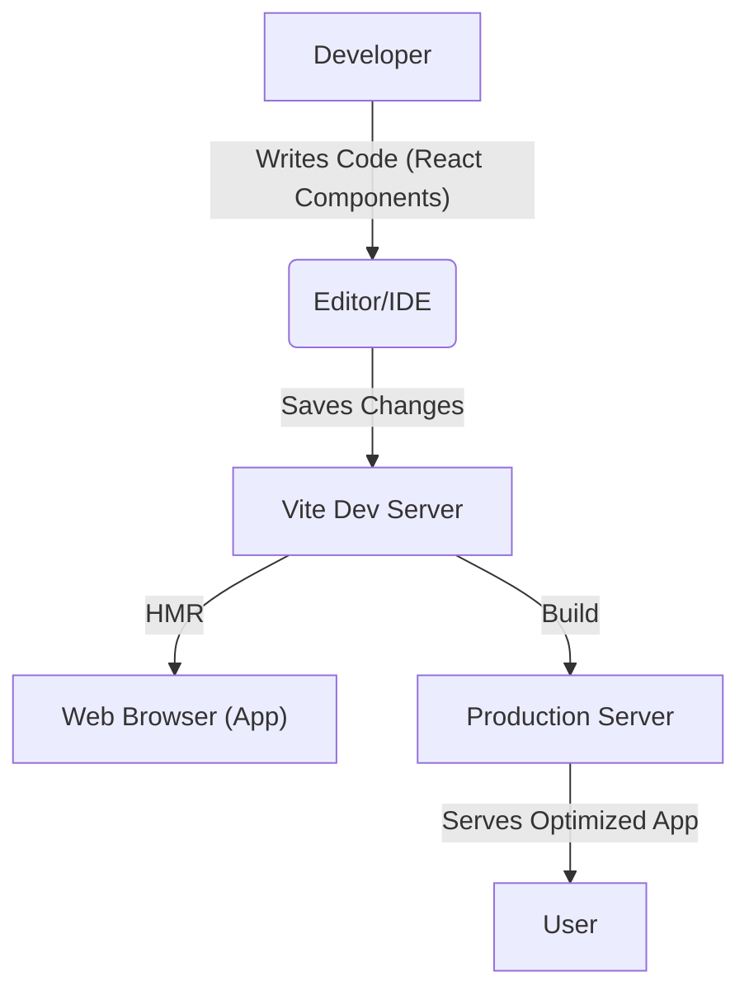
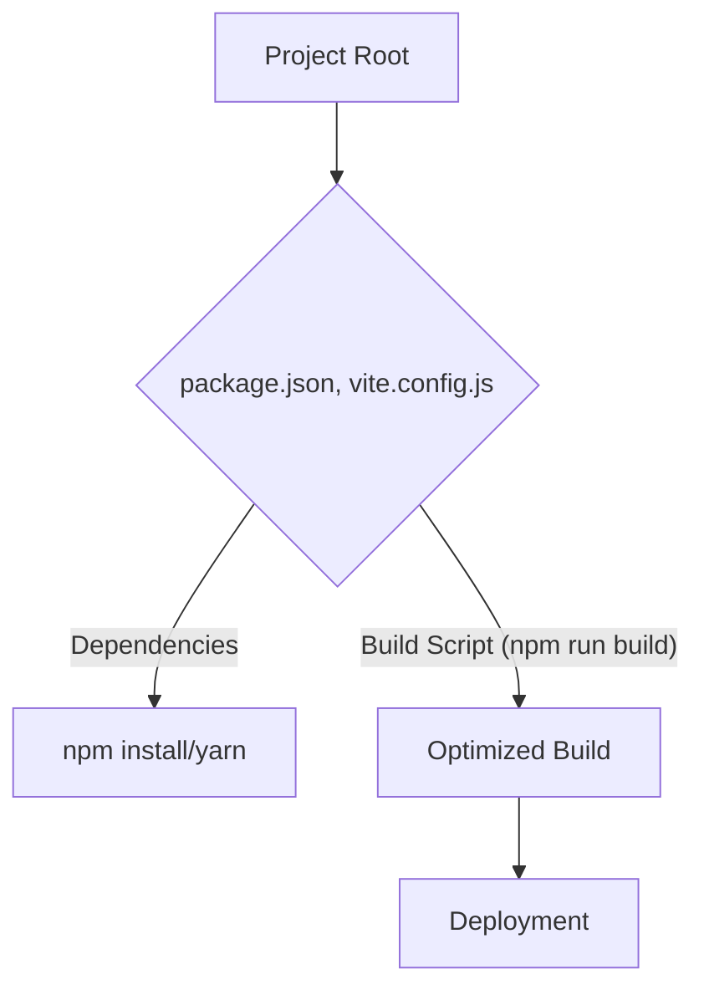

# Development Environment

This section details the development environment for the Med Reminder project, focusing on the build process and the tools used. The project leverages Vite, a modern build tool, for fast development and efficient bundling of the React application.

## Build Process and Tooling

The Med Reminder project utilizes Vite as its primary build tool. Vite offers several advantages, including significantly faster cold start times, hot module replacement (HMR), and optimized production builds. This leads to a more efficient and enjoyable development experience.

### Vite Configuration

The core of the build process is defined within the `vite.config.js` file. This file configures Vite to handle various aspects of the build, such as plugins, modules, and optimization strategies.

Here's the content of `vite.config.js`:

```javascript
// vite.config.js
import { defineConfig } from 'vite'
import react from '@vitejs/plugin-react'

export default defineConfig({
  plugins: [react()],
})
```

[View on GitHub](https://github.com/santrupt29/med_reminder/blob/main/vite.config.js)

This configuration does the following:

1.  **Import necessary modules:** It imports `defineConfig` from 'vite' and the `react` plugin from '@vitejs/plugin-react'.
2.  **Configure Vite:** It uses `defineConfig` to define the Vite configuration.
3.  **Use React Plugin:** It registers the `react` plugin. This plugin is essential for transforming and bundling React components.

This minimal configuration demonstrates the simplicity of using Vite. As the project grows, this file can be extended to include other plugins for tasks like CSS pre-processing, environment variable handling, and code optimization.

### Package Management

The project uses npm or yarn (as determined by the `package-lock.json` or `yarn.lock` file presence) for package management. This involves:

1.  **Installing dependencies:** Running `npm install` (or `yarn`) installs all project dependencies listed in the `package.json` file.
2.  **Managing dependencies:**  The `package.json` file lists all project dependencies, along with their versions. This ensures that the project can be consistently rebuilt across different environments.
3.  **Running scripts:**  Scripts defined in the `package.json` file, such as `npm run dev` (or `yarn dev`) for development builds and `npm run build` (or `yarn build`) for production builds, are used to execute build commands.

### Development Workflow

The typical development workflow involves these steps:

1.  **Install Dependencies:** `npm install` (or `yarn`)
2.  **Start Development Server:** `npm run dev` (or `yarn dev`) to start the Vite development server. This server provides features like HMR for rapid development.
3.  **Code Changes:** Make changes to the React components. Vite automatically updates the application in the browser.
4.  **Build for Production:** `npm run build` (or `yarn build`) generates an optimized production build, ready for deployment.

## Code Snippets and Explanations

Here are a few code snippets to illustrate key aspects of the development process.

### React Component Example

This is a simple React component that might be used within the Med Reminder application:

```javascript
// src/components/MedicationReminder.jsx
import React from 'react';

function MedicationReminder({ medicationName, time }) {
  return (
    <div>
      <p>Medication: {medicationName}</p>
      <p>Time: {time}</p>
    </div>
  );
}

export default MedicationReminder;
```

[View on GitHub](https://github.com/santrupt29/med_reminder/blob/main/src/components/MedicationReminder.jsx) (Example path, might not exist exactly)

This component displays the medication name and the scheduled time.

### Using the Component in App.js

Here's how this component might be used in the main application file (example):

```javascript
// src/App.js
import React from 'react';
import MedicationReminder from './components/MedicationReminder';

function App() {
  return (
    <div>
      <h1>Medication Reminder App</h1>
      <MedicationReminder medicationName="Aspirin" time="8:00 AM" />
      {/* More reminders can be added here */}
    </div>
  );
}

export default App;
```

[View on GitHub](https://github.com/santrupt29/med_reminder/blob/main/src/App.js) (Example path, might not exist exactly)

This `App` component imports and renders the `MedicationReminder` component.

### Example of Handling a Form

A potential form handling example might look like this (example only):

```javascript
// src/components/AddMedicationForm.jsx
import React, { useState } from 'react';

function AddMedicationForm() {
  const [medicationName, setMedicationName] = useState('');
  const [time, setTime] = useState('');

  const handleSubmit = (event) => {
    event.preventDefault();
    // Logic to add the medication
    console.log('Adding medication:', medicationName, time);
    // Reset form
    setMedicationName('');
    setTime('');
  };

  return (
    <form onSubmit={handleSubmit}>
      <label>Medication Name:</label>
      <input type="text" value={medicationName} onChange={(e) => setMedicationName(e.target.value)} required />
      <label>Time:</label>
      <input type="time" value={time} onChange={(e) => setTime(e.target.value)} required />
      <button type="submit">Add Reminder</button>
    </form>
  );
}

export default AddMedicationForm;
```

[View on GitHub](https://github.com/santrupt29/med_reminder/blob/main/src/components/AddMedicationForm.jsx) (Example path, might not exist exactly)

This component manages the state for medication name and time, providing a form to add new reminders.

### Environment Variable Example (Conceptual)

While not in the current `vite.config.js`, environment variables are often utilized.  Here's how you might access one (using Vite's built-in functionality):

```javascript
// src/App.js (or similar)
const API_URL = import.meta.env.VITE_API_URL; // Assuming you have .env.local file
```

[View on GitHub](https://github.com/santrupt29/med_reminder/blob/main/src/App.js) (Example path, might not exist exactly) (Conceptual - assumes an `.env.local` file.)

This snippet demonstrates accessing an environment variable.  Vite handles the loading of these variables, typically from `.env.local` or `.env.production`.

## Key Integration Points

Vite integrates seamlessly with React to streamline the development workflow. The core integration points are:

1.  **Plugin Configuration:** The `react` plugin within `vite.config.js` enables the transformation of JSX code.
2.  **HMR:** Vite's HMR feature provides instant feedback during development, reflecting code changes in the browser without full page reloads.
3.  **Production Builds:**  Vite optimizes the application for production, bundling and minifying the code for improved performance.

## Mermaid Diagrams

Here are a couple of diagrams illustrating aspects of the development process.








These diagrams highlight the flow from code changes to a deployed application, emphasizing the role of Vite in the process.

This document serves as an overview of the development environment. Further details about specific features, libraries, or deployment strategies can be documented in separate sections.
```