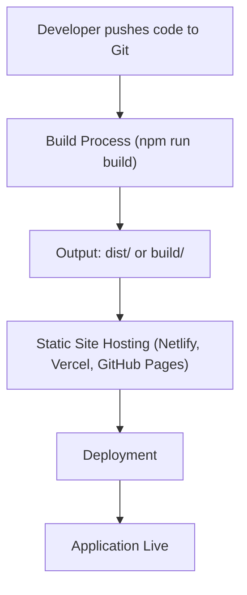

# Deployment and Build

This section details the build and deployment process for the MediRemind Pro application. It covers the necessary steps to get the application up and running, including build configurations and deployment considerations.

## Build Process

The MediRemind Pro application is built using a modern JavaScript build process, likely leveraging tools like Webpack or Vite to bundle the source code. The core of the application's user interface is rendered in the `index.html` file, which serves as the entry point for the application.

### Key Files and Technologies

*   **`index.html`**: This is the main HTML file that serves as the entry point for the application. It includes the necessary `<meta>` tags for responsiveness and links the bundled JavaScript file.

    ```html
    <!DOCTYPE html>
    <html lang="en">
      <head>
        <meta charset="UTF-8" />
        <meta name="viewport" content="width=device-width, initial-scale=1.0" />
        <title>MediRemind Pro</title>
      </head>
      <body>
        <div id="root"></div>
        <script type="module" src="/src/main.jsx"></script>
      </body>
    </html>
    ```

    [View on GitHub](https://github.com/santrupt29/med_reminder/blob/main/index.html)

*   **`/src/main.jsx`**: This file is likely the entry point for the React application. It's responsible for rendering the main application component into the DOM element with the ID `root` in `index.html`. This indicates the application is built using React or a similar framework.

### Build Steps

The build process typically involves the following steps:

1.  **Dependency Installation**: The application's dependencies (e.g., React, any UI libraries, state management libraries, etc.) are installed using a package manager like npm or yarn. This is usually managed by a `package.json` file in the project root.
2.  **Code Compilation/Transpilation**: Source code (likely JSX, TypeScript, or similar) is compiled/transpiled into standard JavaScript that the browser can understand. This step is usually handled by a build tool such as Webpack, Parcel, or Vite, using configurations defined in files like `webpack.config.js` or `vite.config.js`.
3.  **Bundling**: The build tool bundles all the JavaScript modules and assets (CSS, images, etc.) into a set of optimized files. This often involves code minification (removing unnecessary characters), tree-shaking (removing unused code), and asset optimization.
4.  **Output**: The build process generates the output files, which typically include the bundled JavaScript file, CSS files, and other assets. These files are usually placed in a designated `dist` or `build` directory.

### Example Build Command (Hypothetical)

Based on the common patterns used in modern JavaScript projects, the build command might look something like this (executed in the project's root directory):

```bash
npm run build
```

This command would trigger a script defined in the `package.json` file that runs the build tool (e.g., Webpack, Vite, or a similar bundler) to generate the production-ready assets.

### Build Configuration (Hypothetical)

The build configuration, specifying how the source code is processed and the output files are structured, will typically be defined in a configuration file such as `vite.config.js` or `webpack.config.js`. Here's a simplified example of what a possible `vite.config.js` might look like:

```javascript
// vite.config.js (Simplified Example)
import { defineConfig } from 'vite';
import react from '@vitejs/plugin-react';

export default defineConfig({
  plugins: [react()],
  build: {
    outDir: 'dist',
    sourcemap: false,
  },
});
```

This example shows the configuration using Vite, indicating that the `react` plugin is being used for React support and the output directory is set to `dist`. The specific configuration will depend on the libraries and tools used by the MediRemind Pro application.

## Deployment

The deployment process involves making the built application available to users. This can be done in several ways:

### Deployment Options

1.  **Static Site Hosting**:  The simplest deployment method is to deploy the built static assets (HTML, CSS, JavaScript, and images) to a static site hosting platform like Netlify, Vercel, or GitHub Pages. These platforms are designed for serving static content efficiently and often provide features like automatic deployments, CDN integration, and HTTPS.

2.  **Containerization (e.g., Docker)**: For more complex applications, containerization using Docker can be used.  This packages the application and its dependencies into a container, making it easy to deploy to various platforms.

3.  **Server-Side Deployment**:  If the application requires server-side logic (e.g., an API backend), it can be deployed to a server environment. This might involve using platforms like AWS, Google Cloud, or Azure, or a more traditional hosting provider.

### Deployment Steps (Static Site Example)

Assuming a static site deployment to Netlify or Vercel, the steps would be:

1.  **Build the application**:  Run the build command (e.g., `npm run build`) to generate the optimized assets.
2.  **Deploy the `dist` or `build` folder**:  Use the platform's CLI or web interface to deploy the contents of the `dist` or `build` folder to the hosting provider.  This usually involves a drag-and-drop upload, a CLI command, or connecting the project's repository.
3.  **Configure DNS (if necessary)**:  If a custom domain name is desired, the DNS settings need to be configured to point to the hosting provider.

### Example Deployment Configuration (Hypothetical - `.env` file for Vercel)

A deployment configuration might include environment variables for API endpoints or other configuration settings. For example, in a `.env` file:

```plaintext
VITE_API_URL=https://api.example.com
```

This `VITE_API_URL` variable can be accessed within the React application during runtime. This example uses `VITE_` prefix which is a common practice with Vite.

### Deployment Workflow (Mermaid Diagram)





## Key Integration Points

The `index.html` file serves as the crucial entry point for the application. Its primary function is to:

1.  **Load the JavaScript entry point:** The `<script>` tag with `src="/src/main.jsx"` tells the browser to fetch and execute the main application code.  This is where the React application starts.
2.  **Provide a DOM element for rendering:** The `<div id="root"></div>` provides the target element within the HTML where React will mount the application's components.
3.  **Set up the basic HTML structure:** Includes the essential `<!DOCTYPE html>`, `<head>`, and `<body>` tags, along with the viewport meta tag for responsive design.

Understanding the interplay between `index.html` and the build process, including the JavaScript entry point, is fundamental to debugging and understanding the application.