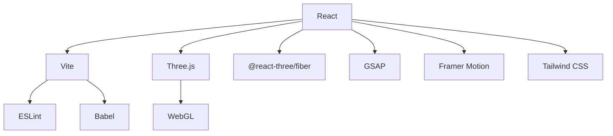

# Project Overview

This project is a 3D portfolio website built with React and Vite, showcasing skills and projects in an interactive and visually appealing manner. It leverages libraries like Three.js, @react-three/fiber, and GSAP for animations and 3D rendering, creating an immersive user experience. The portfolio aims to be both informative and engaging, providing a modern and dynamic way to present a developer's work.

## Key Features

*   **3D Environment:** Uses Three.js and @react-three/fiber to create an interactive 3D scene.
*   **Animations:** Employs GSAP and Framer Motion for smooth and engaging animations.
*   **Responsive Design:** Adapts to different screen sizes for optimal viewing on various devices.
*   **Modern Stack:** Built with React, Vite, and other cutting-edge technologies for performance and maintainability.
*   **Interactive Elements:** Includes interactive elements and components to enhance user engagement.

## Technology Stack

| Technology                | Description                                                                                               |
| :------------------------ | :-------------------------------------------------------------------------------------------------------- |
| React                     | A JavaScript library for building user interfaces.                                                        |
| Vite                      | A build tool that provides a fast and efficient development experience.                                   |
| Three.js                  | A JavaScript 3D library.                                                                                  |
| @react-three/fiber       | A React renderer for Three.js.                                                                            |
| GSAP                      | A JavaScript library for creating animations.                                                              |
| Framer Motion             | A production-ready motion library for React.                                                              |
| Tailwind CSS              | A utility-first CSS framework for rapidly building custom designs.                                         |
| Lenis                     | A smooth scroll library.                                                                                  |
| Lucide React              | A collection of beautiful, consistent icons.                                                             |
| @fortawesome/fontawesome | Comprehensive icon library for scalable vector graphics.                                               |
| Postprocessing            | A set of image effects for adding visual enhancements to the 3D scene. |

## Project Structure

The project follows a standard React + Vite structure. Key files and directories include:

*   `src/`: Contains the main application code.
*   `src/components/`: Houses reusable React components.
*   `public/`: Contains static assets like images and fonts.
*   `vite.config.js`: Vite configuration file.
*   `package.json`: Lists project dependencies and scripts.
*   `README.md`: Provides an overview of the project.

## Code Snippets and Explanations

1.  **Vite Configuration (vite.config.js):**

```javascript
// vite.config.js
import { defineConfig } from 'vite'
import react from '@vitejs/plugin-react'

// https://vite.dev/config/
export default defineConfig({
  plugins: [react()],
})
```

This snippet shows the basic Vite configuration, which includes the `@vitejs/plugin-react` plugin to enable React support. This setup allows for features like Hot Module Replacement (HMR) and JSX transformation.  [View on GitHub](https://github.com/santrupt29/portfolio/blob/main/vite.config.js)

2.  **Package Dependencies (package.json):**

```json
// package.json
{
  "name": "3dportfolioproject",
  "private": true,
  "version": "0.0.0",
  "type": "module",
  "scripts": {
    "dev": "vite",
    "build": "vite build",
    "lint": "eslint .",
    "preview": "vite preview"
  },
  "dependencies": {
    "@fortawesome/fontawesome-svg-core": "^7.1.0",
    "@fortawesome/free-brands-svg-icons": "^7.1.0",
    "@fortawesome/react-fontawesome": "^3.1.0",
    "@react-three/drei": "^10.7.3",
    "@react-three/fiber": "^9.3.0",
    "@react-three/postprocessing": "^3.0.4",
    "framer-motion": "^12.23.12",
    "gsap": "^3.13.0",
    "lenis": "^1.3.8",
    "leva": "^0.10.0",
    "lucide-react": "^0.540.0",
    "react": "^19.1.1",
    "react-dom": "^19.1.1",
    "three": "^0.179.1"
  },
  "devDependencies": {
    "@eslint/js": "^9.33.0",
    "@types/react": "^19.1.10",
    "@types/react-dom": "^19.1.7",
    "@vitejs/plugin-react": "^5.0.0",
    "autoprefixer": "^10.4.21",
    "eslint": "^9.33.0",
    "eslint-plugin-react-hooks": "^5.2.0",
    "eslint-plugin-react-refresh": "^0.4.20",
    "globals": "^16.3.0",
    "postcss": "^8.5.6",
    "tailwindcss": "^3.4.17",
    "vite": "^7.1.2"
  }
}
```

This `package.json` file lists the dependencies required for the project, including React, Three.js, @react-three/fiber, GSAP, and other libraries. It also defines the scripts for running the application in development, building it for production, and linting the code. [View on GitHub](https://github.com/santrupt29/portfolio/blob/main/package.json)

3.  **GSAP Animation Example (Conceptual):**

```javascript
// Example GSAP animation (Conceptual)
import gsap from 'gsap';

const animateElement = (element) => {
  gsap.to(element, {
    duration: 1,
    x: 100, // Move 100 pixels to the right
    opacity: 0.5,
    ease: "power2.inOut",
  });
};

export default animateElement;
```

This conceptual snippet demonstrates how GSAP can be used to animate an element. In a real component, you'd select an element (e.g., using useRef) and then apply the animation using `gsap.to()`.  It moves the element 100 pixels to the right and changes the opacity.

4.  **Lenis Smooth Scrolling (Conceptual Implementation):**

```javascript
// Example Lenis implementation (Conceptual)
import Lenis from '@studio-freight/lenis'

const lenis = new Lenis({
  duration: 1.2,
  easing: (t) => Math.min(1, 1.001 - Math.pow(2, -10 * t))
})

function raf(time) {
  lenis.raf(time)
  requestAnimationFrame(raf)
}

requestAnimationFrame(raf)
```

This snippet initializes Lenis for smooth scrolling. The `raf` function ensures that Lenis updates on each animation frame, providing a smooth scrolling experience.  [View on GitHub](https://github.com/santrupt29/portfolio/blob/main/TODO)
This requires initialization inside a useEffect hook and wrapping the application.

5.  **React Component Structure (Conceptual):**

```javascript
// Example React component (Conceptual)
import React from 'react';

const MyComponent = () => {
  return (
    <div>
      <h1>Hello, World!</h1>
      <p>This is a simple React component.</p>
    </div>
  );
};

export default MyComponent;
```

This example shows a basic React component structure.  Real components in the portfolio project would be more complex, incorporating 3D elements, animations, and interactions.

6.  **Tailwind CSS Styling (Conceptual):**

```html
// Example Tailwind CSS usage (Conceptual)
<div className="bg-blue-500 text-white p-4 rounded-md shadow-md">
  This is a styled element.
</div>
```

This snippet shows how Tailwind CSS classes can be used to style an element. The classes `bg-blue-500`, `text-white`, `p-4`, `rounded-md`, and `shadow-md` apply background color, text color, padding, rounded corners, and a shadow, respectively.

## Mermaid Diagrams

1.  **Technology Stack Diagram:**





This diagram illustrates the relationships between the main technologies used in the project.

2.  **Build and Deployment Flow:**


```mermaid
graph LR
    A["Code Changes"] --> B("Git Repository");
    B --> C{Build Process (Vite)};
    C -- "Success" --> D["Deployment (e.g., Netlify)"];
    C -- "Failure" --> E["Error Logs"];
    D --> F["Live Website"];
```


This diagram outlines the build and deployment process, from code changes to a live website.

## Key Integration Points

*   **React and @react-three/fiber:**  The project uses @react-three/fiber to seamlessly integrate Three.js scenes into React components.  This allows for a declarative approach to 3D development, making it easier to manage and update the scene.
*   **GSAP and Framer Motion:**  GSAP is used for complex animations, while Framer Motion provides a simple way to add transitions and interactions to React components.  These libraries work together to create a dynamic and engaging user experience.
*   **Vite and React:**  Vite's fast build times and HMR capabilities significantly improve the development experience.  The `@vitejs/plugin-react` plugin ensures compatibility between Vite and React.
*   **Lenis Integration:** Lenis provides smooth scrolling, enhancing the user experience by making navigation feel more fluid and responsive. Integrating Lenis involves initializing it and updating its state on each animation frame.

By effectively integrating these technologies, the portfolio project provides a modern and engaging showcase of skills and projects.
```