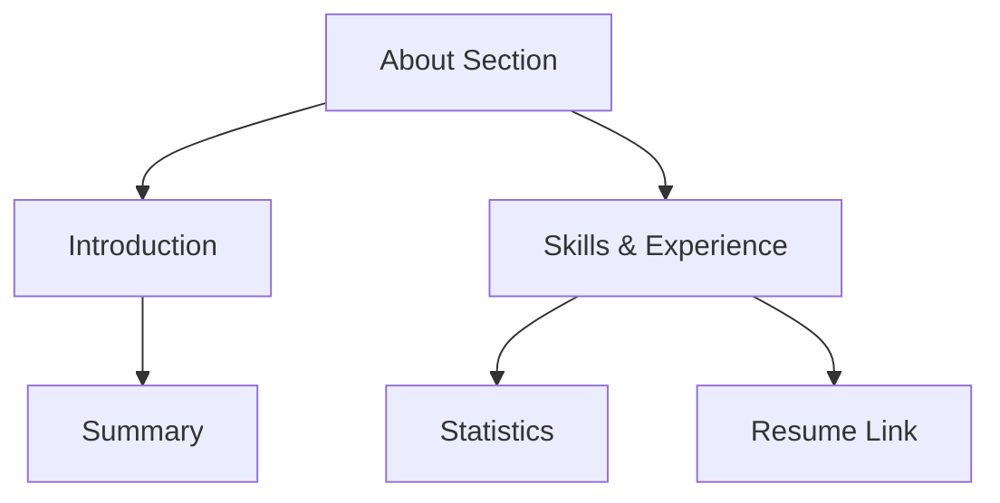
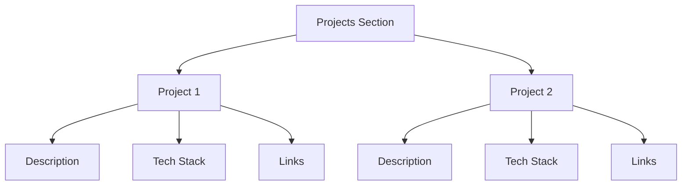
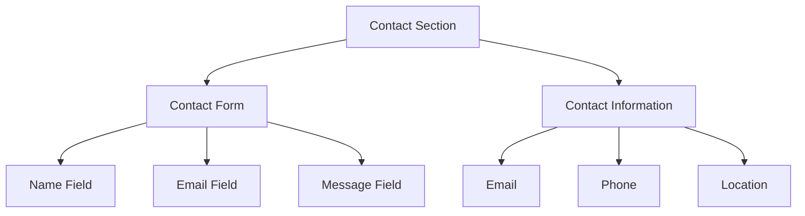

# User Interface Sections

This document describes the main sections of the user interface in the `santrupt29/portfolio` project, focusing on the About, Projects, and Contact sections. These sections are built using React.js and styled with Tailwind CSS, incorporating animations via Framer Motion and GSAP for an engaging user experience.

## About Section

The About section provides an introduction to the developer, highlighting skills and experience.

### Features

*   **Dynamic Animations:** Uses Framer Motion for smooth transitions and GSAP for scroll-triggered animations.
*   **Key Statistics:** Presents a summary of skills and accomplishments (projects completed, years of experience, etc.).
*   **Resume Download:** Offers a direct link to download the developer's resume.

### Code Snippets

#### Framer Motion Animation

This snippet shows how Framer Motion is used to animate the section title:

```javascript jsx
// src/components/AboutSection.jsx
import { motion, useInView } from 'framer-motion';
import { useRef } from 'react';

export default function AboutSection() {
  const sectionRef = useRef();
  const isInView = useInView(sectionRef, { once: true, margin: "-100px" });

  return (
    <section ref={sectionRef} id="about" className="min-h-screen py-20 relative">
      {/* ... other content ... */}
      <motion.div
        initial={{ opacity: 0, y: 50 }}
        animate={isInView ? { opacity: 1, y: 0 } : {}}
        transition={{ duration: 0.8, ease: "easeOut" }}
        className="text-center mb-16"
      >
        <h2 className="text-5xl md:text-6xl font-bold mb-6 bg-gradient-to-r from-white to-amber-200 bg-clip-text text-transparent">
          About Me
        </h2>
        <div className="w-24 h-1 bg-gradient-to-r from-amber-500 to-amber-600 mx-auto" />
      </motion.div>
      {/* ... other content ... */}
    </section>
  );
}
```

`useInView` hook tracks if the section is in the viewport. The `motion.div` component animates opacity and vertical position based on the `isInView` state. [View on GitHub](https://github.com/santrupt29/portfolio/blob/main/src/components/AboutSection.jsx).

#### GSAP ScrollTrigger Animation

This snippet shows how GSAP ScrollTrigger is used to animate the stats:

```javascript jsx
// src/components/AboutSection.jsx
import { useEffect, useRef } from 'react';
import { gsap } from 'gsap';
import { ScrollTrigger } from 'gsap/ScrollTrigger';

gsap.registerPlugin(ScrollTrigger);

export default function AboutSection() {
  const sectionRef = useRef();

  useEffect(() => {
    const ctx = gsap.context(() => {
      gsap.from('.about-stat', {
        scrollTrigger: {
          trigger: sectionRef.current,
          start: "top 70%",
          end: "bottom 30%",
        },
        y: 50,
        opacity: 0,
        duration: 0.8,
        stagger: 0.1,
        ease: "power2.out"
      })
    }, sectionRef)

    return () => ctx.revert()
  }, [])

  return (
    <section ref={sectionRef} id="about" className="min-h-screen py-20 relative">
          {/* ... other content ... */}
    </section>
  );
}
```

`gsap.from` animates elements with the class `about-stat` when the section is in view. ScrollTrigger defines the trigger element and start/end points. [View on GitHub](https://github.com/santrupt29/portfolio/blob/main/src/components/AboutSection.jsx).

### Mermaid Diagram





## Projects Section

The Projects section showcases featured projects with descriptions, technologies used, and links to live demos and source code.

### Features

*   **Project Highlighting:** Displays projects with titles, descriptions, and images.
*   **Technology Stack:** Lists the technologies used in each project.
*   **Live Demo and Source Code Links:** Provides direct access to live demos and GitHub repositories.

### Code Snippets

#### Project Mapping

This snippet shows how projects are mapped to create project cards:

```javascript jsx
// src/components/ProjectsSection.jsx
export default function ProjectsSection() {
  const projects = [
    {
      title: "PC Forge- Custom PC Builder",
      description: "A full stack web app for custom PC building with compatibility checking of all parts.",
      image: "/pc-forge.png",
      tech: ["React", "Express.js", "MongoDB", "Gemini API"],
      github: "https://github.com/santrupt29/pc_forge",
      live: "https://the-pc-forge.vercel.app",
      featured: true
    },
       {
      title: "Zync- Real-time team collaboration platform",
      description: "a full-stack real-time communication platform inspired by Slack, enabling seamless team collaboration.",
      image: "/zync.png",
      tech: ["React", "Express.js", "MongoDB", "Stream Chat", "Clerk Auth", "Inngest"],
      github: "https://github.com/santrupt29/zync",
      live: "https://zync-frontend.vercel.app/",
      featured: true
    },
    {
      title: "3D Portfolio Website",
      description: "Interactive 3D portfolio built with React Three Fiber featuring immersive animations.",
      image: "/portfolio.png",
      tech: ["React", "Three.js", "R3F", "GSAP"],
      github: "https://github.com/santrupt29/portfolio",
      live: "#",
      featured: true
    },
  ];

  return (
    <section id="projects">
      {projects.map((project, index) => (
        <div key={index}>
          {project.title}
        </div>
      ))}
    </section>
  );
}
```

The `projects` array contains project details. The `map` function iterates over the array to render project cards. [View on GitHub](https://github.com/santrupt29/portfolio/blob/main/src/components/ProjectsSection.jsx).

#### Project Links

This snippet shows how external links are added to each project:

```javascript jsx
// src/components/ProjectsSection.jsx
import { ExternalLink, Github, Eye } from 'lucide-react'
export default function ProjectsSection() {
  const projects = [
        {
      title: "PC Forge- Custom PC Builder",
      description: "A full stack web app for custom PC building with compatibility checking of all parts.",
      image: "/pc-forge.png",
      tech: ["React", "Express.js", "MongoDB", "Gemini API"],
      github: "https://github.com/santrupt29/pc_forge",
      live: "https://the-pc-forge.vercel.app",
      featured: true
    },
           {
      title: "Zync- Real-time team collaboration platform",
      description: "a full-stack real-time communication platform inspired by Slack, enabling seamless team collaboration.",
      image: "/zync.png",
      tech: ["React", "Express.js", "MongoDB", "Stream Chat", "Clerk Auth", "Inngest"],
      github: "https://github.com/santrupt29/zync",
      live: "https://zync-frontend.vercel.app/",
      featured: true
    },
    {
      title: "3D Portfolio Website",
      description: "Interactive 3D portfolio built with React Three Fiber featuring immersive animations.",
      image: "/portfolio.png",
      tech: ["React", "Three.js", "R3F", "GSAP"],
      github: "https://github.com/santrupt29/portfolio",
      live: "#",
      featured: true
    },
  ];
  return (
    <section id="projects">
      {projects.map((project, index) => (
          <motion.a
            whileHover={{ scale: 1.05 }}
            href={project.live}
            className="flex items-center gap-2 text-amber-400 hover:text-amber-300 transition-colors"
          >
            <ExternalLink size={16} />
            Live Demo
          </motion.a>
      ))}
    </section>
  );
}
```

`ExternalLink`, `Github`, and `Eye` icons are imported from `lucide-react`.  `motion.a` component is used to wrap the links to apply hover effects. [View on GitHub](https://github.com/santrupt29/portfolio/blob/main/src/components/ProjectsSection.jsx).

### Mermaid Diagram





## Contact Section

The Contact section provides a form for users to send messages and displays contact information.

### Features

*   **Contact Form:** Allows users to send messages directly.
*   **Contact Information:** Displays email, phone number, and location.
*   **Social Media Links:** Provides links to social media profiles.

### Code Snippets

#### Form Submission Handling

This snippet shows how the contact form is handled:

```javascript jsx
// src/components/ContactSection.jsx
import { useState } from 'react';

export default function ContactSection() {
  const [formData, setFormData] = useState({
    name: '',
    email: '',
    subject: '',
    message: ''
  });
  const [isSubmitting, setIsSubmitting] = useState(false);

  const handleSubmit = async (e) => {
    e.preventDefault();
    setIsSubmitting(true);

    // Simulate form submission
    await new Promise(resolve => setTimeout(resolve, 2000));

    console.log('Form submitted:', formData);
    setIsSubmitting(false);
    setFormData({ name: '', email: '', subject: '', message: '' });
  };

  return (
    <section id="contact">
      <form onSubmit={handleSubmit}>
        {/* Form fields */}
      </form>
    </section>
  );
}
```

`useState` hook manages form data and submission state. `handleSubmit` function is called on form submission. [View on GitHub](https://github.com/santrupt29/portfolio/blob/main/src/components/ContactSection.jsx).

#### Contact Information Display

This snippet shows how contact information is displayed:

```javascript jsx
// src/components/ContactSection.jsx
import { Mail, Phone, MapPin } from 'lucide-react'
export default function ContactSection() {
  const contactInfo = [
    {
      icon: Mail,
      label: "Email",
      value: "santrupt.potphode29@gmail.com",
      link: "mailto:santrupt.potphode29@gmail.com"
    },
    {
      icon: Phone,
      label: "Phone",
      value: "+91-9823541475",
      link: "tel:+91-9823541475"
    },
    {
      icon: MapPin,
      label: "Location",
      value: "Mumbai, India",
      link: "#"
    }
  ];

  return (
    <section id="contact">
      {contactInfo.map((info, index) => (
        <a key={index} href={info.link}>
          {info.label}: {info.value}
        </a>
      ))}
    </section>
  );
}
```

The `contactInfo` array stores contact details. The `map` function iterates over the array to render contact information.  Icons are imported from `lucide-react`. [View on GitHub](https://github.com/santrupt29/portfolio/blob/main/src/components/ContactSection.jsx).

### Mermaid Diagram





## Key Integration Points

*   **Framer Motion and GSAP:** Used extensively for animations, providing a smooth and engaging user experience.
*   **Tailwind CSS:** Provides a consistent and responsive design across all sections.
*   **React.js:** Component-based architecture facilitates modularity and reusability.

This combination ensures the portfolio is not only visually appealing but also performs efficiently across devices.
```