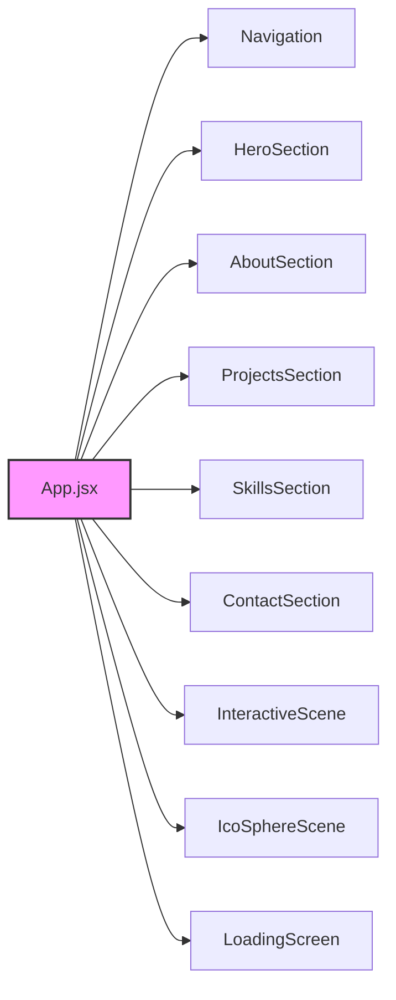
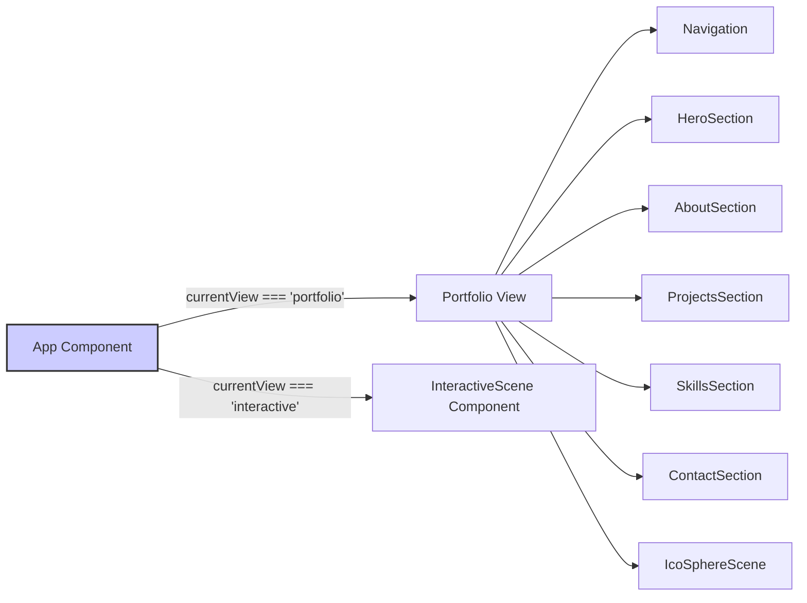

# Core Components

This section details the core components that form the foundation of the portfolio application. Understanding these components and their interactions is crucial for anyone looking to contribute to or modify the application.

## Overview

The application is built using React and leverages libraries such as `@react-three/fiber` for 3D rendering and `lenis` for smooth scrolling. The core functionality is divided into several key components, each responsible for a specific aspect of the user interface and experience. The application supports two main views: a portfolio view and an interactive 3D scene view.

## Key Components

*   **App.jsx:** The main application component that orchestrates the rendering of different sections and manages the view state.
*   **Navigation:**  A component responsible for the navigation bar, allowing users to easily navigate between different sections of the portfolio.
*   **HeroSection:** Introduces the user with a brief introduction and call to action.
*   **AboutSection:** Provides more detailed information about the individual.
*   **ProjectsSection:** Showcases the projects.
*   **SkillsSection:** Highlights the skills.
*   **ContactSection:** Includes methods to contact.
*   **InteractiveScene:** A 3D scene where users can interact with elements.
*   **IcoSphereScene:** A background 3D scene of animated IcoSpheres.
*   **LoadingScreen:**  A full screen component to mask initial load times of assets.

## App.jsx: The Root Component

`App.jsx` serves as the entry point for the application. It manages the overall application state, including the current view ('portfolio' or 'interactive'), and orchestrates the rendering of the appropriate components. It also initializes `Lenis` for smooth scrolling.

```javascript title="src/App.jsx"
import { Suspense, useEffect, useState } from 'react'
import { Canvas } from '@react-three/fiber'
import { Leva } from 'leva'
import Lenis from 'lenis'
import { Menu, X } from 'lucide-react'
import LoadingScreen from './components/LoadingScreen'
import Navigation from './components/Navigation'
import HeroSection from './components/HeroSection'
import AboutSection from './components/AboutSection'
import ProjectsSection from './components/ProjectsSection'
import SkillsSection from './components/SkillsSection'
import ContactSection from './components/ContactSection'
import InteractiveScene from './components/InteractiveScene'
import IcoSphereScene from './components/IcoSphereScene'
import './App.css'

function App() {
  const [currentView, setCurrentView] = useState('portfolio') // 'portfolio' or 'interactive'

  useEffect(() => {
    const lenis = new Lenis({
      duration: 1.2,
      easing: (t) => Math.min(1, 1.001 - Math.pow(2, -10 * t)),
      direction: 'vertical',
      gestureDirection: 'vertical',
      smooth: true,
      mouseMultiplier: 1,
      smoothTouch: false,
      touchMultiplier: 2,
      infinite: false,
    })

    function raf(time) {
      lenis.raf(time)
      requestAnimationFrame(raf)
    }
    requestAnimationFrame(raf)

    return () => lenis.destroy()
  }, [])

  return (
    <>
      <Leva hidden />
      <LoadingScreen />
      
      {/* View Toggle Button */}
      <button
        onClick={() => setCurrentView(currentView === 'portfolio' ? 'interactive' : 'portfolio')}
        className="fixed top-4 right-4 z-50 px-4 py-2 bg-amber-500 text-black rounded-lg hover:bg-amber-400 transition-colors font-semibold"
      >
        {currentView === 'portfolio' ? '3D' : 'Portfolio'}
      </button>

      {currentView === 'portfolio' ? (
        // Portfolio View
        <>
          <div className="fixed inset-0 -z-10">
            <IcoSphereScene 
              enableOrbitControls={false}
              sphereCount={25}
              backgroundColor="transparent"
            />
          </div>
          <div className="relative z-10">
            <Navigation />
            <main>
              <HeroSection />
              <AboutSection />
              <ProjectsSection />
              <SkillsSection />
              <ContactSection />
            </main>
          </div>
        </>
      ) : (
        // Interactive Scene View
        <InteractiveScene />
      )}
    </>
  )
}

export default App
```

[View on GitHub](https://github.com/santrupt29/portfolio/blob/main/src/App.jsx)

### View Switching Logic

The `currentView` state variable determines which view is displayed.  A button is provided for the user to toggle between the 'portfolio' and 'interactive' views.  Conditional rendering is used to display the appropriate content based on the `currentView` state.

```javascript title="src/App.jsx - View Toggle"
const [currentView, setCurrentView] = useState('portfolio');

{currentView === 'portfolio' ? (
    // Portfolio View
    <>
        {/* Portfolio components */}
    </>
) : (
    // Interactive Scene View
    <InteractiveScene />
)}
```

[View on GitHub](https://github.com/santrupt29/portfolio/blob/main/src/App.jsx)

### Lenis Smooth Scrolling

The `useEffect` hook initializes `Lenis`, a smooth scrolling library.  This effect runs once when the component mounts and sets up the smooth scrolling behavior for the application.

```javascript title="src/App.jsx - Lenis Initialization"
useEffect(() => {
    const lenis = new Lenis({
        duration: 1.2,
        easing: (t) => Math.min(1, 1.001 - Math.pow(2, -10 * t)),
        direction: 'vertical',
        gestureDirection: 'vertical',
        smooth: true,
        mouseMultiplier: 1,
        smoothTouch: false,
        touchMultiplier: 2,
        infinite: false,
    });

    function raf(time) {
        lenis.raf(time);
        requestAnimationFrame(raf);
    }
    requestAnimationFrame(raf);

    return () => lenis.destroy();
}, []);
```

[View on GitHub](https://github.com/santrupt29/portfolio/blob/main/src/App.jsx)

## Index.jsx: React Entry Point

`index.jsx` is the starting point for the React application. It imports the necessary React libraries and renders the `<App />` component into the root DOM element.

```javascript title="src/index.jsx"
import React from 'react';
import ReactDOM from 'react-dom/client';
import './index.css';
import App from './App';

const root = ReactDOM.createRoot(document.getElementById('root'));
root.render(
  <React.StrictMode>
    <App />
  </React.StrictMode>
);
```

[View on GitHub](https://github.com/santrupt29/portfolio/blob/main/src/index.jsx)

### React Strict Mode

The `<React.StrictMode>` component is used to highlight potential problems in the application during development. It activates additional checks and warnings to ensure best practices are followed.

## Component Interaction

The following diagram illustrates the high-level interaction between the core components of the application.





## Key Integration Points

*   **State Management:** The `App` component uses the `useState` hook to manage the current view.  This state is used to conditionally render different sections of the application.
*   **Lifecycle Management:** The `useEffect` hook is used to initialize and destroy the `Lenis` smooth scrolling library.
*   **Component Composition:** The `App` component composes several smaller components to build the overall user interface.
*   **3D Rendering:**  The application uses `@react-three/fiber` to render 3D scenes in both the portfolio and interactive views.

## View Component Rendering
The application renders one of two 'views' depending on the user selection: the portfolio or the interactive scene.




