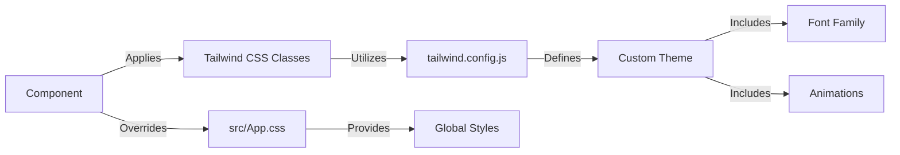

# Styling and Theming

This document outlines the styling and theming approach used in this portfolio project. The project leverages Tailwind CSS for utility-first styling and custom CSS for specific components and global styles.

## Core Styling Approach

The project adopts a utility-first approach using Tailwind CSS, supplemented by custom CSS for specific styling needs. This allows for rapid prototyping and consistent design throughout the application. Key files involved in styling are `src/App.css`, `src/index.css`, and `tailwind.config.js`.

### Tailwind CSS Configuration

Tailwind CSS is configured in `tailwind.config.js` to customize the theme, fonts, and animations. This file extends the default Tailwind theme with custom font families and keyframe animations.

```javascript title="tailwind.config.js"
/** @type {import('tailwindcss').Config} */
// tailwind.config.js
module.exports = {
  content: [
    "./index.html",
    "./src/**/*.{js,ts,jsx,tsx}",
  ],
  theme: {
    extend: {
      fontFamily: {
        sans: ['Inter', 'system-ui', 'sans-serif'],
      },
      animation: {
        'gradient': 'gradient 6s linear infinite',
      },
      keyframes: {
        gradient: {
          '0%, 100%': {
            'background-size': '200% 200%',
            'background-position': 'left center'
          },
          '50%': {
            'background-size': '200% 200%',
            'background-position': 'right center'
          },
        },
      },
    },
  },
  plugins: [],
}
```

[View on GitHub](https://github.com/santrupt29/portfolio/blob/main/tailwind.config.js)

This snippet shows the configuration for Tailwind CSS, including extending the default theme with the 'Inter' font family and defining a 'gradient' animation. The `content` array specifies the files to scan for Tailwind classes.

### Global Styles in `src/App.css`

The `src/App.css` file imports Tailwind's base, components, and utilities, and sets global styles for the application. This includes setting the font family, background color, and text color. It also configures a custom scrollbar and defines a transition property for smooth animations.

```css title="src/App.css"
/* src/App.css */
@import 'tailwindcss/base';
@import 'tailwindcss/components';
@import 'tailwindcss/utilities';
@import url('https://fonts.googleapis.com/css2?family=Inter:wght@300;400;500;600;700;800;900&display=swap');

* {
  margin: 0;
  padding: 0;
  box-sizing: border-box;
}

html {
  scroll-behavior: smooth;
}

body {
  font-family: 'Inter', sans-serif;
  background: #0f172a;
  color: white;
  overflow-x: hidden;
}

/* Custom scrollbar */
::-webkit-scrollbar {
  width: 8px;
}

::-webkit-scrollbar-track {
  background: #1e293b;
}

::-webkit-scrollbar-thumb {
  background: #f59e0b;
  border-radius: 4px;
}

::-webkit-scrollbar-thumb:hover {
  background: #d97706;
}

/* Smooth animations */
* {
  transition: color 0.15s ease, background-color 0.15s ease, border-color 0.15s ease;
}
```

[View on GitHub](https://github.com/santrupt29/portfolio/blob/main/src/App.css)

The `@import` statements bring in Tailwind's styles. The `body` styles set the default font, background, and text color. The scrollbar styling provides a custom look for scrollbars across the application.

### CSS Reset and Tailwind Layers in `src/index.css`

The `src/index.css` file imports the Tailwind layers. This ensures that Tailwind's base styles are applied correctly.

```css title="src/index.css"
@tailwind base;
@tailwind components;
@tailwind utilities;
```

[View on GitHub](https://github.com/santrupt29/portfolio/blob/main/src/index.css)

This file is essential for including Tailwind's pre-defined styles into the project. By importing `base`, `components`, and `utilities`, the project leverages Tailwind's utility-first approach.

### Custom Scrollbar Styling

The project implements a custom scrollbar style for a more personalized look and feel.

```css
/* Custom scrollbar */
::-webkit-scrollbar {
  width: 8px;
}

::-webkit-scrollbar-track {
  background: #1e293b;
}

::-webkit-scrollbar-thumb {
  background: #f59e0b;
  border-radius: 4px;
}

::-webkit-scrollbar-thumb:hover {
  background: #d97706;
}
```

This CSS snippet targets webkit-based browsers (Chrome, Safari) to style the scrollbar. The `::-webkit-scrollbar` selector targets the scrollbar itself, `::-webkit-scrollbar-track` targets the area behind the scrollbar, and `::-webkit-scrollbar-thumb` targets the draggable part of the scrollbar.

### Smooth Animations

The project incorporates smooth animations to enhance the user experience.

```css
/* Smooth animations */
* {
  transition: color 0.15s ease, background-color 0.15s ease, border-color 0.15s ease;
}
```

This CSS rule applies a transition to all elements on the page, ensuring smooth changes in color, background color, and border color.

### Gradient Animation

A gradient animation is defined in `tailwind.config.js` and can be applied to elements using the `animate-gradient` class.

```javascript
      animation: {
        'gradient': 'gradient 6s linear infinite',
      },
      keyframes: {
        gradient: {
          '0%, 100%': {
            'background-size': '200% 200%',
            'background-position': 'left center'
          },
          '50%': {
            'background-size': '200% 200%',
            'background-position': 'right center'
          },
        },
      },
```

This configuration defines a keyframe animation named `gradient` that smoothly transitions the background position of an element.





## Key Integration Points

The styling system integrates with the React components through Tailwind CSS classes. Components are styled by adding relevant Tailwind classes directly in the JSX. Custom styles are defined in `src/App.css` and applied as needed. The `tailwind.config.js` file is the central configuration point for extending Tailwind's default theme and adding custom animations.

**Best Practices:**

*   **Utility-First:** Leverage Tailwind CSS classes as much as possible for styling components.
*   **Customization:** Use `tailwind.config.js` to extend the default theme and add custom styles.
*   **Global Styles:** Use `src/App.css` for global styles and overrides.
*   **Consistency:** Maintain a consistent design language across the application.
```
```