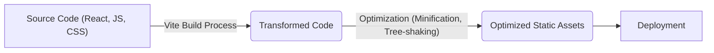
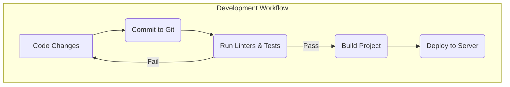

# Configuration and Build

This document details the configuration and build process for the portfolio project, focusing on the essential files that govern its behavior and deployment. The project utilizes Vite as a build tool, React for the frontend, and leverages various libraries for enhanced functionality and styling.

## Project Structure and Key Files

The project's configuration is primarily managed through `package.json`, `vite.config.js`, and `postcss.config.js`. Each file plays a crucial role in defining the project's dependencies, build process, and styling.

### `package.json`

The `package.json` file is the heart of any Node.js project. It contains metadata about the project, including its name, version, and dependencies.  It also defines the scripts that are used to build, test, and run the project.

```json title="package.json"
{
  "name": "3dportfolioproject",
  "private": true,
  "version": "0.0.0",
  "type": "module",
  "scripts": {
    "dev": "vite",
    "build": "vite build",
    "lint": "eslint .",
    "preview": "vite preview"
  },
  "dependencies": {
    "@fortawesome/fontawesome-svg-core": "^7.1.0",
    "@fortawesome/free-brands-svg-icons": "^7.1.0",
    "@fortawesome/react-fontawesome": "^3.1.0",
    "@react-three/drei": "^10.7.3",
    "@react-three/fiber": "^9.3.0",
    "@react-three/postprocessing": "^3.0.4",
    "framer-motion": "^12.23.12",
    "gsap": "^3.13.0",
    "lenis": "^1.3.8",
    "leva": "^0.10.0",
    "lucide-react": "^0.540.0",
    "react": "^19.1.1",
    "react-dom": "^19.1.1",
    "three": "^0.179.1"
  },
  "devDependencies": {
    "@eslint/js": "^9.33.0",
    "@types/react": "^19.1.10",
    "@types/react-dom": "^19.1.7",
    "@vitejs/plugin-react": "^5.0.0",
    "autoprefixer": "^10.4.21",
    "eslint": "^9.33.0",
    "eslint-plugin-react-hooks": "^5.2.0",
    "eslint-plugin-react-refresh": "^0.4.20",
    "globals": "^16.3.0",
    "postcss": "^8.5.6",
    "tailwindcss": "^3.4.17",
    "vite": "^7.1.2"
  }
}
```

Key aspects of the `package.json` file:

*   **`dependencies`**:  Lists the libraries required at runtime.  This includes core libraries like `react`, `react-dom`, `three`, and libraries for animation and UI enhancements like `framer-motion` and `gsap`. The `@react-three` libraries are crucial for rendering 3D elements.
    [View on GitHub](https://github.com/santrupt29/portfolio/blob/main/package.json)
*   **`devDependencies`**: Lists tools used during development, like testing frameworks, linters, and build tools.  Here, `vite` is used for building the project, and `eslint` is used for linting. Typescript related dependencies are also included for type checking
*   **`scripts`**: Defines commands for common tasks:
    *   `dev`: Starts the development server using Vite.
    *   `build`: Builds the project for production using Vite.
    *   `lint`: Runs the ESLint linter to check for code quality issues.
    *   `preview`:  Starts a local server to preview the production build.

### `vite.config.js`

`vite.config.js` configures the Vite build tool. It specifies plugins, build options, and other settings that control how the project is built and served during development.

```javascript title="vite.config.js"
import { defineConfig } from 'vite'
import react from '@vitejs/plugin-react'

// https://vite.dev/config/
export default defineConfig({
  plugins: [react()],
})
```

In this configuration:

*   `plugins: [react()]`:  Enables the official React plugin for Vite, providing fast refresh and other optimizations for React projects.
    [View on GitHub](https://github.com/santrupt29/portfolio/blob/main/vite.config.js)

### `postcss.config.js`

PostCSS is a tool for transforming CSS with JavaScript. `postcss.config.js` configures PostCSS plugins, such as Tailwind CSS and Autoprefixer, which are used to enhance and optimize the project's CSS.

```javascript title="postcss.config.js"
export default {
  plugins: {
    tailwindcss: {},
    autoprefixer: {},
  },
}
```

This configuration includes:

*   `tailwindcss`: Enables Tailwind CSS, a utility-first CSS framework.
*   `autoprefixer`: Automatically adds vendor prefixes to CSS rules, ensuring compatibility with different browsers.
    [View on GitHub](https://github.com/santrupt29/portfolio/blob/main/postcss.config.js)

## Dependency Management

The project relies on several key dependencies:

*   **React & React DOM:**  The core libraries for building the user interface.
*   **Three.js & React Three Fiber:** Three.js is a JavaScript 3D library, and React Three Fiber is a React renderer for Three.js, allowing you to use React components to describe 3D scenes.
*   **GSAP & Framer Motion:** Animation libraries for creating smooth and engaging user experiences.
*   **Tailwind CSS:**  A utility-first CSS framework for styling the application.

## Build Process

The build process, orchestrated by Vite, transforms the source code into optimized static assets ready for deployment. The key steps involve:

1.  **Dependency Resolution:**  Vite analyzes `package.json` and installs the necessary dependencies.
2.  **Code Transformation:**  Vite uses plugins to transform the code, including:
    *   React plugin: Compiles JSX into JavaScript.
    *   PostCSS: Processes CSS files, applying Tailwind CSS and Autoprefixer.
3.  **Optimization:**  Vite optimizes the code for production, including:
    *   Minification: Reduces the size of JavaScript and CSS files.
    *   Tree-shaking: Removes unused code.
    *   Asset optimization: Optimizes images and other assets.
4.  **Bundle Creation:** Vite bundles the transformed and optimized code into static assets (HTML, CSS, JavaScript) that can be deployed to a web server.





## Code Snippets and Explanations

1.  **Using `useFrame` for Animation in React Three Fiber:**

    ```javascript
    import { useFrame } from '@react-three/fiber'
    import { useRef } from 'react'

    function SpinningMesh() {
      const mesh = useRef()
      useFrame(() => (mesh.current.rotation.x = mesh.current.rotation.y += 0.01))
      return (
        <mesh ref={mesh}>
          <boxGeometry args={[1, 1, 1]} />
          <meshStandardMaterial color="royalblue" />
        </mesh>
      )
    }
    ```

    This snippet demonstrates how to use `useFrame` from `@react-three/fiber` to animate a mesh. `useFrame` is a hook that runs on every frame, allowing you to update the properties of the mesh.  Here, the `rotation.x` and `rotation.y` properties are updated, causing the mesh to spin.
    [View on GitHub](https://github.com/santrupt29/portfolio/blob/main/src/components/SpinningMesh.jsx)

2.  **Configuration of Tailwind CSS:**

    ```javascript
    // tailwind.config.js
    module.exports = {
      purge: ['./index.html', './src/**/*.{vue,js,ts,jsx,tsx}'],
      darkMode: false, // or 'media' or 'class'
      theme: {
        extend: {},
      },
      variants: {
        extend: {},
      },
      plugins: [],
    }
    ```

    This code snippet illustrates a basic Tailwind CSS configuration. The `purge` option specifies the files to scan for CSS classes, ensuring that only used classes are included in the final CSS bundle. This is important for reducing the file size of the CSS.
    [View on GitHub](https://github.com/santrupt29/portfolio/blob/main/tailwind.config.js)

3.  **Using Framer Motion for Page Transitions:**

    ```javascript
    import { motion } from "framer-motion";

    const Page = ({ children }) => {
      return (
        <motion.div
          initial={{ opacity: 0 }}
          animate={{ opacity: 1 }}
          exit={{ opacity: 0 }}
          transition={{ duration: 0.5 }}
        >
          {children}
        </motion.div>
      );
    };
    ```

    This example demonstrates how to use Framer Motion to create fade-in/fade-out transitions between pages. The `motion.div` component is used to wrap the page content. The `initial`, `animate`, and `exit` props define the initial, animated, and exit states of the component, respectively. The `transition` prop specifies the duration of the animation.

4. **Lenis configuration for smooth scrolling**

```javascript
import Lenis from '@studio-freight/lenis'

const lenis = new Lenis({
  duration: 1.2,
  easing: (t) => Math.min(1, 1.001 - Math.pow(2, -10 * t)), // https://www.desmos.com/calculator/brs54l4xou
  orientation: 'vertical', // vertical, horizontal
  gestureOrientation: 'vertical', // vertical, horizontal, both
  smoothWheel: true,
  wheelMultiplier: 1,
  smoothTouch: false,
  touchMultiplier: 2,
  infinite: false,
})

//get scroll value
lenis.on('scroll', ({ scroll, limit, velocity, direction, progress }) => {
  console.log({ scroll, limit, velocity, direction, progress })
})

function raf(time) {
  lenis.raf(time)
  requestAnimationFrame(raf)
}

requestAnimationFrame(raf)

```

This code snippet sets up Lenis for smooth scrolling. It creates a new Lenis instance with specified properties for duration, easing, orientation, and smoothness. The `raf` function ensures that Lenis updates on each animation frame, providing a smooth scrolling experience.
[View on GitHub](https://github.com/santrupt29/portfolio/blob/main/src/App.jsx)

## Key Integration Points

*   **Vite and React:** Vite provides a fast and efficient development environment for React applications, with features like hot module replacement and optimized builds.
*   **React Three Fiber and Three.js:**  React Three Fiber simplifies the process of creating 3D scenes in React by providing a declarative API for working with Three.js. This allows developers to leverage React's component-based architecture for building complex 3D experiences.
*   **GSAP/Framer Motion and React:** Animation libraries like GSAP and Framer Motion integrate seamlessly with React, allowing developers to create engaging and dynamic user interfaces.

## Best Practices

*   **Keep Dependencies Up-to-Date:** Regularly update dependencies to benefit from bug fixes, performance improvements, and new features.
*   **Optimize Assets:**  Optimize images and other assets to reduce file sizes and improve page load times.
*   **Use Code Linting:**  Enforce code style and quality using a linter like ESLint.
*   **Version Control:** Use Git for version control to track changes and collaborate effectively.




