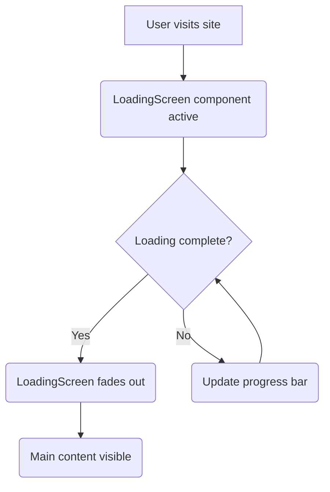
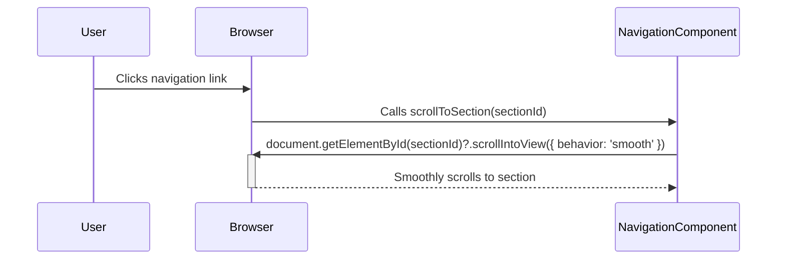

# Navigation and User Experience

This section details the navigation components and user experience enhancements implemented in the portfolio website. Key elements include a responsive navigation bar and a loading screen to provide a smooth and engaging user experience.

## Navigation Component (src/components/Navigation.jsx)

The `Navigation` component provides the primary means for users to navigate the website. It features a dynamic navigation bar that highlights the currently active section based on the user's scroll position. The component is responsive, adapting to both desktop and mobile devices.

### Key Features:

*   **Dynamic Active Section:** Highlights the active section in the navigation bar based on scroll position.
*   **Smooth Scrolling:** Uses `scrollIntoView` with `behavior: 'smooth'` for smooth transitions between sections.
*   **Responsive Design:** Adapts to different screen sizes with a mobile menu.
*   **Framer Motion Animations:** Incorporates animations for a polished user experience.

```javascript
// src/components/Navigation.jsx
import { useState, useEffect } from 'react'
import { motion, AnimatePresence } from 'framer-motion'
import { Menu, X } from 'lucide-react'

export default function Navigation() {
  const [isOpen, setIsOpen] = useState(false)
  const [activeSection, setActiveSection] = useState('hero')

  const navItems = [
    { id: 'hero', label: 'Home' },
    { id: 'about', label: 'About' },
    { id: 'projects', label: 'Projects' },
    { id: 'skills', label: 'Skills' },
    { id: 'contact', label: 'Contact' }
  ]

  useEffect(() => {
    const handleScroll = () => {
      const sections = navItems.map(item => item.id)
      const scrollPosition = window.scrollY + 100

      for (let i = sections.length - 1; i >= 0; i--) {
        const section = document.getElementById(sections[i])
        if (section && scrollPosition >= section.offsetTop) {
          setActiveSection(sections[i])
          break
        }
      }
    }

    window.addEventListener('scroll', handleScroll)
    return () => window.removeEventListener('scroll', handleScroll)
  }, [])

  const scrollToSection = (sectionId) => {
    document.getElementById(sectionId)?.scrollIntoView({ behavior: 'smooth' })
    setIsOpen(false)
  }

  return (
    <motion.nav
      initial={{ opacity: 0, y: -50 }}
      animate={{ opacity: 1, y: 0 }}
      className="fixed top-0 left-0 right-0 z-50 bg-slate-900/80 backdrop-blur-md border-b border-slate-700/50"
    >
      {/* ... */}
    </motion.nav>
  )
}
```

[View on GitHub](https://github.com/santrupt29/portfolio/blob/main/src/components/Navigation.jsx)

This snippet shows the basic structure of the `Navigation` component, including state management for the active section and mobile menu, as well as the useEffect hook for scroll handling.

### Mobile Menu

The mobile menu is implemented using `AnimatePresence` from `framer-motion` to provide smooth transitions when the menu is opened and closed.

```javascript
// src/components/Navigation.jsx
<AnimatePresence>
  {isOpen && (
    <motion.div
      initial={{ opacity: 0, height: 0 }}
      animate={{ opacity: 1, height: 'auto' }}
      exit={{ opacity: 0, height: 0 }}
      className="md:hidden bg-slate-900 border-t border-slate-700"
    >
      <div className="container mx-auto px-6 py-4 space-y-2">
        {navItems.map((item) => (
          <motion.button
            key={item.id}
            onClick={() => scrollToSection(item.id)}
            className={`block w-full text-left px-3 py-2 rounded-lg transition-colors ${
              activeSection === item.id
                ? 'text-amber-400 bg-amber-400/10'
                : 'text-gray-300 hover:text-white hover:bg-slate-800'
            }`}
            whileTap={{ scale: 0.98 }}
          >
            {item.label}
          </motion.button>
        ))}
      </div>
    </motion.div>
  )}
</AnimatePresence>
```

[View on GitHub](https://github.com/santrupt29/portfolio/blob/main/src/components/Navigation.jsx)

This snippet illustrates the use of `AnimatePresence` to animate the mobile navigation menu's appearance and disappearance, enhancing the user experience on smaller screens.

### Active Section Indicator

The active section is visually indicated by a sliding underline implemented with `framer-motion`'s `layoutId`.

```javascript
// src/components/Navigation.jsx
<motion.button
  key={item.id}
  onClick={() => scrollToSection(item.id)}
  className={`relative px-3 py-2 text-sm font-medium transition-colors ${
    activeSection === item.id
      ? 'text-amber-400'
      : 'text-gray-300 hover:text-white'
  }`}
  whileHover={{ scale: 1.05 }}
>
  {item.label}
  {activeSection === item.id && (
    <motion.div
      layoutId="activeSection"
      className="absolute bottom-0 left-0 right-0 h-0.5 bg-amber-400"
      transition={{ type: "spring", stiffness: 380, damping: 30 }}
    />
  )}
</motion.button>
```

[View on GitHub](https://github.com/santrupt29/portfolio/blob/main/src/components/Navigation.jsx)

This snippet highlights how `layoutId` is used to create a smooth transition effect for the active section indicator, improving the visual feedback for the user.

## Loading Screen Component (src/components/LoadingScreen.jsx)

The `LoadingScreen` component provides a visual indication while the website's content is loading.  It displays a loading animation with a progress bar and percentage indicator.

### Key Features:

*   **Animated Spinner:** An animated spinner provides visual feedback during loading.
*   **Progress Bar:** A progress bar indicates the loading progress.
*   **Percentage Indicator:** Displays the loading progress as a percentage.
*   **Framer Motion Animations:**  Uses `framer-motion` for smooth appearance and disappearance.

```javascript
// src/components/LoadingScreen.jsx
import { useState, useEffect } from 'react'
import { motion, AnimatePresence } from 'framer-motion'

export default function LoadingScreen() {
  const [isLoading, setIsLoading] = useState(true)
  const [progress, setProgress] = useState(0)

  useEffect(() => {
    const timer = setInterval(() => {
      setProgress(prev => {
        if (prev >= 100) {
          clearInterval(timer)
          setTimeout(() => setIsLoading(false), 500)
          return 100
        }
        return prev + Math.random() * 15
      })
    }, 150)

    return () => clearInterval(timer)
  }, [])

  return (
    <AnimatePresence>
      {isLoading && (
        <motion.div
          initial={{ opacity: 1 }}
          exit={{ opacity: 0, scale: 1.1 }}
          transition={{ duration: 0.5 }}
          className="fixed inset-0 z-50 bg-slate-900 flex items-center justify-center"
        >
          {/* ... */}
        </motion.div>
      )}
    </AnimatePresence>
  )
}
```

[View on GitHub](https://github.com/santrupt29/portfolio/blob/main/src/components/LoadingScreen.jsx)

This snippet demonstrates the structure of the `LoadingScreen` component, including state management for loading status and progress, and the use of `AnimatePresence` for smooth transitions.

### Progress Bar Animation

The progress bar is animated using `framer-motion` to visually represent the loading progress.

```javascript
// src/components/LoadingScreen.jsx
<div className="w-64 h-1 bg-slate-700 rounded-full mx-auto mb-4">
  <motion.div
    className="h-full bg-gradient-to-r from-amber-500 to-amber-600 rounded-full"
    initial={{ width: 0 }}
    animate={{ width: `${Math.min(progress, 100)}%` }}
    transition={{ duration: 0.3 }}
  />
</div>
```

[View on GitHub](https://github.com/santrupt29/portfolio/blob/main/src/components/LoadingScreen.jsx)

This snippet showcases how `framer-motion` is used to animate the width of the progress bar based on the loading progress, providing a visual cue to the user.





## Key Integration Points

*   **Scroll Handling:** The `Navigation` component utilizes a `useEffect` hook to listen for scroll events and update the active section accordingly. This ensures that the navigation bar accurately reflects the user's current position on the page.
*   **Framer Motion Integration:** Both the `Navigation` and `LoadingScreen` components heavily rely on `framer-motion` for animations. This library provides a declarative and performant way to create smooth transitions and animations, enhancing the overall user experience.
*   **Responsive Design:** The `Navigation` component uses CSS media queries to adapt to different screen sizes, providing an optimal viewing experience on both desktop and mobile devices. The mobile menu is hidden on larger screens and revealed on smaller screens via the conditional rendering of the Menu and X icons.
*   **Smooth Scrolling:**  Clicking on navigation links triggers the `scrollToSection` function, which uses `scrollIntoView` with the `behavior: 'smooth'` option. This ensures that the page smoothly scrolls to the target section, rather than jumping abruptly.

```javascript
// Example of smooth scrolling
const scrollToSection = (sectionId) => {
  document.getElementById(sectionId)?.scrollIntoView({ behavior: 'smooth' })
  setIsOpen(false)
}
```

[View on GitHub](https://github.com/santrupt29/portfolio/blob/main/src/components/Navigation.jsx)

This function demonstrates the use of `scrollIntoView` with the `behavior: 'smooth'` option to provide a smooth scrolling experience when navigating between sections.





By focusing on these aspects, the portfolio website offers intuitive navigation and a visually appealing loading experience, contributing to a positive overall user experience.
```