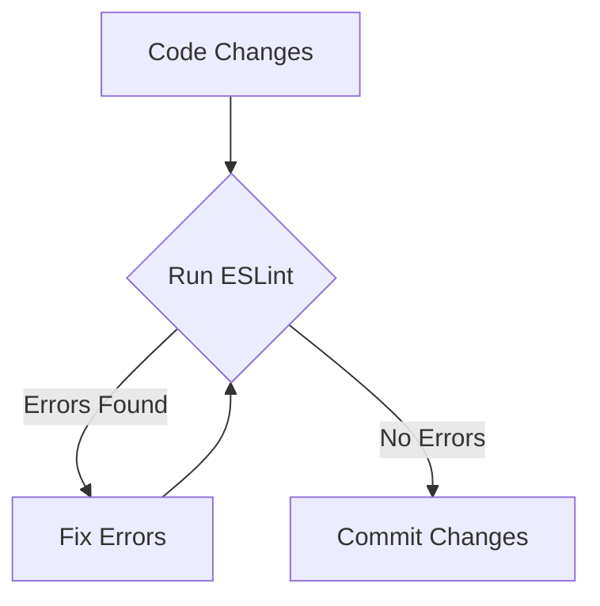

# Code Quality and Linting

This section details the code quality tools and configurations used in this project to ensure a consistent and maintainable codebase. We primarily leverage ESLint, a popular JavaScript linter, to enforce coding standards, identify potential errors, and promote best practices.

## ESLint Configuration

The project's ESLint configuration is defined in `eslint.config.js`. This file extends recommended configurations and defines custom rules tailored to the project's specific needs.

### Core Configuration

The base configuration extends the recommended JavaScript rules and includes configurations for React Hooks and React Refresh.

```javascript title="eslint.config.js (Partial) - Core Configuration"
import js from '@eslint/js'
import reactHooks from 'eslint-plugin-react-hooks'
import reactRefresh from 'eslint-plugin-react-refresh'
import { defineConfig, globalIgnores } from 'eslint/config'

export default defineConfig([
  globalIgnores(['dist']),
  {
    files: ['**/*.{js,jsx}'],
    extends: [
      js.configs.recommended,
      reactHooks.configs['recommended-latest'],
      reactRefresh.configs.vite,
    ],
```

[View on GitHub](https://github.com/santrupt29/portfolio/blob/main/eslint.config.js)

This setup provides a solid foundation for code quality, incorporating standard JavaScript linting rules, best practices for React Hooks usage, and optimizations for React Refresh in a Vite development environment.

### Environment and Parser Options

The configuration specifies the JavaScript version, browser environment, and parser options to enable modern JavaScript features and JSX syntax.

```javascript title="eslint.config.js (Partial) - Environment and Parser Options"
    languageOptions: {
      ecmaVersion: 2020,
      globals: globals.browser,
      parserOptions: {
        ecmaVersion: 'latest',
        ecmaFeatures: { jsx: true },
        sourceType: 'module',
      },
    },
```

[View on GitHub](https://github.com/santrupt29/portfolio/blob/main/eslint.config.js)

This configuration ensures that ESLint understands the project's syntax and environment, preventing false positives and enabling accurate linting.  The `ecmaVersion` and `parserOptions` are set to the latest available, which allows the use of modern JavaScript features in the project.

### Custom Rules

The configuration defines custom rules to enforce specific coding conventions within the project.

```javascript title="eslint.config.js (Partial) - Custom Rules"
    rules: {
      'no-unused-vars': ['error', { varsIgnorePattern: '^[A-Z_]' }],
    },
  },
])
```

[View on GitHub](https://github.com/santrupt29/portfolio/blob/main/eslint.config.js)

In this example, the `no-unused-vars` rule is configured to report an error when variables are unused, but it ignores variables that start with a capital letter or underscore. This is useful for React components, where variables like `Component` or `_unusedVariable` might be defined but not immediately used.

### Ignoring Files

The `globalIgnores` function is used to exclude certain directories from linting.

```javascript title="eslint.config.js (Partial) - Ignoring Files"
import { defineConfig, globalIgnores } from 'eslint/config'

export default defineConfig([
  globalIgnores(['dist']),
```

[View on GitHub](https://github.com/santrupt29/portfolio/blob/main/eslint.config.js)

The 'dist' directory is commonly used for build artifacts. Linting these files is usually unnecessary and can lead to errors due to minification or other transformations.

### ESLint Workflow

The typical ESLint workflow involves running the linter from the command line or integrating it into the IDE. To run ESLint, you can use the following command:

```bash title="Running ESLint"
npx eslint .
```

This command will analyze all files in the current directory and its subdirectories, reporting any linting errors or warnings based on the configuration in `eslint.config.js`. Many IDEs also have ESLint plugins that provide real-time feedback as you type.





### Key Integration Points

*   **Pre-commit Hook:** Integrate ESLint into a pre-commit hook using tools like Husky to ensure that code is linted before being committed. This helps prevent code with linting errors from being introduced into the repository.
*   **CI/CD Pipeline:** Include ESLint in the CI/CD pipeline to automatically lint code on every push or pull request. This ensures that code quality is consistently maintained.
*   **IDE Integration:** Use ESLint plugins in your IDE to receive real-time feedback on code quality as you develop. This helps catch errors early and improve your coding workflow.

## Best Practices

*   **Consistent Configuration:** Maintain a consistent ESLint configuration across the entire project to ensure uniform code quality.
*   **Custom Rules:** Define custom rules to enforce project-specific coding conventions and best practices.
*   **Regular Updates:** Keep ESLint and its plugins up to date to benefit from the latest features and bug fixes.
*   **Documentation:** Document the ESLint configuration and any custom rules to help developers understand the project's coding standards.
```