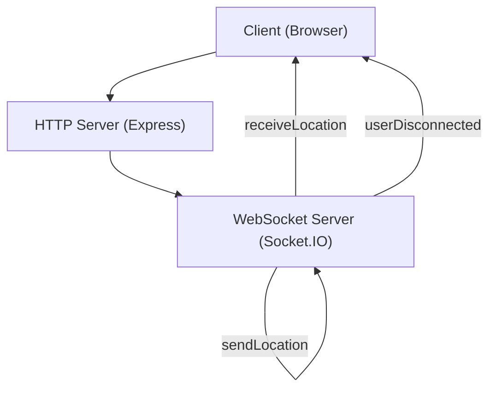

# Core Application Logic

This section details the fundamental components and logic of the realtime_tracker application server, responsible for managing client connections and broadcasting location data.

## Server Setup and Initialization

The application utilizes `express` for creating the web server and `socket.io` for real-time, bi-directional communication between clients. The server is configured to serve static files from the `public` directory and uses `ejs` as its view engine.

```javascript
const express = require('express');
const app = express();
const path = require('path');

const http = require('http');
const socketio = require('socket.io');
const server = http.createServer(app);
const io = socketio(server);

app.set('view engine', 'ejs');
app.use(express.static(path.join(__dirname, 'public')));
```

## WebSocket Event Handling

The core real-time functionality revolves around `socket.io` event listeners. When a client connects, the server logs a "Connected" message. The primary events handled are:

*   **`sendLocation`**: This event is triggered when a client sends its location data. The server logs the received data and then broadcasts it to all connected clients (including the sender) using the `receiveLocation` event. Each broadcast includes the sender's `socket.id` along with the location data.

    ```javascript
    socket.on('sendLocation', function (data) {
        console.log(data);
        io.emit("receiveLocation", {id: socket.id, ...data});
    });
    ```

*   **`disconnect`**: When a client disconnects, this event is triggered. The server emits a `userDisconnected` event to all connected clients, passing the `socket.id` of the disconnected user.

    ```javascript
    socket.on('disconnect', function () {
        io.emit("userDisconnected", socket.id);
    });
    ```

## Root Route Handling

The application defines a simple GET route for the root path (`/`). This route renders the `index.ejs` template, which is assumed to contain the client-side application logic.

```javascript
app.get('/', (req, res) => {
  res.render('index');
});
```

## Server Listening

Finally, the HTTP server is configured to listen for incoming connections on port 3000.

```javascript
server.listen(3000);
```

## Architecture Overview





## Key Takeaways

*   The server acts as a central hub for real-time location data.
*   `socket.io` is crucial for enabling instant communication between all connected clients.
*   The `sendLocation` and `userDisconnected` events form the backbone of the application's real-time updates.