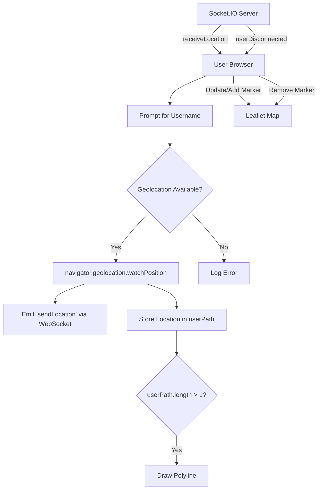

# Frontend Structure and Styling

This section details the organization and visual presentation of the Realtime Tracker's user interface, focusing on the frontend structure and styling implemented using CSS and JavaScript.

## User Interface Initialization and Styling

The base styling for the application is handled by `public/css/styles.css`. This file establishes fundamental layout rules, ensuring that the map container takes up the full viewport.

```css
* {
    margin: 0;
    padding: 0;
    box-sizing: border-box;
}
html, body {
    width: 100%;
    height: 100%;
}

#map {
    width: 100%;
    height: 100%;
}
```

The `script.js` file (`public/js/script.js`) initializes the application, including setting up the map, handling user input, and managing WebSocket communication.

## Map Integration and User Interaction

The frontend utilizes Leaflet.js for map rendering and management. The map is initialized with a default view and a tile layer sourced from OpenStreetMap. User location is tracked and displayed as markers on the map.

### Location Tracking and Display

The browser's geolocation API is used to obtain the user's current position. This data is then sent to the server via WebSockets and displayed on the map.

```javascript
const socket = io();

const username = prompt("Enter your Username");

// User Location History
const userPath = [];
// Check if browser supports geolocation
if (navigator.geolocation) {
    navigator.geolocation.watchPosition((position) => {
        const { latitude, longitude } = position.coords;
        socket.emit('sendLocation', {username, latitude, longitude });
        userPath.push([latitude, longitude]);
        if (userPath.length > 1) {
            const polyline = L.polyline(userPath, { color: 'red' }).addTo(map); // Route
        }
    }, (error) => {
        console.log(error);
    }, {
        enableHighAccuracy: true,
        timeout: 5000,
        maximumAge: 0,
    });
}

const map = L.map("map").setView([0, 0], 10);

L.tileLayer("https://{s}.tile.openstreetmap.org/{z}/{x}/{y}.png", {
    attribution: "© OpenStreetMap contributors",
}).addTo(map);
```

### Real-time Updates and Marker Management

Incoming location data from other users is received via WebSocket. The `receiveLocation` event handler updates existing markers or creates new ones for users. Disconnected users have their markers removed.

```javascript
const markers = {};

socket.on("userDisconnected", (id) => {
    if (markers[id]) {
        map.removeLayer(markers[id]);
        delete markers[id];
    }
});
socket.on("receiveLocation", (data) => {
    const { id, username, latitude, longitude } = data;
    map.setView([latitude, longitude]);
    if (!markers[id]) {
        markers[id] = L.marker([latitude, longitude])
        .bindPopup(username)
        .addTo(map)
        .openPopup();
    } else {
        markers[id].setLatLng([latitude, longitude]).bindPopup(username).openPopup();
    }
});
```

### Visual Elements and Mock Data

The frontend also includes the capability to draw static elements on the map, such as polygons, for reference or testing purposes.

```javascript
// Mock coordinates
const polygonCoords = [
    [19.0208754, 72.856137],
    [19.0208754, 72.853137],
    [19.0188754, 72.853137],
    [19.0188754, 72.856137]
];


// Draw the polygon on the map
L.polygon(polygonCoords, { color: 'red' }).addTo(map)
    .bindPopup("Test Polygon Area")
    .openPopup();
```

## Frontend Architecture Flow

The following diagram illustrates the general flow of data and interactions within the frontend.





## Key Takeaways

*   The frontend is built with HTML, CSS, and JavaScript.
*   Leaflet.js is the core library for map rendering and interaction.
*   WebSockets (`socket.io-client`) are used for real-time communication with the server.
*   The browser's Geolocation API is leveraged for user location tracking.
*   Markers are dynamically managed to represent user positions on the map.