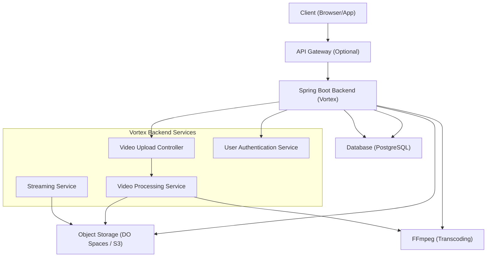

# Project Overview and Setup

The Vortex Backend is a powerful Spring Boot application engineered to support a feature-rich video streaming platform. It is designed to manage the entire lifecycle of video content, from initial upload and sophisticated processing (including HLS transcoding) to seamless streaming. The backend utilizes AWS S3-compatible object storage, specifically DigitalOcean Spaces, for scalable and reliable video hosting, and PostgreSQL for robust metadata management.

## Core Functionality

This backend provides the essential services for a video streaming service, including:

*   **Video Upload and Processing**: Accepts raw MP4 video files, which are then transcoded into HLS (HTTP Live Streaming) format using FFmpeg. This enables adaptive bitrate streaming.
*   **Adaptive Bitrate Streaming**: Delivers HLS playlists (`.m3u8` files) and individual video segments (`.ts` files), allowing for smooth playback across various network conditions.
*   **Partial Content Streaming**: Supports HTTP Range requests for raw video files, facilitating efficient seeking and playback.
*   **Secure and Scalable Storage**: Integrates with S3-compatible object storage (DigitalOcean Spaces) for storing video assets.
*   **User Management**: Incorporates basic user authentication and associates uploaded videos with their respective owners.
*   **Data Persistence**: Leverages JPA/Hibernate with PostgreSQL to manage and store application data.

## Technology Stack

*   **Language**: Java 21
*   **Framework**: Spring Boot 3.5.10
*   **Database**: PostgreSQL
*   **Build Tool**: Maven
*   **Video Processing**: FFmpeg
*   **Cloud Storage**: AWS SDK (for S3-compatible services like DigitalOcean Spaces)
*   **Security**: Spring Security & JWT

## Prerequisites

Before proceeding with the setup, ensure you have the following software installed and configured:

*   **Java Development Kit (JDK)**: Version 21
*   **Apache Maven**: For building the project.
*   **PostgreSQL**: A running PostgreSQL instance.
*   **FFmpeg**: This must be installed and accessible in your system's PATH for video transcoding.

## Configuration

### Environment Variables

The application requires specific environment variables to securely access cloud storage. These are crucial for connecting to DigitalOcean Spaces or any other S3-compatible service.

```bash
export CLOUD_AWS_CREDENTIALS_ACCESS_KEY="your_access_key"
export CLOUD_AWS_CREDENTIALS_SECRET_KEY="your_secret_key"
```

### Application Properties

Key configurations for the application are managed within `src/main/resources/application.properties`.

*   **Database Connection**:
    ```properties
    jdbc:postgresql://localhost:5433/videodb
    ```
    Note: The default PostgreSQL port is configured as `5433`.

*   **S3/Spaces Configuration**:
    ```properties
    # Example for DigitalOcean Spaces
    spring.cloud.aws.s3.endpoint=https://sgp1.digitaloceanspaces.com
    spring.cloud.aws.s3.region=sgp1
    spring.cloud.aws.s3.bucket=stream-app-storage
    ```

## Installation and Running

Follow these steps to clone, build, and run the Vortex Backend application:

1.  **Clone the Repository**:
    ```bash
    git clone https://github.com/santrupt29/stream-spring-backend.git
    cd stream-spring-backend
    ```

2.  **Set up the Database**:
    Ensure your PostgreSQL server is running and accessible on the configured port (default `5433`). Create the necessary database:
    ```sql
    CREATE DATABASE videodb;
    ```

3.  **Build the Project**:
    Use Maven to compile the code and package the application. Skipping tests can speed up this process for initial setup.
    ```bash
    mvn clean package -DskipTests
    ```

4.  **Run the Application**:
    You can execute the application directly from the generated JAR file or using the Maven Spring Boot plugin.

    *   **Using JAR**:
        ```bash
        java -jar target/spring-stream-backend-0.0.1-SNAPSHOT.jar
        ```

    *   **Using Maven**:
        ```bash
        mvn spring-boot:run
        ```

    The application will start on `http://localhost:8080`.

## Architecture Overview

The Vortex Backend follows a typical Spring Boot layered architecture, handling requests, processing data, and interacting with external services like databases and object storage.





## Key Takeaways

*   The Vortex Backend is a full-featured Spring Boot application for video streaming.
*   It relies on external services for storage (DigitalOcean Spaces) and database management (PostgreSQL).
*   Proper configuration of environment variables and application properties is essential for operation.
*   FFmpeg is a critical dependency for video transcoding.
*   The application provides endpoints for video upload, streaming (raw and HLS), and user management.