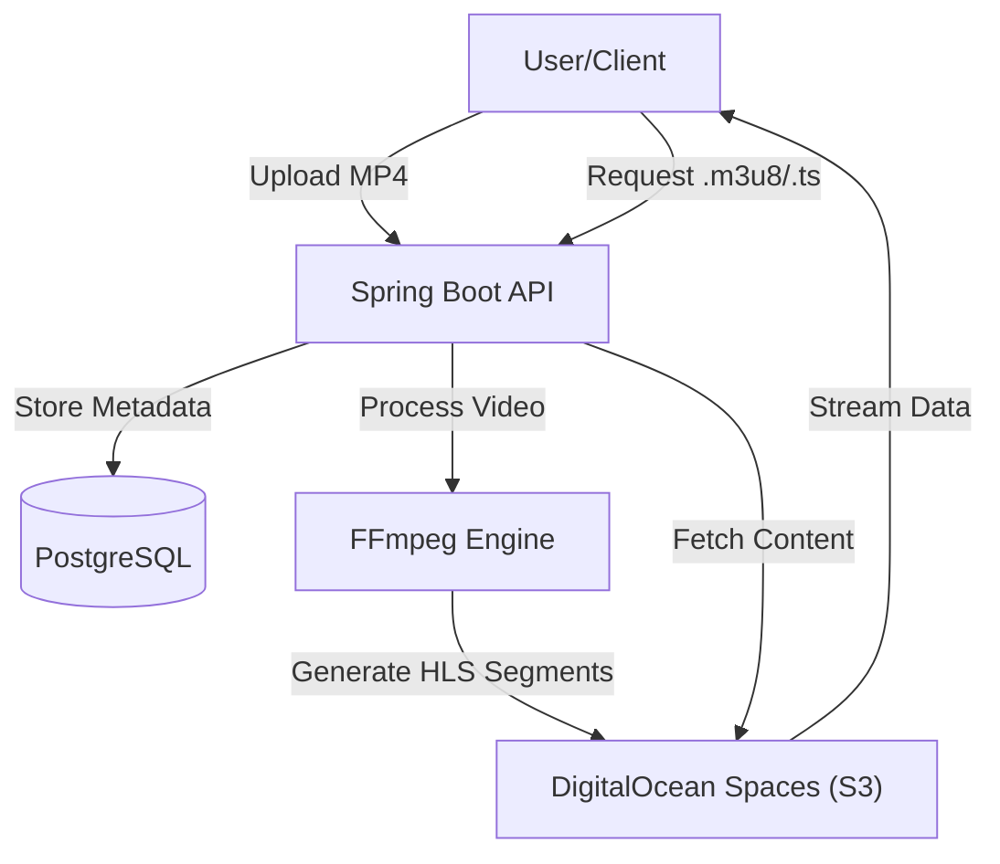

# Project Overview

Vortex is a high-performance video streaming backend engineered with **Spring Boot 3.5.10** and **Java 21**. The system is designed to handle the end-to-end lifecycle of video content—from secure upload and automated transcoding to adaptive bitrate streaming.

By integrating **FFmpeg** for processing and **S3-compatible object storage** (DigitalOcean Spaces), Vortex ensures that videos are delivered efficiently across various network conditions using the HLS (HTTP Live Streaming) protocol.

## 🏗 System Architecture

The following diagram illustrates the high-level data flow from the moment a user uploads a video to the delivery of streamable segments.



## 🚀 Key Capabilities

- **Automated HLS Transcoding**: Converts raw MP4 uploads into HLS playlists (`.m3u8`) and transport stream segments (`.ts`) for adaptive bitrate streaming.
- **Efficient Content Delivery**: 
    - **Partial Content Streaming**: Supports HTTP Range requests for raw file seeking.
    - **Segmented Streaming**: Serves optimized chunks for smooth playback.
- **Scalable Storage**: Offloads heavy binary data to S3-compatible storage, keeping the application server stateless and lean.
- **Robust Metadata Management**: Leverages PostgreSQL and JPA/Hibernate for persistent tracking of video ownership and file paths.
- **Secure Infrastructure**: Implements Spring Security and JWT for user authentication and access control.

## 🛠 Technology Stack

| Component | Technology |
| :--- | :--- |
| **Runtime** | Java 21 |
| **Framework** | Spring Boot 3.5.10 |
| **Database** | PostgreSQL |
| **Build Tool** | Maven |
| **Processing** | FFmpeg |
| **Cloud Storage** | AWS SDK (S3 / DigitalOcean Spaces) |
| **Security** | Spring Security & JWT |

## ⚙️ Quick Start & Setup

### Prerequisites

Ensure the following are installed on your local machine or server:
- **JDK 21**
- **Maven**
- **PostgreSQL** (Configured to port `5433` by default)
- **FFmpeg** (Must be added to the system `PATH`)

### Environment Configuration

The application requires S3 credentials to be set as environment variables:

```bash
export CLOUD_AWS_CREDENTIALS_ACCESS_KEY="your_access_key"
export CLOUD_AWS_CREDENTIALS_SECRET_KEY="your_secret_key"
```

### Local Execution

1. **Database Initialization**:
   ```sql
   CREATE DATABASE videodb;
   ```

2. **Build and Run**:
   ```bash
   mvn clean package -DskipTests
   java -jar target/spring-stream-backend-0.0.1-SNAPSHOT.jar
   ```

## 🌐 Deployment Overview

Vortex is optimized for deployment on Linux-based virtual machines (e.g., DigitalOcean Droplets). The deployment pipeline involves:

1. **System Hardening**: Configuring SSH keys and UFW firewall rules (opening ports `22`, `8080`, and `5433`).
2. **Dependency Injection**: Installing the OpenJDK 21 runtime and FFmpeg binaries.
3. **Memory Optimization**: Creating a **2GB Swap file** to prevent Out-of-Memory (OOM) errors during intensive FFmpeg transcoding tasks.
4. **Process Management**: Running the JAR via `nohup` or `systemd` for background persistence.

For detailed step-by-step server configuration, refer to the **Deployment Guide**.