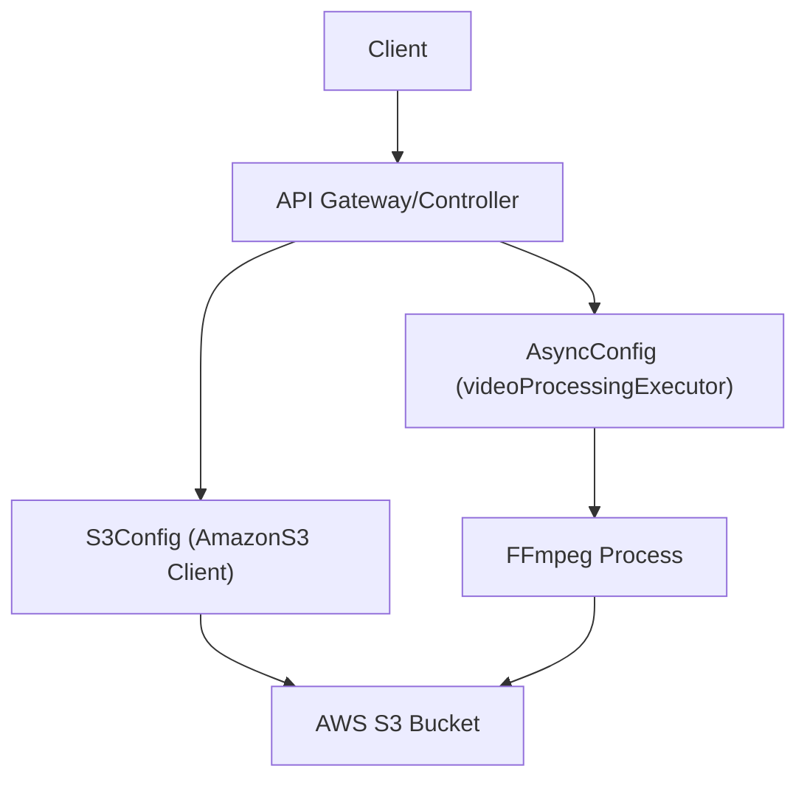

# System Configuration

This section details the infrastructure and runtime configurations for the Stream Spring Backend, focusing on resource management for heavy video processing and cloud storage integration.

## Infrastructure Overview

The system is designed to handle resource-intensive tasks (like FFmpeg transcoding) while maintaining stability on constrained environments (e.g., 2GB RAM VMs). The following diagram illustrates the flow of a video asset from upload to processing.



## Asynchronous Processing

To prevent Out-Of-Memory (OOM) errors during video transcoding, the application implements a bounded thread pool. Since FFmpeg processes and S3 multipart uploads are memory-intensive, concurrency is strictly limited.

### Video Processing Executor
The `videoProcessingExecutor` is configured as a fixed thread pool to ensure system stability.

- **Implementation**: `AsyncConfig.java`
- **Pool Size**: `2` concurrent threads.
- **Resource Constraint**: On a 2GB VM, each FFmpeg process combined with S3 overhead consumes approximately 300-500MB. A limit of 2 ensures the JVM and OS have sufficient headroom.

```java
@Bean(name = "videoProcessingExecutor")
public ExecutorService videoProcessingExecutor() {
    return Executors.newFixedThreadPool(2);
}
```

## Cloud Storage (S3) Configuration

The application uses the Amazon S3 SDK to manage video assets. The configuration is decoupled via Spring `@Value` annotations to allow for environment-specific overrides.

### Required Properties
The following properties must be defined in your environment variables or `application.yml`:

| Property | Description | Example |
| :--- | :--- | :--- |
| `cloud.aws.credentials.access-key` | AWS IAM Access Key | `AKIA...` |
| `cloud.aws.credentials.secret-key` | AWS IAM Secret Key | `wJalr...` |
| `cloud.aws.endpoint` | S3 Endpoint URL (Custom or AWS) | `s3.amazonaws.com` |
| `cloud.aws.region.static` | AWS Region | `us-east-1` |

### Client Bean
The `S3Config` class initializes the `AmazonS3` client using a `BasicAWSCredentials` provider and a static endpoint configuration, enabling compatibility with both AWS S3 and S3-compatible storage (like MinIO).

## Database Migration

The application utilizes Flyway for schema versioning. To ensure smooth deployment across existing databases, the following configuration is applied:

```yaml
spring:
  flyway:
    baseline-on-migrate: true
```

**Note**: `baseline-on-migrate: true` allows Flyway to automatically create a baseline version if the database is not empty and no migration history table exists, preventing startup failures during the first migration of an existing database.