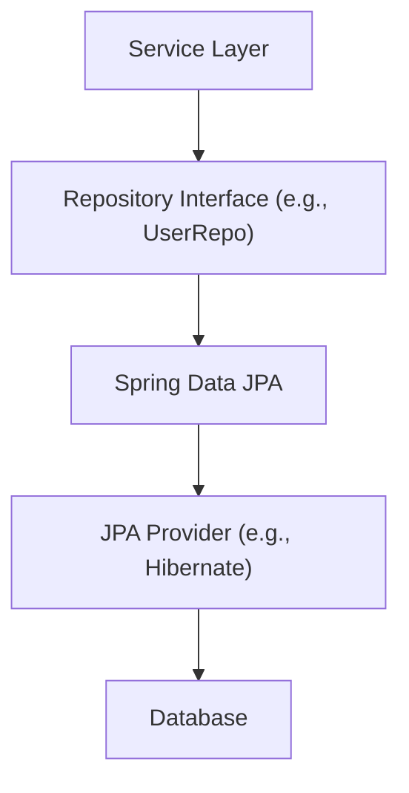

# Data Persistence and Repositories

This section details the mechanisms for interacting with the data storage layer within the stream-spring-backend application. The project utilizes Spring Data JPA for efficient data access, abstracting away much of the boilerplate code associated with database operations.

## Repository Interfaces

The application defines repository interfaces that extend Spring Data JPA's `JpaRepository`. These interfaces provide a set of common CRUD (Create, Read, Update, Delete) operations out-of-the-box, along with the ability to define custom query methods.

### User Repository (`UserRepo.java`)

The `UserRepo` interface is responsible for managing `Users` entities. It extends `JpaRepository<Users, UUID>`, indicating that it operates on `Users` objects and uses `UUID` as the primary key type.

A custom method `findByEmail(String email)` is defined to retrieve a user based on their email address, returning an `Optional<Users>` to handle cases where the user might not exist.

```java
package com.stream.app.repositories;

import com.stream.app.entities.Users;
import org.springframework.data.jpa.repository.JpaRepository;
import org.springframework.stereotype.Repository;

import java.util.Optional;
import java.util.UUID;

@Repository
public interface UserRepo extends JpaRepository<Users, UUID> {
    Optional<Users> findByEmail(String email);
}
```

### Video Repository (`VideoRepository.java`)

The `VideoRepository` interface handles persistence for `Video` entities. It extends `JpaRepository<Video, String>`, with `String` serving as the entity's primary key.

This repository includes two custom query methods:
*   `findByTitle(String title)`: Retrieves a specific video by its title, returning an `Optional<Video>`.
*   `findByUserId(UUID userId)`: Fetches all videos associated with a given user ID, returning a `List<Video>`.

```java
package com.stream.app.repositories;

import com.stream.app.entities.Video;
import org.springframework.data.jpa.repository.JpaRepository;
import org.springframework.stereotype.Repository;

import java.util.List;
import java.util.Optional;
import java.util.UUID;

@Repository
public interface VideoRepository extends JpaRepository<Video, String> {
    Optional <Video> findByTitle(String title);
    List<Video> findByUserId(UUID userId);
}
```

## Data Access Flow

The repositories serve as the primary interface between the application's service layer and the underlying database. When a service needs to perform data operations (e.g., retrieving user information, saving a new video), it calls the appropriate methods on these repository interfaces. Spring Data JPA, in conjunction with the configured JPA provider (e.g., Hibernate), translates these method calls into SQL queries executed against the database.





## Key Takeaways

*   Spring Data JPA simplifies data access by providing repository interfaces with built-in CRUD operations.
*   Custom query methods can be easily defined in repository interfaces to handle specific data retrieval needs.
*   The `Optional` type is used for methods that may not return a result, promoting robust error handling.
*   Repositories abstract database interactions, allowing developers to focus on business logic.