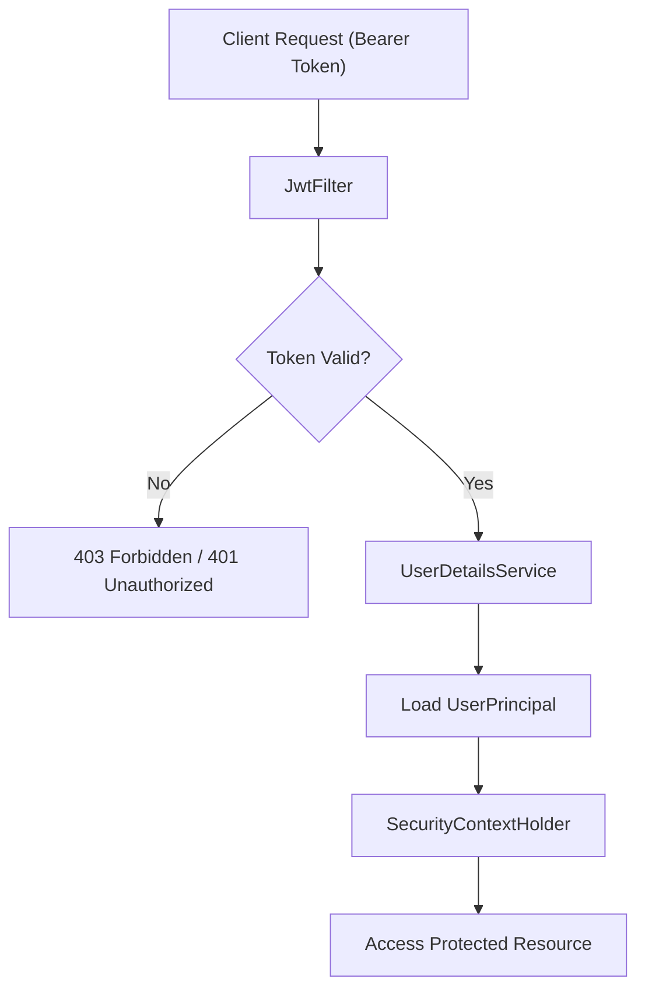

# Security & Authentication

The `stream-spring-backend` employs a stateless security architecture leveraging **JSON Web Tokens (JWT)** and **Spring Security**. This ensures that the server does not need to store session state, allowing for scalable, distributed authentication.

## Authentication Flow

The following diagram illustrates the request lifecycle for a secured endpoint:

## Core Security Components

### 1. Security Configuration (`SecurityConfig`)
The `SecurityConfig` class serves as the central hub for security rules. It defines the `SecurityFilterChain`, which determines which requests are public and which require authentication.

- **Stateless Session**: Configured via `SessionCreationPolicy.STATELESS` to prevent the creation of HTTP sessions.
- **Permit-All Endpoints**: The following routes are accessible without authentication:
    - `/register`
    - `/login`
    - `/actuator/health`
- **Filter Ordering**: The `JwtFilter` is injected before the `UsernamePasswordAuthenticationFilter` to ensure tokens are validated before Spring attempts standard session-based authentication.
- **Password Encoding**: Uses `BCryptPasswordEncoder` with a strength of `12` for secure credential hashing.

### 2. JWT Processing Layer

#### `JwtFilter`
A `OncePerRequestFilter` that intercepts every incoming HTTP request to validate the identity of the requester.

1. **Header Extraction**: It looks for the `Authorization` header and strips the `Bearer ` prefix.
2. **Token Validation**: It utilizes the `JWTService` to extract the user's email and validate the token's integrity.
3. **Context Setting**: If the token is valid and the user is not already authenticated, it creates a `UsernamePasswordAuthenticationToken` and injects it into the `SecurityContextHolder`.

#### `JWTService`
An interface defining the contract for token operations:
- `generateToken(String email)`: Creates a new signed JWT.
- `extractEmail(String token)`: Retrieves the subject (email) from the token claims.
- `validateToken(String token, UserDetails userDetails)`: Checks if the token is expired and matches the provided user details.

### 3. User Principal Mapping (`UserPrincipal`)
To bridge the gap between the database entity (`Users`) and Spring Security's requirements, the `UserPrincipal` class implements `UserDetails`.

- **Mapping**: It wraps the `Users` entity, providing access to the username, password, and email.
- **Authorities**: Currently assigns a default `USER` role to all authenticated principals via `SimpleGrantedAuthority`.
- **Account Status**: Hardcoded to `true` for `isAccountNonExpired`, `isAccountNonLocked`, and `isEnabled`, simplifying the initial authentication logic.

## Summary Table

| Feature | Implementation | Detail |
| :--- | :--- | :--- |
| **Auth Type** | JWT (Stateless) | Bearer Token based |
| **Password Hashing** | BCrypt | Strength factor 12 |
| **Filter Chain** | `SecurityFilterChain` | Custom filter before `UsernamePasswordAuthenticationFilter` |
| **User Identity** | `UserPrincipal` | Implements `UserDetails` |
| **Session Policy** | `STATELESS` | No server-side session storage |