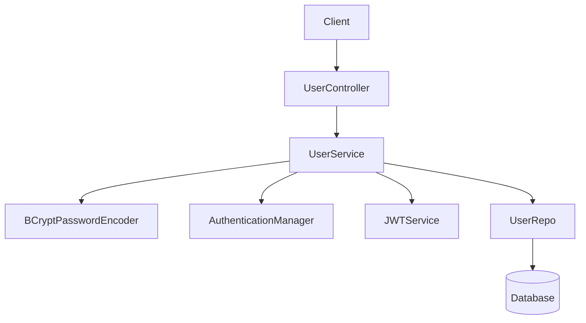

# User Management Module

The User Management Module handles the core identity services of the application, providing secure user registration, authentication, and session management through JSON Web Tokens (JWT).

## Architecture Overview

The module follows a layered architecture: Controller $\rightarrow$ Service $\rightarrow$ Repository. Authentication is integrated with Spring Security, utilizing BCrypt for password hashing and a custom JWT service for token generation.



## API Reference

### User Registration
Creates a new user account in the system. Passwords are encrypted using BCrypt with a strength of 12 before being persisted.

**Endpoint:** `POST /register`

**Request Body:**
```json
{
  "email": "user@example.com",
  "password": "securePassword123"
}
```

**Response:**
- **Success:** Returns the created `Users` object including the generated `UUID`.
- **Status:** `200 OK`

---

### User Login
Authenticates user credentials and returns a bearer token for subsequent authorized requests.

**Endpoint:** `POST /login`

**Request Body:**
```json
{
  "email": "user@example.com",
  "password": "securePassword123"
}
```

**Response:**
- **Success:** Returns a JWT string.
- **Failure:** Returns the string `"Failure"`.
- **Status:** `200 OK`

## Data Model

The `Users` entity implements `UserDetails` to integrate seamlessly with Spring Security.

| Field | Type | Constraints | Description |
| :--- | :--- | :--- | :--- |
| `id` | `UUID` | Primary Key | Unique identifier generated automatically. |
| `email` | `String` | Unique, Not Null | Used as the primary username for authentication. |
| `password` | `String` | Not Null | BCrypt hashed password. |
| `createdAt` | `Instant` | Not Null | Automatically timestamped on creation. |
| `videos` | `List<Video>` | One-to-Many | List of videos uploaded by the user (JSON ignored). |

## Technical Implementation Details

### Security Workflow
1. **Password Hashing**: The `UserServiceImplementation` uses `BCryptPasswordEncoder` to ensure that plain-text passwords are never stored in the database.
2. **Authentication**: The `/login` endpoint utilizes the `AuthenticationManager` to verify `UsernamePasswordAuthenticationToken`.
3. **Identity**: The system uses `UUID` for user IDs instead of sequential integers to enhance security and prevent ID enumeration attacks.
4. **Tokenization**: Upon successful authentication, the `JWTService` generates a token based on the user's email (username), which serves as the identity credential for stateless communication.