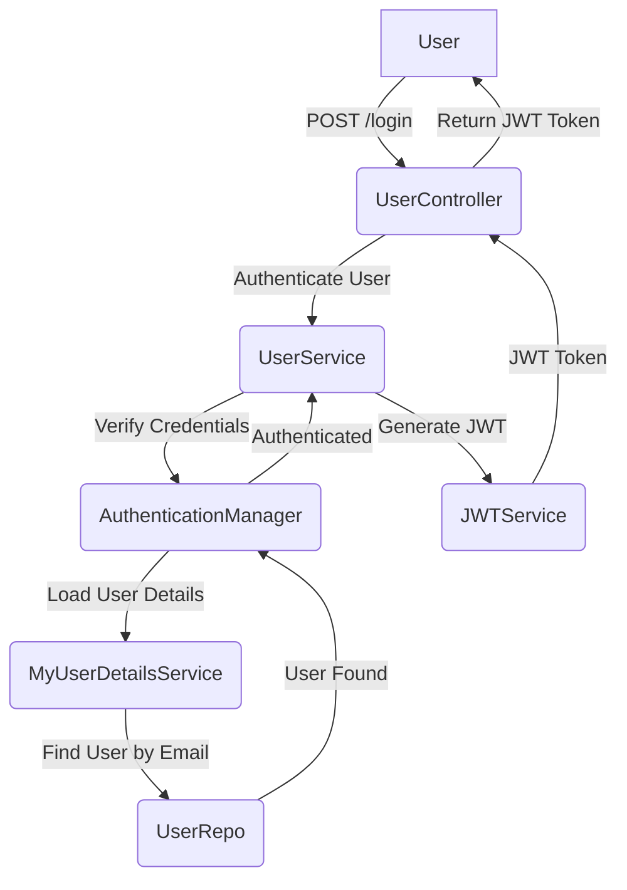

# User Management and Authentication

This section details the components responsible for handling user registration, login, and the underlying authentication mechanisms within the stream-spring-backend application. It outlines the interactions between controllers, services, and security configurations.

## User Registration

The `UserController` exposes a `/register` endpoint to handle new user sign-ups. The `UserService` then processes this request, ensuring that the user's password is securely hashed before being persisted to the database.

```java
@RestController
@RequiredArgsConstructor
@CrossOrigin("*")
public class UserController {
    private final UserService service;

    @PostMapping("/register")
    public Users register(@RequestBody Users user) {
        return service.register(user);
    }

    // ... other endpoints
}
```

The `UserServiceImplementation` handles the password encoding using `BCryptPasswordEncoder` for enhanced security.

```java
@Service
public class UserServiceImplementation implements UserService {

    // ... other fields

    private BCryptPasswordEncoder encoder = new BCryptPasswordEncoder(12);

    @Override
    public Users register(Users user) {
        user.setPassword(encoder.encode(user.getPassword()));
        return repo.save(user);
    }

    // ... other methods
}
```

## User Authentication and Login

The `/login` endpoint in `UserController` is responsible for authenticating existing users. It leverages the `UserService` to verify credentials and, upon successful authentication, generates a JSON Web Token (JWT) for subsequent API access.

```java
@RestController
@RequiredArgsConstructor
@CrossOrigin("*")
public class UserController {
    private final UserService service;

    // ... register endpoint

    @PostMapping("/login")
    public String login(@RequestBody Users user) {
        return service.verify(user);
    }
}
```

The `UserServiceImplementation` utilizes Spring Security's `AuthenticationManager` to perform the authentication. If the authentication is successful, a JWT is generated by the `JWTService`.

```java
@Service
public class UserServiceImplementation implements UserService {

    // ... other fields and constructor

    @Override
    public String verify(Users user) {
        Authentication authentication = authManager.authenticate(new UsernamePasswordAuthenticationToken(user.getUsername(), user.getPassword()));
        if(authentication.isAuthenticated()) return jwtService.generateToken(user.getUsername());
        return "Failure";
    }
}
```

The `MyUserDetailsServiceImplementation` plays a crucial role in Spring Security's authentication process by loading user details based on their email (username) from the `UserRepo`.

```java
@Service
public class MyUserDetailsServiceImplementation implements UserDetailsService {

    UserRepo repo;

    public MyUserDetailsServiceImplementation(UserRepo repo) {
        this.repo = repo;
    }

    @Override
    public UserDetails loadUserByUsername(String email)
            throws UsernameNotFoundException {
        return repo.findByEmail(email)
                .orElseThrow(() -> new UsernameNotFoundException("User not found with email: " + email));
    }
}
```

## Authentication Flow

The following diagram illustrates the typical flow for user authentication:





## Key Takeaways

*   User registration involves password hashing using `BCryptPasswordEncoder`.
*   Login authentication is handled by Spring Security's `AuthenticationManager`.
*   `MyUserDetailsServiceImplementation` is essential for fetching user data during authentication.
*   A JWT is generated upon successful login to secure subsequent API requests.