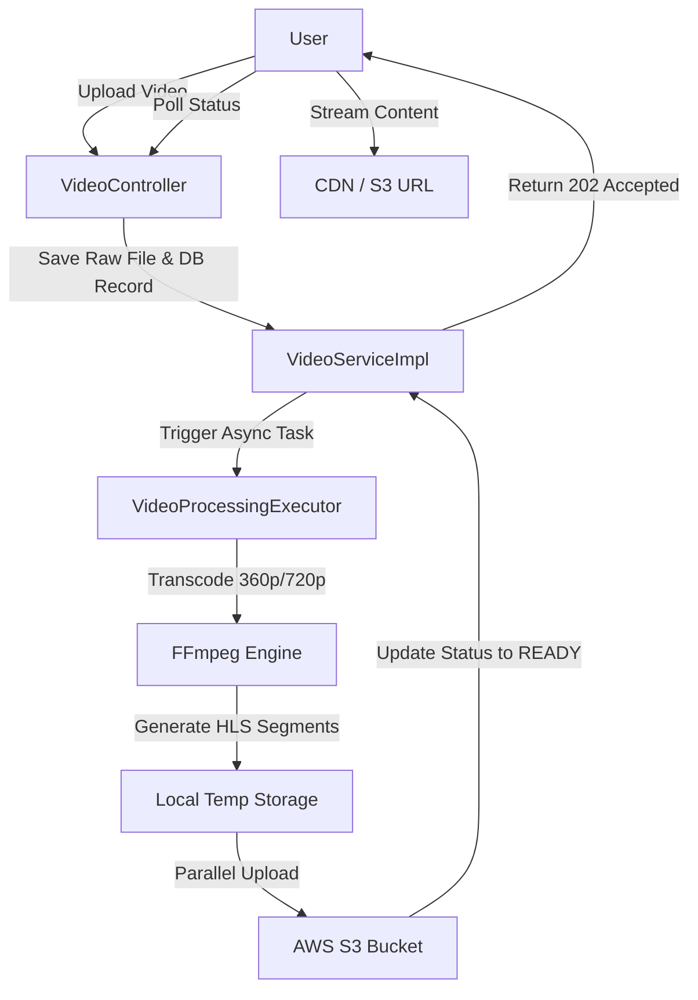

# Video Streaming Module

The Video Streaming Module provides a robust pipeline for uploading, processing, and delivering video content. It implements an asynchronous processing architecture to handle heavy video transcoding tasks without blocking the client, utilizing FFmpeg for Adaptive Bitrate (ABR) streaming and AWS S3 for scalable storage.

## System Workflow

The following diagram illustrates the lifecycle of a video from upload to delivery.



## API Reference

### Video Management

| Endpoint | Method | Description | Status Code |
| :--- | :--- | :--- | :--- |
| `/api/v1/videos` | `POST` | Uploads a new video file with title and description. | `202 Accepted` |
| `/api/v1/videos/{videoId}/status` | `GET` | Polls the current processing state of a specific video. | `200 OK` |
| `/api/v1/videos` | `GET` | Retrieves a list of all public videos. | `200 OK` |
| `/api/v1/videos/my-videos` | `GET` | Retrieves videos uploaded by the authenticated user. | `200 OK` |

### Streaming Endpoints

| Endpoint | Method | Description | Content Type |
| :--- | :--- | :--- | :--- |
| `/api/v1/videos/stream/{videoId}` | `GET` | Simple streaming of the video file. | `video/*` |
| `/api/v1/videos/stream/range/{videoId}` | `GET` | Byte-range requests for seeking/scrubbing support. | `Partial Content` |
| `/api/v1/videos/{videoId}/master.m3u8` | `GET` | Serves the HLS master playlist. | `application/vnd.apple.mpegurl` |
| `/api/v1/videos/{videoId}/{segment}.ts` | `GET` | Serves individual HLS video segments. | `video/mp2t` |

## Technical Implementation

### Asynchronous Processing Pipeline
To ensure high availability, the system decouples the upload from the transcoding process:
1. **Immediate Response**: The `save` method persists the initial metadata and saves the raw file to a temporary directory, returning a `202 Accepted` response immediately.
2. **Background Execution**: A dedicated `videoProcessingExecutor` handles the `processVideo` logic.
3. **Status Tracking**: The `VideoStatus` enum (`UPLOADING` $\rightarrow$ `PROCESSING` $\rightarrow$ `READY`/`FAILED`) allows the frontend to provide real-time feedback to the user via polling.

### Adaptive Bitrate (ABR) with FFmpeg
The module implements ABR to optimize playback based on the user's network conditions. It uses a complex FFmpeg filter to split the input stream into two renditions:
- **Low Quality**: 360p resolution at 800kbps.
- **High Quality**: 720p resolution at 2500kbps.

The output is formatted as **HLS (HTTP Live Streaming)**, creating `.ts` segments and a `.m3u8` playlist for each resolution, linked together by a generated `master.m3u8` file.

### Storage and Distribution
- **S3 Parallel Upload**: To minimize processing time, the system uses `CompletableFuture` to upload multiple HLS segments to AWS S3 concurrently.
- **CDN Integration**: Once uploads are complete, the `filePath` in the database is updated from the local temp path to the final CDN URL for global delivery.
- **Byte-Range Support**: The `/stream/range` endpoint implements the `Range` HTTP header, enabling clients to request specific byte chunks of a video, which is critical for video seeking.

## Data Model

### Video Entity
The `Video` entity tracks the metadata and state of the content.

```java
public class Video {
    private String videoId;          // UUID primary key
    private String title;
    private String description;
    private String contentType;      // MIME type (e.g., video/mp4)
    private String filePath;         // Local path during processing, CDN URL when READY
    private VideoStatus status;      // UPLOADING, PROCESSING, READY, FAILED
    private Instant uploadedAt;
    private Users user;              // Lazy-loaded relationship to the uploader
}