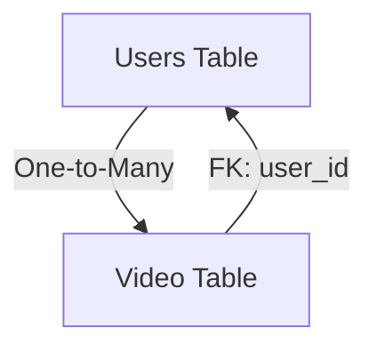

# Persistence & Data Migration

The application utilizes **Spring Data JPA** for the persistence layer and **Flyway** for database schema versioning. This ensures that the database schema is evolved predictably across different environments.

## Database Schema

The system is designed around two primary entities: `Users` and `Video`. The relationship is a **One-to-Many** association, where a single user can upload multiple videos.

### Entity Definitions

#### 1. Users Table
Stores identity and authentication data.
- `id`: Primary Key (UUID).
- `email`: Unique identifier used for authentication.
- `password`: Hashed credential storage.
- `created_at`: Timestamp of account creation.

#### 2. Video Table
Stores metadata for uploaded content.
- `video_id`: Primary Key (String).
- `title`: Title of the video.
- `status`: Current state of the video processing. Restricted to: `UPLOADING`, `PROCESSING`, `READY`, `FAILED`.
- `user_id`: Foreign Key referencing `users(id)` with `ON DELETE CASCADE`.

## Data Model Relationship

## Repository Layer

The application implements the Repository pattern via Spring Data JPA to abstract data access logic.

### User Repository (`UserRepo`)
Handles user-specific persistence operations.
- **Base Interface**: `JpaRepository<Users, UUID>`
- **Custom Query**: `findByEmail(String email)` — Used primarily during the authentication and registration flow to prevent duplicate accounts and retrieve user profiles.

### Video Repository (`VideoRepository`)
Manages video metadata and retrieval.
- **Base Interface**: `JpaRepository<Video, String>`
- **Custom Queries**:
    - `findByTitle(String title)`: Enables searching for videos by their title.
    - `findByUserId(UUID userId)`: Retrieves all videos associated with a specific user.

## Migration Strategy

Database migrations are managed by **Flyway**. Migration scripts are located in `src/main/resources/db/migration/`.

### Migration: `V1__add_new_column.sql`
The initial migration script establishes the core schema:
1. **Table Creation**: Creates `users` first to satisfy foreign key dependencies.
2. **Integrity Constraints**: 
    - Implements a `CHECK` constraint on `video.status` to ensure only valid lifecycle states are persisted.
    - Defines `fk_video_user` to maintain referential integrity between videos and their owners.
3. **Cascading Deletes**: Configured `ON DELETE CASCADE` so that deleting a user automatically purges their associated video metadata.