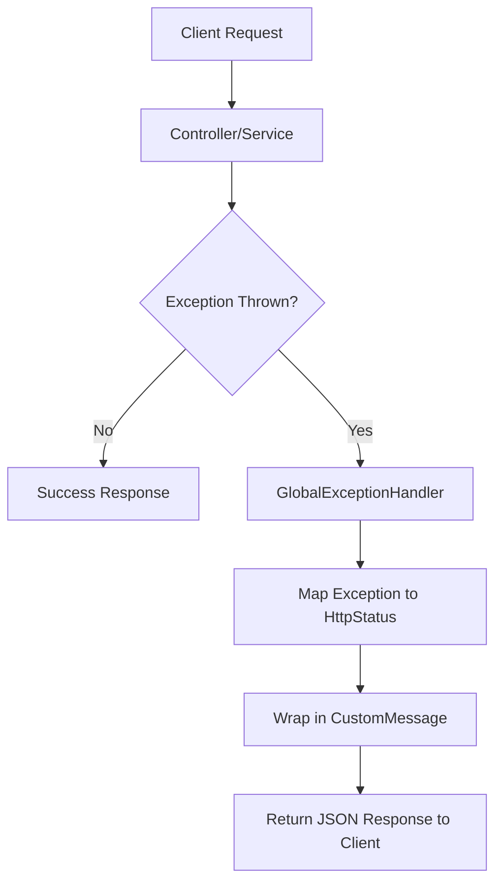

# Global Infrastructure & Error Handling

This section details the centralized infrastructure used to maintain consistency across the application, including global constants, standardized API response payloads, and the centralized exception handling mechanism.

## Application Constants

The application utilizes a centralized constants class to ensure maintainability and avoid "magic numbers" throughout the codebase.

### `AppConstants.java`

Currently, the application defines critical parameters for data streaming and file handling.

| Constant | Value | Description |
| :--- | :--- | :--- |
| `CHUNK_SIZE` | `1024 * 1024` (1MB) | The buffer size used for reading and writing data streams to optimize memory usage during video processing. |

---

## Unified Response Payload

To ensure a consistent contract between the backend and the frontend, all error responses are wrapped in a standardized payload.

### `CustomMessage.java`

This POJO is used by the `GlobalExceptionHandler` to return a predictable JSON structure.

**Structure:**
- `message` (String): A human-readable description of the event or error.
- `success` (boolean): A flag indicating whether the request was processed successfully.

---

## Global Exception Management

The application employs a `@RestControllerAdvice` strategy to decouple error handling from business logic. This ensures that no matter where an exception is thrown in the service layer or controllers, the client receives a consistent HTTP response.

### Error Handling Flow

### Exception Mapping Table

The `GlobalExceptionHandler` intercepts the following exceptions and maps them to specific HTTP status codes:

| Exception | HTTP Status | Logic/Message |
| :--- | :--- | :--- |
| `NoSuchElementException` | `404 Not Found` | Triggered when a requested video or resource does not exist. |
| `UsernameNotFoundException` | `404 Not Found` | Triggered during authentication if the user is not registered. |
| `BadCredentialsException` | `401 Unauthorized` | Triggered on login failure (invalid email or password). |
| `IllegalArgumentException` | `400 Bad Request` | Triggered by validation failures or illegal arguments. |
| `MaxUploadSizeExceededException`| `413 Payload Too Large`| Triggered when an upload exceeds the defined limit (e.g., 500MB). |
| `Exception` (Generic) | `500 Internal Server Error`| Catch-all for unexpected failures; logs the stack trace internally. |

### Implementation Highlights

- **Logging**: The handler uses `SLF4J` to log warnings for client-side errors (4xx) and errors for server-side failures (5xx), providing observability without exposing sensitive stack traces to the end-user.
- **Builder Pattern**: Utilizes Lombok's `@Builder` in `CustomMessage` for concise and readable response construction.