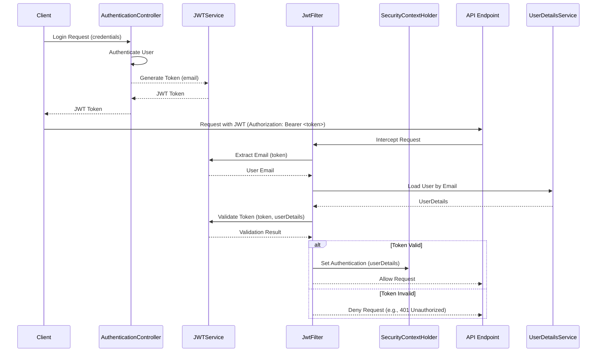

# Security and Token Management

This section details the security mechanisms employed by the application, focusing on the use of JSON Web Tokens (JWTs) for authentication and authorization. The application leverages JWTs to secure API endpoints and manage user sessions.

## JWT Generation and Validation

The core of the security system lies in the `JWTService` and its implementation `JWTServiceImplementation`. This service is responsible for generating JWTs upon successful user authentication and validating them for subsequent requests.

The `JWTServiceImplementation` generates a secret key using `HmacSHA256` upon initialization. This key is crucial for signing and verifying the integrity of the JWTs.

```java
    private String secretKey = "";

    public JWTServiceImplementation() {
        try {
            KeyGenerator keyGen = KeyGenerator.getInstance("HmacSHA256");
            SecretKey sk = keyGen.generateKey();
            secretKey = Base64.getEncoder().encodeToString(sk.getEncoded());
        } catch (NoSuchAlgorithmException e) {
            throw new RuntimeException(e);
        }
    }
```

A JWT is generated for a user's email, including the subject, issue time, and expiration time.

```java
    @Override
    public String generateToken(String email) {
        Map<String, Object> claims = new HashMap<>();

        return Jwts.builder()
                .claims()
                .add(claims)
                .subject(email)
                .issuedAt(new Date(System.currentTimeMillis()))
                .expiration(new Date(System.currentTimeMillis()+60*60*30*30))
                .and()
                .signWith(getKey())
                .compact();
    }
```

The `JWTService` interface defines the contract for token operations:

```java
public interface JWTService {

    public String generateToken(String email);

    public String extractEmail(String token);

    public boolean validateToken(String token, UserDetails userDetails);
}
```

Token validation involves extracting the email from the token and comparing it with the `UserDetails` username, as well as checking if the token has expired.

```java
    @Override
    public boolean validateToken(String token, UserDetails userDetails) {
        final String email = extractEmail(token);
        return (email.equals(userDetails.getUsername()) && !isTokenExpired(token));
    }
```

## JWT Authentication Filter

The `JwtFilter` is a `OncePerRequestFilter` that intercepts incoming requests. It checks for an `Authorization` header, extracts the JWT (expected in the "Bearer <token>" format), and then uses the `JWTService` to validate the token. If the token is valid, it loads the associated `UserDetails` and sets the authentication context for the current request.

```java
@Component
@RequiredArgsConstructor
public class JwtFilter extends OncePerRequestFilter {

    private final JWTService jwtService;
    private final MyUserDetailsServiceImplementation userDetailsService;

    @Override
    protected void doFilterInternal(HttpServletRequest request,
                                    HttpServletResponse response,
                                    FilterChain filterChain)
            throws ServletException, IOException {
        // Bearer "token"
        String authHeader = request.getHeader("Authorization");
        String token = null;
        String email = null;

        if (authHeader != null && authHeader.startsWith("Bearer")) {
            token = authHeader.substring(7);
            email = jwtService.extractEmail(token);
        }

        if(email != null && SecurityContextHolder.getContext().getAuthentication() == null) {

            UserDetails userDetails = userDetailsService.loadUserByUsername(email);
            if(jwtService.validateToken(token, userDetails)) {
                UsernamePasswordAuthenticationToken authToken = new UsernamePasswordAuthenticationToken(userDetails, null, userDetails.getAuthorities());
                authToken.setDetails(new WebAuthenticationDetailsSource().buildDetails(request));
                SecurityContextHolder.getContext().setAuthentication(authToken);
            }
        }

        filterChain.doFilter(request, response);
    }
}
```

## Token Flow

The following diagram illustrates the flow of token generation and validation within the application:





## Key Takeaways

*   **JWT for Authentication**: The application uses JWTs for securing API access.
*   **Bearer Token Scheme**: Tokens are expected in the `Authorization: Bearer <token>` header.
*   **Token Generation**: `JWTService` generates unique JWTs for authenticated users.
*   **Token Validation**: `JwtFilter` intercepts requests, validates JWTs, and establishes the security context.
*   **Secure Key Management**: A strong, dynamically generated secret key is used for signing JWTs.