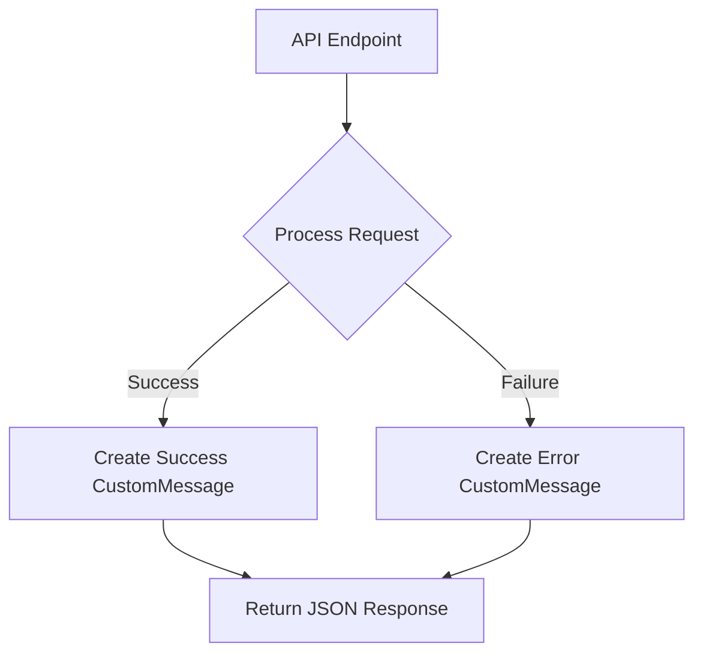

# Utility and Response Handling

This section details the utility classes and custom response structures employed within the application to manage constants and standardize API responses.

## Application Constants

The `AppConstants` class serves as a centralized repository for application-wide constants. This promotes consistency and simplifies maintenance by defining values in a single location.

```java
package com.stream.app;

public class AppConstants {
    public static final int CHUNK_SIZE=1024*1024; // 1MB
}
```

The primary constant defined here is `CHUNK_SIZE`, set to 1MB (1024 * 1024 bytes), which is likely used for file processing or data streaming operations.

## Custom Response Messages

The `CustomMessage` class provides a standardized format for API responses, ensuring that clients consistently receive information about the success or failure of an operation, along with a descriptive message. This class utilizes Lombok annotations for conciseness.

```java
package com.stream.app.payload;

import lombok.*;

@AllArgsConstructor
@NoArgsConstructor
@Getter
@Setter
@Builder
public class CustomMessage {
    private String message;
    private boolean success = false;
}
```

This structure allows for easy creation of response objects, such as:

```java
CustomMessage successResponse = CustomMessage.builder()
    .message("Operation completed successfully.")
    .success(true)
    .build();

CustomMessage errorResponse = CustomMessage.builder()
    .message("An error occurred during processing.")
    .success(false)
    .build();
```

## Response Handling Flow

The following diagram illustrates a typical flow for handling API responses using the `CustomMessage` class.





## Key Takeaways

*   **`AppConstants`**: Provides a single source of truth for application-wide constants, improving maintainability.
*   **`CustomMessage`**: Standardizes API responses, offering a clear and consistent way to communicate operation status and messages to clients.
*   **`CHUNK_SIZE`**: A crucial constant likely used in data streaming or file handling for defining segment sizes.