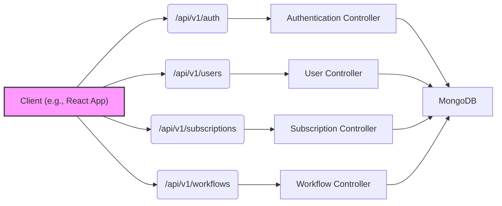
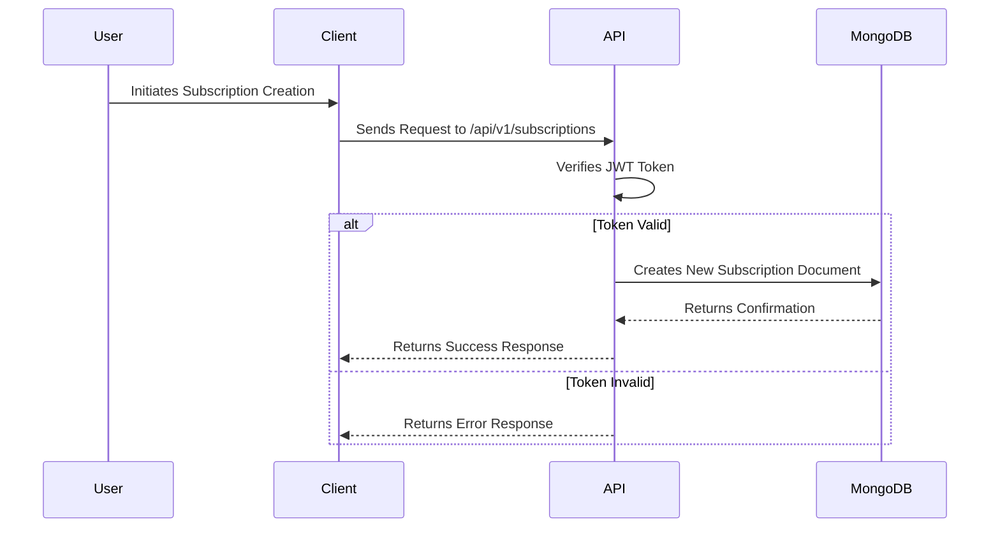

# Application Overview

The Sub Tracker application is a REST API designed to manage and track user subscriptions. Built with Node.js, Express, and MongoDB, it provides functionalities for user authentication, subscription management, and workflow automation related to subscriptions. It aims to streamline the process of monitoring subscription statuses, sending reminders, and managing subscription lifecycles.

## Key Features

*   **User Authentication:** Secure user registration, login, and authentication using JWT (JSON Web Tokens) and bcryptjs for password hashing.
*   **Subscription Management:** CRUD (Create, Read, Update, Delete) operations for managing user subscriptions, including details such as subscription name, billing cycle, and renewal date.
*   **Workflow Automation:** Integrates with Upstash Workflow to automate tasks related to subscriptions, such as sending renewal reminders and deactivating expired subscriptions.
*   **Error Handling:** Centralized error handling middleware for consistent error responses.
*   **Security:** Implements CORS (Cross-Origin Resource Sharing) for controlled access from different origins and Arcjet for rate limiting and security.
*   **Database Integration:** Uses MongoDB for persistent data storage with Mongoose as an ODM (Object-Document Mapper).

## Technology Stack

| Technology    | Description                                                              |
| :------------ | :----------------------------------------------------------------------- |
| Node.js       | JavaScript runtime environment for server-side development.              |
| Express       | Web application framework for building RESTful APIs.                     |
| MongoDB       | NoSQL database for storing application data.                             |
| Mongoose      | MongoDB object modeling tool designed to work in an asynchronous environment. |
| JWT           | JSON Web Tokens for user authentication and authorization.              |
| bcryptjs      | Library for hashing passwords securely.                                   |
| Upstash Workflow| Workflow engine for automating subscription-related tasks.              |
| CORS          | Middleware for enabling Cross-Origin Resource Sharing.                   |
| Cookie-parser | Middleware for parsing cookies.                                          |
| Arcjet        | Middleware for rate limiting and security.                               |

## Application Architecture

The application follows a modular architecture, with separate routes and controllers for users, authentication, and subscriptions. Middleware functions are used for authentication, error handling, and request processing.





## Core Components

### `app.js`

This is the main entry point of the application. It sets up the Express server, middleware, routes, and database connection.

```javascript
// File: app.js
import express from 'express';
import cookieParser from 'cookie-parser';
import cors from 'cors';

import { PORT } from './config/env.js';

import userRouter from './routes/user.routes.js';
import authRouter from './routes/auth.routes.js';
import subscriptionRouter from './routes/subscription.route.js';
import connectToDatabase from './database/mongodb.js'
import errorMiddleware from './middlewares/error.middleware.js'
import arcjetMiddleware from './middlewares/arcjet.middleware.js'
import workflowRouter from './routes/workflow.route.js'

const app = express();

app.use(express.json());
app.use(express.urlencoded({ extended: false }));
app.use(cookieParser());
app.use(arcjetMiddleware);
app.use(cors());

app.use('/api/v1/auth', authRouter);
app.use('/api/v1/users', userRouter);
app.use('/api/v1/subscriptions', subscriptionRouter);
app.use('/api/v1/workflows', workflowRouter);

app.use(errorMiddleware);

app.get('/', (req, res) => {
  res.send('Welcome to the Subscription Tracker API!');
});

app.listen(PORT, async () => {
  console.log(`Subscription Tracker API is running on http://localhost:${PORT}`);

  await connectToDatabase();
});

export default app;
```

[View on GitHub](https://github.com/santrupt29/sub_tracker/blob/main/app.js)

### Routes

The application defines several routes for different functionalities:

*   `/api/v1/auth`: Authentication routes for user registration and login.
*   `/api/v1/users`: User management routes for retrieving user information.
*   `/api/v1/subscriptions`: Subscription management routes for creating, reading, updating, and deleting subscriptions.
*   `/api/v1/workflows`: Workflow management routes for triggering subscription-related workflows.

```javascript
// Example: routes/subscription.route.js
import express from 'express';
import {
    createSubscription,
    getAllSubscriptions,
    getSubscriptionById,
    updateSubscription,
    deleteSubscription,
} from '../controllers/subscription.controller.js';
import { verifyToken } from '../middlewares/auth.middleware.js';

const router = express.Router();

router.post('/', verifyToken, createSubscription);
router.get('/', verifyToken, getAllSubscriptions);
router.get('/:id', verifyToken, getSubscriptionById);
router.put('/:id', verifyToken, updateSubscription);
router.delete('/:id', verifyToken, deleteSubscription);

export default router;
```

[View on GitHub](https://github.com/santrupt29/sub_tracker/blob/main/routes/subscription.route.js)

### Controllers

Controllers handle the business logic for each route. They interact with the database to perform CRUD operations and return appropriate responses.

```javascript
// Example: controllers/subscription.controller.js
import Subscription from '../models/subscription.model.js';
import {handleHttpError} from "../utils/errorHandler.js";

// Create a new subscription
export const createSubscription = async (req, res) => {
    try {
        const newSubscription = new Subscription({
            ...req.body,
            userId: req.user.id
        });
        const savedSubscription = await newSubscription.save();
        res.status(201).json(savedSubscription);
    } catch (error) {
        handleHttpError(res, error)
    }
};
```

[View on GitHub](https://github.com/santrupt29/sub_tracker/blob/main/controllers/subscription.controller.js)

### Models

Mongoose models define the structure of the data stored in MongoDB.

```javascript
// Example: models/subscription.model.js
import mongoose from 'mongoose';

const subscriptionSchema = new mongoose.Schema({
  name: { type: String, required: true },
  userId: { type: mongoose.Schema.Types.ObjectId, ref: 'User', required: true },
  amount: { type: Number, required: true },
  billingCycle: { type: String, required: true },
  renewalDate: { type: Date, required: true },
  notes: { type: String },
  createdAt: { type: Date, default: Date.now },
  updatedAt: { type: Date, default: Date.now },
});

const Subscription = mongoose.model('Subscription', subscriptionSchema);

export default Subscription;
```

[View on GitHub](https://github.com/santrupt29/sub_tracker/blob/main/models/subscription.model.js)

### Middleware

Middleware functions are used to intercept requests and perform actions such as authentication, authorization, and error handling.

```javascript
// Example: middlewares/auth.middleware.js
import jwt from 'jsonwebtoken';
import { JWT_SECRET } from '../config/env.js';

export const verifyToken = (req, res, next) => {
  const token = req.cookies.token || req.headers.authorization?.split(' ')[1];

  if (!token) {
    return res.status(401).json({ message: 'Authentication required' });
  }

  jwt.verify(token, JWT_SECRET, (err, user) => {
    if (err) {
      return res.status(403).json({ message: 'Invalid token' });
    }
    req.user = user;
    next();
  });
};
```

[View on GitHub](https://github.com/santrupt29/sub_tracker/blob/main/middlewares/auth.middleware.js)

### Error Handling
The `errorMiddleware` centralizes error handling.

```javascript
// Example: middlewares/error.middleware.js
const errorMiddleware = (err, req, res, next) => {
    console.error(err.stack);
    const statusCode = err.statusCode || 500;
    const message = err.message || 'Internal Server Error';
    res.status(statusCode).json({
        message: message,
        stack: process.env.NODE_ENV === 'production' ? null : err.stack,
    });
};

export default errorMiddleware;
```

[View on GitHub](https://github.com/santrupt29/sub_tracker/blob/main/middlewares/error.middleware.js)

## Key Integration Points

The Sub Tracker API integrates several key components to provide a comprehensive subscription management solution. The authentication flow ensures secure access to the API, while the subscription management features allow users to track and manage their subscriptions effectively. The Upstash Workflow integration automates subscription-related tasks, such as sending renewal reminders and deactivating expired subscriptions.




