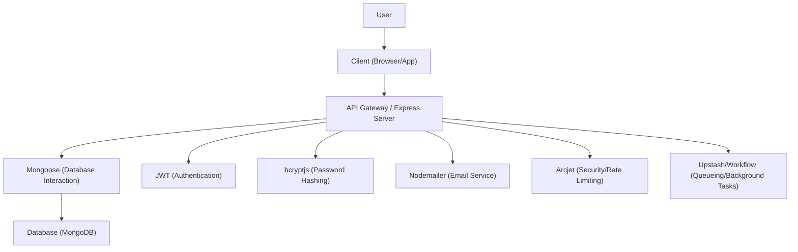

# Project Setup and Configuration

This section details the project's setup, its dependencies, and environment configuration for the `sub_tracker` project.

## Project Structure and Dependencies

The `sub_tracker` project is a Node.js application built with Express. The `package.json` file outlines the project's dependencies and development dependencies, along with scripts for running the application.

```json
{
  "name": "subdub",
  "version": "0.0.0",
  "private": true,
  "type": "module",
  "scripts": {
    "start": "node app.js",
    "dev": "nodemon app.js"
  },
  "dependencies": {
    "@arcjet/node": "^1.0.0-beta.2",
    "@upstash/workflow": "^0.2.10",
    "bcryptjs": "^3.0.2",
    "cookie-parser": "~1.4.4",
    "cors": "^2.8.5",
    "dayjs": "^1.11.13",
    "debug": "~2.6.9",
    "dotenv": "^16.4.7",
    "express": "~4.16.1",
    "jsonwebtoken": "^9.0.2",
    "mongodb": "^6.13.1",
    "mongoose": "^8.11.0",
    "morgan": "~1.9.1",
    "nodemailer": "^6.10.0"
  },
  "devDependencies": {
    "@eslint/js": "^9.21.0",
    "eslint": "^9.21.0",
    "globals": "^16.0.0",
    "nodemon": "^3.1.9"
  }
}
```

The `package-lock.json` file ensures deterministic installs by locking down the exact versions of all dependencies and their sub-dependencies. It includes a comprehensive list of packages like `@arcjet/node`, `@upstash/workflow`, `bcryptjs`, `cors`, `dayjs`, `dotenv`, `express`, `jsonwebtoken`, `mongodb`, `mongoose`, `morgan`, `nodemailer`, and development tools like `eslint`, `globals`, and `nodemon`.

## Environment Configuration

The application utilizes environment variables for configuration, managed through the `dotenv` package. The `config/env.js` file is responsible for loading these variables.

```javascript
import { config } from 'dotenv';

config({ path: `.env.${process.env.NODE_ENV || 'development'}.local` });

export const {
  PORT, NODE_ENV, SERVER_URL,
  DB_URI,
  JWT_SECRET, JWT_EXPIRES_IN,
  ARCJET_ENV, ARCJET_KEY,
  QSTASH_TOKEN, QSTASH_URL,
  EMAIL_PASSWORD, UPSTASH_TOKEN,
} = process.env;
```

This setup allows for different configurations based on the `NODE_ENV` variable (e.g., `development`, `production`). Key environment variables that are expected to be set include:

*   `PORT`: The port the server will listen on.
*   `NODE_ENV`: The environment the application is running in.
*   `SERVER_URL`: The base URL of the server.
*   `DB_URI`: The connection string for the database.
*   `JWT_SECRET`: The secret key for JWT token generation.
*   `JWT_EXPIRES_IN`: The expiration time for JWT tokens.
*   `ARCJET_ENV`: The Arcjet environment type (e.g., `production`, `development`).
*   `ARCJET_KEY`: The Arcjet API key.
*   `QSTASH_TOKEN`: The token for QStash.
*   `QSTASH_URL`: The URL for QStash.
*   `EMAIL_PASSWORD`: The password for the email service.
*   `UPSTASH_TOKEN`: The token for Upstash.

## Linting Configuration

The project uses ESLint for code linting to maintain code quality and consistency. The `eslint.config.js` file defines the ESLint configuration.

```javascript
import globals from "globals";
import pluginJs from "@eslint/js";


/** @type {import('eslint').Linter.Config[]} */
export default [
  {languageOptions: { globals: globals.node }},
  pluginJs.configs.recommended,
];
```

This configuration enables Node.js globals and applies the recommended ESLint rules.

## Architecture Overview

The project follows a standard Node.js/Express architecture, where the server handles incoming requests, interacts with the database via Mongoose, and utilizes various services for functionalities like authentication (JWT, bcryptjs), email (nodemailer), and rate limiting/security (Arcjet).





## Key Takeaways

*   **Node.js & Express**: The core of the application is built using Node.js and the Express framework.
*   **Environment Variables**: Configuration is managed through `.env` files, allowing for flexible environment-specific settings.
*   **Dependency Management**: `npm` and `package-lock.json` ensure consistent dependency versions.
*   **Code Quality**: ESLint is configured to enforce code style and quality standards.
*   **Key Libraries**: The project leverages libraries for database interaction (Mongoose), authentication (JWT, bcryptjs), email services (Nodemailer), security (Arcjet), and background task management (Upstash/Workflow).