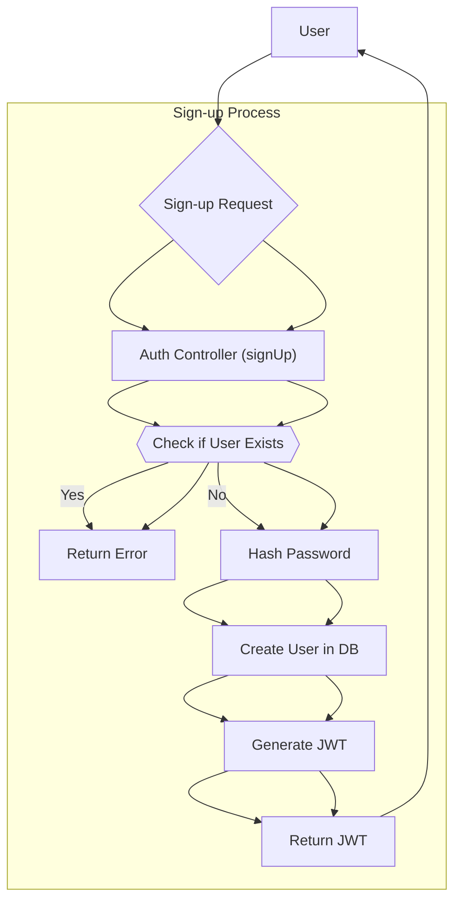
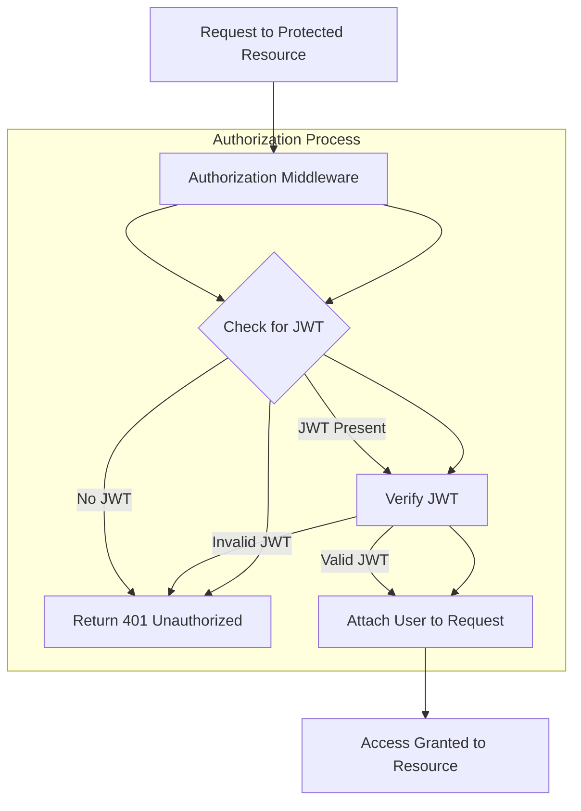

# Authentication & Authorization

This document details the authentication and authorization mechanisms implemented in the `sub_tracker` application.  Authentication verifies the identity of a user, while authorization determines what resources a user is allowed to access. The system uses JSON Web Tokens (JWT) for secure authentication and authorization.

## Features

*   **User Registration (Sign-up):** Allows new users to create accounts.
*   **User Login (Sign-in):** Authenticates existing users and provides them with a JWT.
*   **Authorization Middleware:** Protects specific routes, ensuring only authenticated users can access them.
*   **Password Hashing:**  Uses bcryptjs to securely store user passwords.
*   **JWT Expiration:** JWTs expire after a configured time, enhancing security.

## Files

*   `controllers/auth.controller.js`: Contains the logic for user registration, login, and logout.
*   `routes/auth.routes.js`: Defines the authentication routes.
*   `middlewares/auth.middleware.js`: Implements the authorization middleware.

## User Registration (Sign-up)

The `signUp` function in `controllers/auth.controller.js` handles user registration.  It performs the following steps:

1.  Checks if a user with the provided email already exists.
2.  Hashes the user's password using bcryptjs.
3.  Creates a new user in the database.
4.  Generates a JWT for the new user.

```javascript title="controllers/auth.controller.js - signUp function"
import mongoose from "mongoose";
import User from "../models/user.model.js";
import bcrypt from "bcryptjs";
import jwt from "jsonwebtoken";
import { JWT_EXPIRES_IN } from "../config/env.js";
import { JWT_SECRET } from "../config/env.js";

export const signUp = async (req, res, next) => {
    const session = await mongoose.startSession();
    session.startTransaction();

    try {
        const {name, email, password} = req.body;

        const userExists = await User.findOne({email});
        if (userExists) {
            const error = new Error('User already exists');
            error.statusCode = 409;
            throw error;
        }

        const salt = await bcrypt.genSalt(10);
        const hashedPassword = await bcrypt.hash(password, salt);

        const newUsers = await User.create([{name, email, password: hashedPassword}], {session: session});   

        const token = jwt.sign({userId: newUsers[0]._id}, JWT_SECRET, {expiresIn: JWT_EXPIRES_IN});

        await session.commitTransaction();
        session.endSession();

        res.status(201).json({
            success: true,
            message: 'User created successfully',
            data: {
                token,
                user : newUsers[0],
            }
        })
    } catch (error) {
        await session.abortTransaction();
        session.endSession();           
        next(error);
    }
}
```

[View on GitHub](https://github.com/santrupt29/sub_tracker/blob/main/controllers/auth.controller.js)

## User Login (Sign-in)

The `signIn` function in `controllers/auth.controller.js` handles user login. It verifies the user's credentials and generates a JWT upon successful authentication.

```javascript title="controllers/auth.controller.js - signIn function"
export const signIn = async (req, res, next) => {
    try {
        const {email, password} = req.body;

        const user = await User.findOne({email});
        if (!user) {
            const error = new Error('User not found');
            error.statusCode = 401;
            throw error;
        }

        const isPasswordValid = await bcrypt.compare(password, user.password);
        if (!isPasswordValid) {
            const error = new Error('Invalid password');
            error.statusCode = 401;
            throw error;
        }

        const token = jwt.sign({userId: user._id}, JWT_SECRET, {expiresIn: JWT_EXPIRES_IN});

        res.status(200).json({
            success: true,
            message: 'User signed in successfully',
            data: {
                token,
                user,
            }
        });
    } catch (error) {
        next(error);
    }
}
```

[View on GitHub](https://github.com/santrupt29/sub_tracker/blob/main/controllers/auth.controller.js)

## Authorization Middleware

The `authorize` middleware in `middlewares/auth.middleware.js` protects routes by verifying the JWT sent in the `Authorization` header.

```javascript title="middlewares/auth.middleware.js - authorize middleware"
import { JWT_SECRET } from "../config/env.js";
import jwt from 'jsonwebtoken';
import User from "../models/user.model.js";
const authorize = async (req, res, next) => {
    try {
        let token;
        if (req.headers.authorization && req.headers.authorization.startsWith('Bearer')) {
            token = req.headers.authorization.split(' ')[1];
        }
        if (!token) {
            return res.status(401).json({
                message: 'Unauthorized'
            });
        }

        const decoded = jwt.verify(token, JWT_SECRET);

        const user = await User.findById(decoded.userId);

        if (!user) {                
            return res.status(401).json({
                message: 'Unauthorized'
            });
        }

    req.user = user;

    next();
 } catch (error) {
        res.status(401).json({
            message: 'Unauthorized',
            message: error.message
        });
    }
}

export default authorize;
```

[View on GitHub](https://github.com/santrupt29/sub_tracker/blob/main/middlewares/auth.middleware.js)

This middleware extracts the JWT from the `Authorization` header, verifies it using the `JWT_SECRET`, and attaches the user object to the request if the token is valid.

## Authentication Routes

The `authRouter` in `routes/auth.routes.js` defines the API endpoints for authentication:

```javascript title="routes/auth.routes.js"
import { Router } from "express";

import { signUp } from "../controllers/auth.controller.js";
import { signIn } from "../controllers/auth.controller.js";
import { signOut } from "../controllers/auth.controller.js";

const authRouter = Router();

// Path: /api/v1/auth/sign-up (POST)
authRouter.post('/sign-up', signUp);

authRouter.post('/sign-in', signIn);

authRouter.post('/sign-out', signOut);

export default authRouter;
```

[View on GitHub](https://github.com/santrupt29/sub_tracker/blob/main/routes/auth.routes.js)

These routes are then mounted under `/api/v1/auth` in the main application.

## Password Hashing

bcryptjs is used to securely hash passwords before storing them in the database. This prevents attackers from accessing user passwords even if they gain access to the database.

```javascript title="controllers/auth.controller.js - Password Hashing"
import bcrypt from "bcryptjs";

// Hash password
const salt = await bcrypt.genSalt(10);
const hashedPassword = await bcrypt.hash(password, salt);
```

[View on GitHub](https://github.com/santrupt29/sub_tracker/blob/main/controllers/auth.controller.js)

A salt is generated for each password to further enhance security.

## JWT Configuration

The JWT expiration time and secret key are configured using environment variables:

```plaintext title=".env - JWT Configuration"
JWT_SECRET=your-secret-key
JWT_EXPIRES_IN=1d
```

It's crucial to keep the `JWT_SECRET` secure and never expose it in the code.  A long, randomly generated string is recommended. The `JWT_EXPIRES_IN` value specifies the duration for which the JWT is valid (e.g., `1d` for one day, `1h` for one hour).

## Authentication Flow





## Authorization Flow





## Key Integration Points

*   The `authorize` middleware is applied to routes that require authentication.  This is typically done in the route definition file.

    ```javascript title="routes/some.routes.js - Applying Authorization Middleware"
    import authorize from "../middlewares/auth.middleware.js";
    import { someController } from "../controllers/some.controller.js";

    router.get('/protected', authorize, someController);
    ```

*   The JWT is included in the `Authorization` header of requests to protected resources.  The header should have the format `Bearer <JWT>`.

## Best Practices

*   **Securely Store JWT Secret:** The `JWT_SECRET` should be stored as an environment variable and kept confidential.
*   **Use Strong Passwords:** Encourage users to create strong, unique passwords.
*   **Implement Refresh Tokens:**  Consider implementing refresh tokens to allow users to maintain their session without requiring them to log in frequently.  This involves issuing a short-lived access token (the JWT) and a longer-lived refresh token. When the access token expires, the refresh token can be used to obtain a new access token.
*   **Input Validation:**  Validate all user input to prevent injection attacks and other security vulnerabilities.
*   **HTTPS:**  Always use HTTPS to encrypt communication between the client and the server.
```