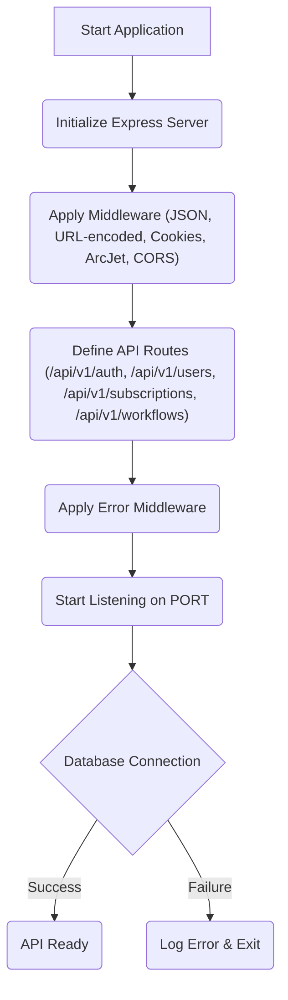

# Core Application Logic

This section details the central components and fundamental operations of the Subscription Tracker application, covering its initialization, core functionalities, and database connectivity.

## Application Initialization and Setup

The `app.js` file serves as the primary entry point for the application. It sets up the Express.js server, configures middleware, and defines API routes.

```javascript
import express from 'express';
import cookieParser from 'cookie-parser';
import cors from 'cors';

import { PORT } from './config/env.js';

import userRouter from './routes/user.routes.js';
import authRouter from './routes/auth.routes.js';
import subscriptionRouter from './routes/subscription.route.js';
import connectToDatabase from './database/mongodb.js'
import errorMiddleware from './middlewares/error.middleware.js'
import arcjetMiddleware from './middlewares/arcjet.middleware.js'
import workflowRouter from './routes/workflow.route.js'

const app = express();

app.use(express.json());
app.use(express.urlencoded({ extended: false }));
app.use(cookieParser());
app.use(arcjetMiddleware);
app.use(cors());

app.use('/api/v1/auth', authRouter);
app.use('/api/v1/users', userRouter);
app.use('/api/v1/subscriptions', subscriptionRouter);
app.use('/api/v1/workflows', workflowRouter);

app.use(errorMiddleware);

app.get('/', (req, res) => {
  res.send('Welcome to the Subscription Tracker API!');
});

app.listen(PORT, async () => {
  console.log(`Subscription Tracker API is running on http://localhost:${PORT}`);

  await connectToDatabase();
});

export default app;
```

The application utilizes several middleware functions for request processing:
*   `express.json()` and `express.urlencoded()`: For parsing JSON and URL-encoded request bodies.
*   `cookieParser()`: To parse cookies attached to the client request.
*   `arcjetMiddleware`: Integrates ArcJet for security and rate limiting.
*   `cors()`: Enables Cross-Origin Resource Sharing.

The application defines routes for authentication, users, subscriptions, and workflows under the `/api/v1/` path. An `errorMiddleware` is configured to handle all application errors.

## Database Connection

The `database/mongodb.js` file is responsible for establishing and managing the connection to the MongoDB database.

```javascript
import mongoose from "mongoose";
import { DB_URI, NODE_ENV } from "../config/env.js";

if (!DB_URI) {
    throw new Error('Please define the MONGODB_URI environment variable inside .env.<development/production>.local')
}

const connectToDatabase = async () => {
    try {
        await mongoose.connect(DB_URI);

        console.log(`Connected to Database in ${NODE_ENV} mode`);
    } catch (error) {
        console.error('Error connecting to database: ', error);

        process.exit(1);
    }
}

export default connectToDatabase;
```

The `connectToDatabase` function uses Mongoose to connect to the database specified by the `DB_URI` environment variable. It logs the connection status and the current `NODE_ENV`. If the `DB_URI` is not defined, it throws an error, ensuring the application cannot start without a valid database connection string. In case of connection errors, it logs the error and terminates the process.

## Application Flow

The application starts by initializing the Express server, applying middleware, defining API routes, and then listening on the specified `PORT`. Concurrently, it attempts to establish a connection to the MongoDB database.





## Key Takeaways

*   The application follows a standard Express.js structure for API development.
*   Environment variables (`PORT`, `DB_URI`, `NODE_ENV`) are crucial for configuration.
*   Database connectivity is handled asynchronously and robustly.
*   Middleware plays a significant role in request processing and security.