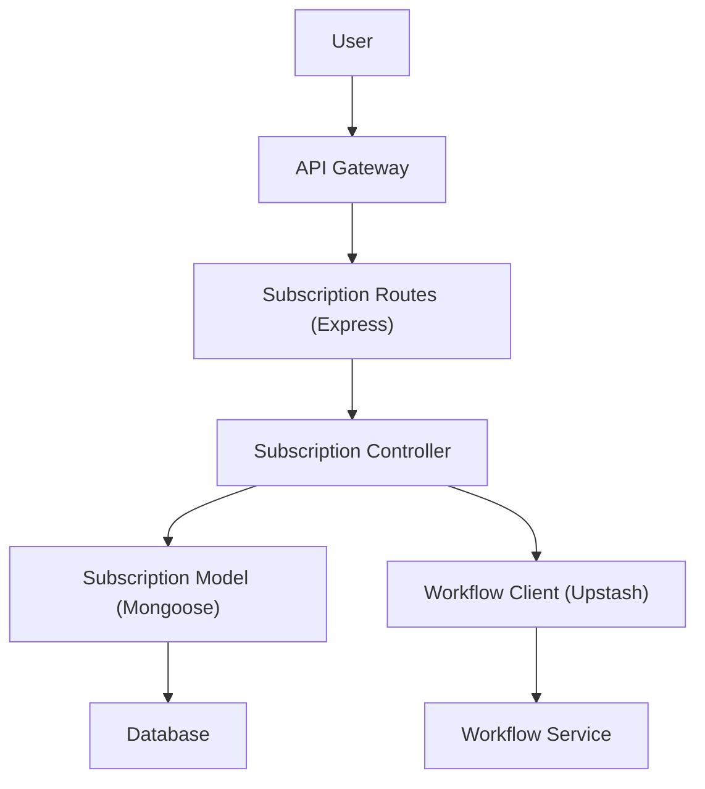

# Subscription Management

This section details the features for managing user subscriptions and their lifecycle, including creation, retrieval, and the underlying data model and workflow integration.

## Creating a Subscription

Users can create new subscriptions through the API. This process involves storing subscription details and triggering a reminder workflow via Upstash.

The `createSubscription` controller function handles this:

```javascript
export const createSubscription = async (req, res, next) => {
  try {
    const subscription = await Subscription.create({
      ...req.body,
      user: req.user._id,
    });

    const { workflowRunId } = await workflowClient.trigger({
      url: `${SERVER_URL}/api/v1/workflows/subscription/reminder`,
      body: {
        subscriptionId: subscription.id,
      },
      headers: {
        'content-type': 'application/json',
        'Authorization': 'Bearer ' + tok,
      },
      retries: 0,
    })

    res.status(201).json({ success: true, data: { subscription, workflowRunId } });
  } catch (e) {
    next(e);
  }
}
```

The corresponding route is:

```javascript
subscriptionRouter.post('/', authorize, createSubscription);
```

## Retrieving User Subscriptions

Users can view their own subscriptions. The API enforces authorization to ensure users can only access their own subscription data.

The `getUserSubscriptions` controller function implements this:

```javascript
export const getUserSubscriptions = async (req, res, next) => {
  try {
    // Check if the user is the same as the one in the token
    if(req.user.id !== req.params.id) {
      const error = new Error('You are not the owner of this account');
      error.status = 401;
      throw error;
    }

    const subscriptions = await Subscription.find({ user: req.params.id });

    res.status(200).json({ success: true, data: subscriptions });
  } catch (e) {
    next(e);
  }
}
```

This functionality is exposed via the following route:

```javascript
subscriptionRouter.get('/user/:id', authorize, getUserSubscriptions);
```

## Subscription Data Model

The `Subscription` model defines the structure and validation for subscription data.

```javascript
const subscriptionSchema = new mongoose.Schema({
  name: {
    type: String,
    required: [true, 'Subscription name is required'],
    trim: true,
    minLength: 2,
    maxLength: 100,
  },
  price: {
    type: Number,
    required: [true, 'Subscription price is required'],
    min: [0, 'Price must be greater than 0']
  },
  frequency: {
    type: String,
    enum: ['daily', 'weekly', 'monthly', 'yearly'],
  },
  category: {
    type: String,
    enum: ['sports', 'news', 'entertainment', 'lifestyle', 'technology', 'finance', 'politics', 'other'],
    required: true,
  },
  paymentMethod: {
    type: String,
    required: true,
    trim: true,
  },
  status: {
    type: String,
    enum: ['active', 'cancelled', 'expired'],
    default: 'active'
  },
  startDate: {
    type: Date,
    required: true,
    validate: {
      validator: (value) => value <= new Date(),
      message: 'Start date must be in the past',
    }
  },
  renewalDate: {
    type: Date,
    validate: {
      validator: function (value) {
        return value > this.startDate;
      },
      message: 'Renewal date must be after the start date',
    }
  },
  user: {
    type: mongoose.Schema.Types.ObjectId,
    ref: 'User',
    required: true,
    index: true,
  }
}, { timestamps: true });
```

The model includes pre-save hooks for automatically calculating the `renewalDate` and updating the `status` if the renewal date has passed.

```javascript
subscriptionSchema.pre('save', function (next) {
  if(!this.renewalDate) {
    const renewalPeriods = {
      daily: 1,
      weekly: 7,
      monthly: 30,
      yearly: 365,
    };

    this.renewalDate = new Date(this.startDate);
    this.renewalDate.setDate(this.renewalDate.getDate() + renewalPeriods[this.frequency]);
  }

  // Auto-update the status if renewal date has passed
  if (this.renewalDate < new Date()) {
    this.status = 'expired';
  }

  next();
});
```

## Workflow Integration for Reminders

When a subscription is created, a reminder workflow is triggered using `workflowClient`. This ensures timely notifications about upcoming renewals.

```javascript
    const { workflowRunId } = await workflowClient.trigger({
      url: `${SERVER_URL}/api/v1/workflows/subscription/reminder`,
      body: {
        subscriptionId: subscription.id,
      },
      headers: {
        'content-type': 'application/json',
        'Authorization': 'Bearer ' + tok,
      },
      retries: 0,
    })
```

This integration allows for proactive management of subscription lifecycles.

## Architecture Overview

The subscription management system interacts with the API, controllers, models, and an external workflow service.





## Key Takeaways

*   **Secure Creation**: Subscriptions are created securely with user authentication and trigger reminder workflows.
*   **User-Centric Retrieval**: Users can access only their own subscription data.
*   **Automated Lifecycle**: The `Subscription` model automates renewal date calculations and status updates.
*   **Event-Driven Notifications**: Integration with a workflow service ensures timely reminders.