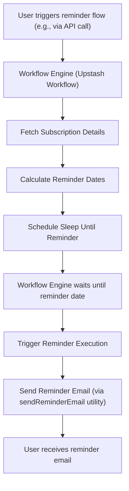

# Workflow Automation

Components related to defining and executing automated workflows. This section details the functionality for automating subscription-related tasks, primarily focusing on sending timely reminders to users before their subscription renewal dates.

## Subscription Reminders

The `sub_tracker` application leverages a workflow automation system to proactively notify users about upcoming subscription renewals. This is crucial for improving user retention and preventing accidental service interruptions. The system is designed to send multiple reminders at predefined intervals before the renewal date.

The core logic for sending reminders is handled by the `sendReminders` function, which is exposed as an HTTP endpoint. This function orchestrates fetching subscription details, calculating reminder dates, and scheduling the sending of reminder emails.

```javascript
// controllers/workflow.controller.js
export const sendReminders = serve(async (context) => {
  const { subscriptionId } = context.requestPayload;
  const subscription = await fetchSubscription(context, subscriptionId);

  if(!subscription || subscription.status !== 'active') return;

  const renewalDate = dayjs(subscription.renewalDate);

  if(renewalDate.isBefore(dayjs())) {
    console.log(`Renewal date has passed for subscription ${subscriptionId}. Stopping workflow.`);
    return;
  }

  for (const daysBefore of REMINDERS) {
    const reminderDate = renewalDate.subtract(daysBefore, 'day');

    if(reminderDate.isAfter(dayjs())) {
      await sleepUntilReminder(context, `Reminder ${daysBefore} days before`, reminderDate);
    }

    if (dayjs().isSame(reminderDate, 'day')) {
      await triggerReminder(context, `${daysBefore} days before reminder`, subscription);
    }
  }
});
```

The workflow defines a set of standard reminder intervals: 7, 5, 2, and 1 day before the renewal date.

```javascript
// controllers/workflow.controller.js
const REMINDERS = [7, 5, 2, 1]
```

The `fetchSubscription` helper function is responsible for retrieving subscription details from the database, including associated user information.

```javascript
// controllers/workflow.controller.js
const fetchSubscription = async (context, subscriptionId) => {
  return await context.run('get subscription', async () => {
    return Subscription.findById(subscriptionId).populate('user', 'name email');
  })
}
```

Similarly, `triggerReminder` handles the actual sending of the email notification.

```javascript
// controllers/workflow.controller.js
const triggerReminder = async (context, label, subscription) => {
  return await context.run(label, async () => {
    console.log(`Triggering ${label} reminder`);

    await sendReminderEmail({
      to: subscription.user.email,
      type: label,
      subscription,
    })
  })
}
```

### API Endpoint

The subscription reminder workflow is accessible via a POST request to the `/subscription/reminder` endpoint.

```bash
POST /subscription/reminder
```

**Request Body Example:**

```json
{
  "subscriptionId": "sub_123abc"
}
```

This endpoint is integrated into the application's routing as follows:

```javascript
// routes/workflow.route.js
import { Router} from 'express';
import { sendReminders } from '../controllers/workflow.controller.js'

const workflowRouter = Router();

workflowRouter.post('/subscription/reminder', sendReminders);

export default workflowRouter;
```

## Workflow Architecture

The workflow automation for subscription reminders operates as a distributed system, where the `@upstash/workflow` library plays a central role in managing the execution and state of asynchronous tasks. The `sendReminders` function, acting as the entry point, communicates with the workflow engine to schedule and execute reminder logic.





## Key Takeaways

*   Subscription renewal reminders are automated to enhance user experience and retention.
*   Reminders are sent at predefined intervals (7, 5, 2, and 1 day before renewal).
*   The system leverages `@upstash/workflow` for robust asynchronous task management.
*   An API endpoint is available to initiate the reminder workflow for a given subscription.