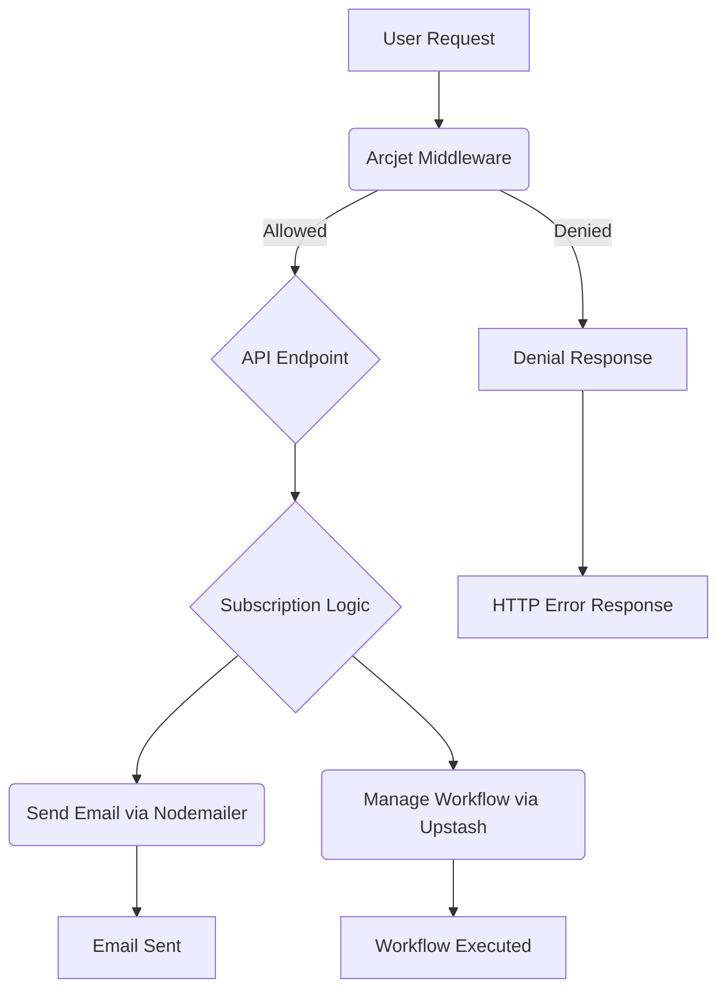

# External Integrations and Utilities

This section details the external integrations and utility functions employed within the `sub_tracker` project. These components enhance security, enable communication, and leverage external services for efficient operation.

## Arcjet Integration

Arcjet is integrated for security purposes, providing protection against common web threats like rate limiting and bot detection.

The `arcjet.js` configuration file initializes the Arcjet client with specific rules.

```javascript
// config/arcjet.js
import arcjet, {shield, detectBot, tokenBucket} from "@arcjet/node";
import { ARCJET_KEY } from "./env.js";

const aj = arcjet({
    key: ARCJET_KEY,
    characteristics: ["ip.src"],
    rules: [
      shield({ mode: "LIVE" }),
      detectBot({
        mode: "LIVE",
        allow: [
          "CATEGORY:SEARCH_ENGINE",
        ],
      }),
      tokenBucket({
        mode: "LIVE",
        refillRate: 5, // Refill 5 tokens per interval
        interval: 10, // Refill every 10 seconds
        capacity: 10, // Bucket capacity of 10 tokens
      }),
    ],
  });

  export default aj;
```

The `arcjet.middleware.js` file implements a middleware function that leverages the Arcjet client to protect incoming requests.

```javascript
// middlewares/arcjet.middleware.js
import aj from "../config/arcjet.js";

const arcjetMiddleware = async (req, res, next) => {
    try {
        const decision = await aj.protect(req, {requested:1});

        if (decision.isDenied()) {
            if (decision.reason.isRateLimit()) {
                return res.status(429).json({
                    message: "Rate Limit Exceeded"
                });
            }
            if (decision.reason.isBot()) {
                return res.status(401).json({
                    message: "Bot Detected"
                });
            }
            return res.status(403).json({
                error: "Access Denied"
            });
        }

        next();
    } catch (error) {
        console.log(`Arcjet middleware error: ${error.message}`);
        next(error);
    }
}

export default arcjetMiddleware;
```

## Nodemailer for Email Notifications

Nodemailer is used to send transactional emails, such as subscription renewal reminders.

The `nodemailer.js` configuration sets up the transporter using Gmail as the email service.

```javascript
// config/nodemailer.js
import nodemailer from 'nodemailer';

import { EMAIL_PASSWORD } from './env.js'

export const accountEmail = 'santrupt.potphode29@gmail.com';

const transporter = nodemailer.createTransport({
  service: 'gmail',
  auth: {
    user: accountEmail,
    pass: EMAIL_PASSWORD
  }
})

export default transporter;
```

The `send-email.js` utility provides a function `sendReminderEmail` to dispatch these notifications.

```javascript
// utils/send-email.js
import { emailTemplates } from './email-template.js'
import dayjs from 'dayjs'
import transporter, { accountEmail } from '../config/nodemailer.js'

export const sendReminderEmail = async ({ to, type, subscription }) => {
  if(!to || !type) throw new Error('Missing required parameters');

  const template = emailTemplates.find((t) => t.label === type);

  if(!template) throw new Error('Invalid email type');

  const mailInfo = {
    userName: subscription.user.name,
    subscriptionName: subscription.name,
    renewalDate: dayjs(subscription.renewalDate).format('MMM D, YYYY'),
    planName: subscription.name,
    price: `${subscription.currency} ${subscription.price} (${subscription.frequency})`,
    paymentMethod: subscription.paymentMethod,
  }

  const message = template.generateBody(mailInfo);
  const subject = template.generateSubject(mailInfo);

  const mailOptions = {
    from: accountEmail,
    to: to,
    subject: subject,
    html: message,
  }

  transporter.sendMail(mailOptions, (error, info) => {
    if(error) return console.log(error, 'Error sending email');

    console.log('Email sent: ' + info.response);
  })
}
```

The `email-template.js` file defines reusable email templates for various reminder scenarios.

```javascript
// utils/email-template.js
export const generateEmailTemplate = ({
  userName,
  subscriptionName,
  renewalDate,
  planName,
  price,
  paymentMethod,
  accountSettingsLink,
  supportLink,
  daysLeft,
}) => `
<div style="font-family: 'Segoe UI', Tahoma, Geneva, Verdana, sans-serif; line-height: 1.6; color: #333; max-width: 600px; margin: 0 auto; padding: 0; background-color: #f4f7fa;">
    <table cellpadding="0" cellspacing="0" border="0" width="100%" style="background-color: #ffffff; border-radius: 10px; overflow: hidden; box-shadow: 0 4px 6px rgba(0, 0, 0, 0.1);">
        <tr>
            <td style="background-color: #4a90e2; text-align: center;">
                <p style="font-size: 54px; line-height: 54px; font-weight: 800;">SubDub</p>
            </td>
        </tr>
        <tr>
            <td style="padding: 40px 30px;">
                <p style="font-size: 16px; margin-bottom: 25px;">Hello <strong style="color: #4a90e2;">${userName}</strong>,</p>

                <p style="font-size: 16px; margin-bottom: 25px;">Your <strong>${subscriptionName}</strong> subscription is set to renew on <strong style="color: #4a90e2;">${renewalDate}</strong> (${daysLeft} days from today).</p>

                <table cellpadding="15" cellspacing="0" border="0" width="100%" style="background-color: #f0f7ff; border-radius: 10px; margin-bottom: 25px;">
                    <tr>
                        <td style="font-size: 16px; border-bottom: 1px solid #d0e3ff;">
                            <strong>Plan:</strong> ${planName}
                        </td>
                    </tr>
                    <tr>
                        <td style="font-size: 16px; border-bottom: 1px solid #d0e3ff;">
                            <strong>Price:</strong> ${price}
                        </td>
                    </tr>
                    <tr>
                        <td style="font-size: 16px;">
                            <strong>Payment Method:</strong> ${paymentMethod}
                        </td>
                    </tr>
                </table>

                <p style="font-size: 16px; margin-bottom: 25px;">If you'd like to make changes or cancel your subscription, please visit your <a href="${accountSettingsLink}" style="color: #4a90e2; text-decoration: none;">account settings</a> before the renewal date.</p>

                <p style="font-size: 16px; margin-top: 30px;">Need help? <a href="${supportLink}" style="color: #4a90e2; text-decoration: none;">Contact our support team</a> anytime.</p>

                <p style="font-size: 16px; margin-top: 30px;">
                    Best regards,<br>
                    <strong>The SubDub Team</strong>
                </p>
            </td>
        </tr>
        <tr>
            <td style="background-color: #f0f7ff; padding: 20px; text-align: center; font-size: 14px;">
                <p style="margin: 0 0 10px;">
                    SubDub Inc. | 123 Main St, Anytown, AN 12345
                </p>
                <p style="margin: 0;">
                    <a href="#" style="color: #4a90e2; text-decoration: none; margin: 0 10px;">Unsubscribe</a> |
                    <a href="#" style="color: #4a90e2; text-decoration: none; margin: 0 10px;">Privacy Policy</a> |
                    <a href="#" style="color: #4a90e2; text-decoration: none; margin: 0 10px;">Terms of Service</a>
                </p>
            </td>
        </tr>
    </table>
</div>
`;

export const emailTemplates = [
  {
    label: "7 days before reminder",
    generateSubject: (data) =>
      `📅 Reminder: Your ${data.subscriptionName} Subscription Renews in 7 Days!`,
    generateBody: (data) => generateEmailTemplate({ ...data, daysLeft: 7 }),
  },
  {
    label: "5 days before reminder",
    generateSubject: (data) =>
      `⏳ ${data.subscriptionName} Renews in 5 Days – Stay Subscribed!`,
    generateBody: (data) => generateEmailTemplate({ ...data, daysLeft: 5 }),
  },
  {
    label: "2 days before reminder",
    generateSubject: (data) =>
      `🚀 2 Days Left!  ${data.subscriptionName} Subscription Renewal`,
    generateBody: (data) => generateEmailTemplate({ ...data, daysLeft: 2 }),
  },
  {
    label: "1 days before reminder",
    generateSubject: (data) =>
      `⚡ Final Reminder: ${data.subscriptionName} Renews Tomorrow!`,
    generateBody: (data) => generateEmailTemplate({ ...data, daysLeft: 1 }),
  },
];
```

## Upstash Integration

Upstash is utilized for managing workflows, likely for background job processing or state management related to subscription tracking.

The `upstash.js` configuration initializes the Upstash workflow client.

```javascript
// config/upstash.js
import { Client as WorkflowClient } from '@upstash/workflow';

import { QSTASH_TOKEN, QSTASH_URL } from './env.js';

export const workflowClient = new WorkflowClient({
  baseUrl: QSTASH_URL,
  token: QSTASH_TOKEN,
});
```

## Integration Flow

The following diagram illustrates a simplified flow of how these integrations might interact.





## Key Takeaways

*   **Security**: Arcjet provides essential security layers for rate limiting and bot detection.
*   **Communication**: Nodemailer facilitates timely email notifications for subscription management.
*   **Scalability**: Upstash is integrated for robust workflow management, supporting background tasks.