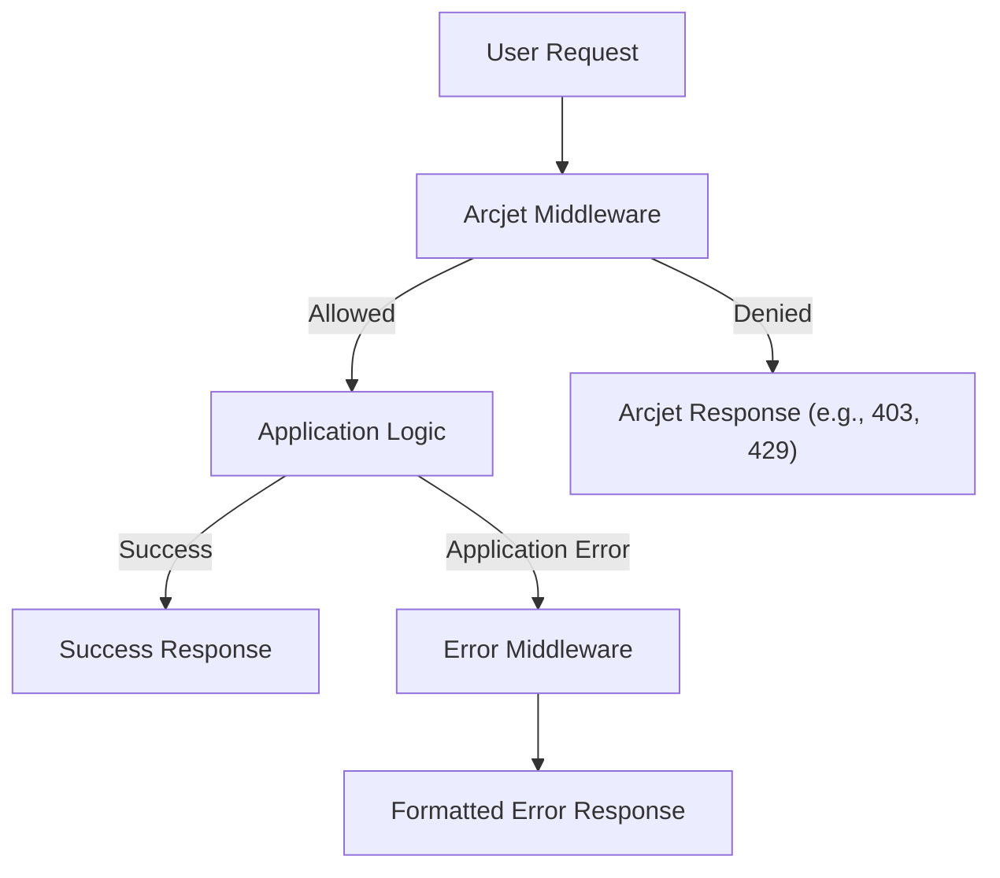

# Error Handling and Middleware

This section details the strategies employed for robust error handling and request processing middleware within the sub_tracker application. These middlewares ensure that application errors are caught and handled gracefully, and that incoming requests are properly secured and validated before reaching the application logic.

## Arcjet Security Middleware

The `arcjet.middleware.js` file implements middleware to integrate Arcjet for request security. Arcjet helps protect against common web threats like rate limiting and bot attacks.

```javascript
import aj from "../config/arcjet.js";

const arcjetMiddleware = async (req, res, next) => {
    try {
        const decision = await aj.protect(req, {requested:1});

        if (decision.isDenied()) {
            if (decision.reason.isRateLimit()) {
                return res.status(429).json({
                    message: "Rate Limit Exceeded"
                });
            }
            if (decision.reason.isBot()) {
                return res.status(401).json({
                    message: "Bot Detected"
                });
            }
            return res.status(403).json({
                error: "Access Denied"
            });
        }

        next();
    } catch (error) {
        console.log(`Arcjet middleware error: ${error.message}`);
        next(error);
    }
}

export default arcjetMiddleware;
```

This middleware intercepts incoming requests, calls Arcjet's `protect` function, and denies access with appropriate status codes (429 for rate limits, 401 for bots, 403 for general access denied) if the request is deemed malicious. Any errors during Arcjet's processing are logged and passed to the next error handler.

## Global Error Handling Middleware

The `error.middleware.js` file provides a centralized error handling mechanism for the application. This middleware catches errors thrown throughout the request lifecycle and formats them into a consistent JSON response.

```javascript
const errorMiddeleware = (err, req, res, next) => {
    try {
        let error = { ...err };

        error.message = err.message;

        console.error(err);

        // Mongoose bad ObjectID
        if (err.name === 'CastError') {
            const message = `Resource not found with id of ${err.value}`;
            error = new ErrorResponse(message);
            error.statusCode = 404;
        }

        // Mongoose duplicate key
        if (err.code === 11000) {
            const message = 'Duplicate field value entered';
            error = new ErrorResponse(message);
            error.statusCode = 400;
        }

        // Mongoose validation error
        if (err.name === 'ValidationError') {
            const message = Object.values(err.errors).map(val => val.message);
            error = new Error(message.join(', '));
            error.statusCode = 400;
        }

        res.status(error.statusCode || 500).json({
            success: false,
            error: error.message || 'Server Error'
        });

    } catch(error) {
        next(error);
    }
}

export default errorMiddeleware;
```

This middleware specifically handles common Mongoose errors:
*   `CastError`: For invalid ObjectIDs, returning a 404 Not Found.
*   `code === 11000`: For duplicate key violations, returning a 400 Bad Request.
*   `ValidationError`: For validation failures, returning a 400 Bad Request with detailed error messages.

For any other unhandled errors, it defaults to a 500 Internal Server Error.

## Request Flow with Middleware

The following diagram illustrates the flow of a request through the security and error handling middlewares.





## Integration Details

To effectively utilize these middlewares:

1.  **Arcjet Middleware Integration**: Apply `arcjetMiddleware` to routes that require security protection. Ensure Arcjet is properly configured in `../config/arcjet.js`.
2.  **Error Middleware Integration**: Place the `errorMiddeleware` as the last middleware in your application's middleware stack to catch all uncaught errors.

This layered approach ensures that requests are first secured and then any resulting errors are handled in a consistent and informative manner.