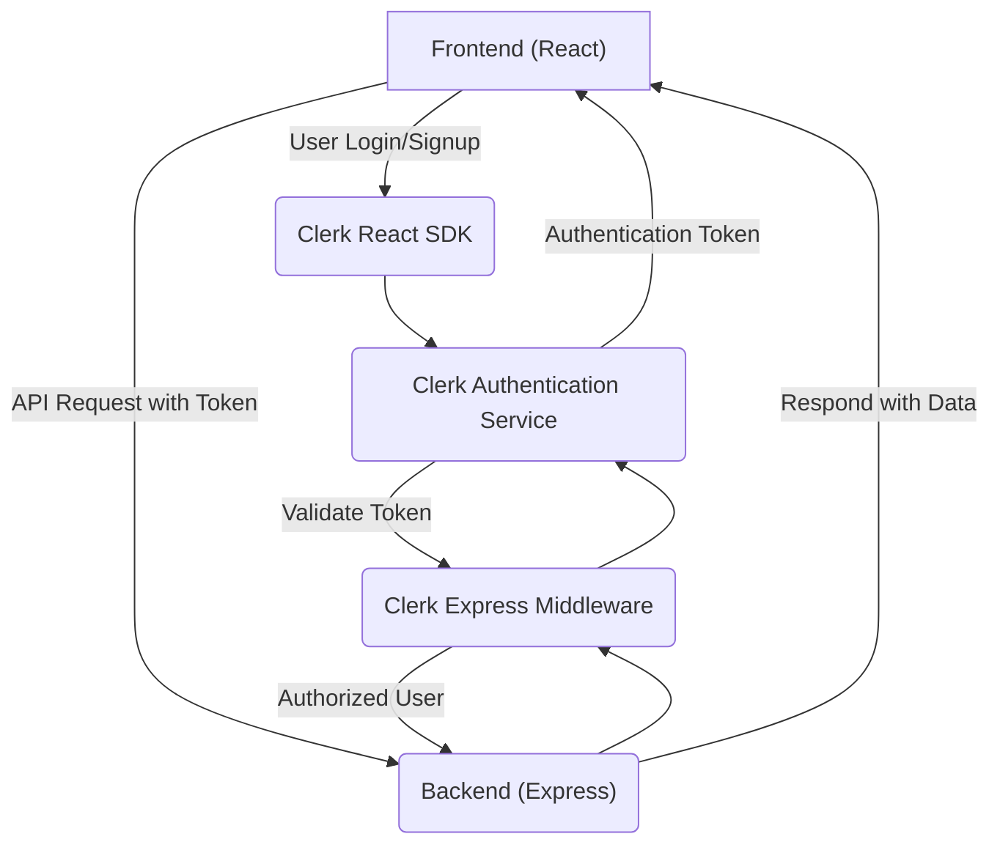
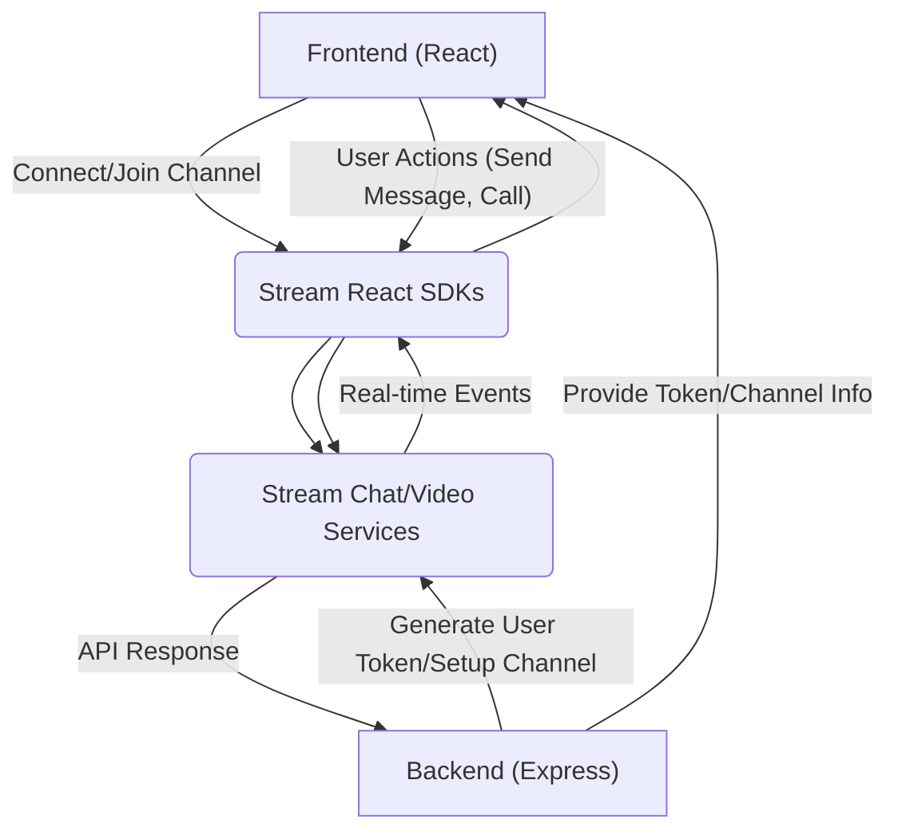

 # Introduction and Setup

Welcome to Zync, a robust real-time communication application designed to facilitate seamless interactions. Zync is built with a modern tech stack, separating concerns into distinct backend and frontend services to ensure scalability and maintainability.

The application leverages advanced authentication, real-time messaging, and video conferencing capabilities, integrated with robust error monitoring and background job processing. This documentation provides a high-level overview of Zync and guides you through the initial setup process to get the application running on your local machine.

## Application Overview

Zync is structured as a monorepo containing two main components: a `backend` service and a `frontend` client.

### Core Features

*   **Real-time Communication**: Powered by Stream Chat and Stream Video SDK for live messaging and video conferencing.
*   **User Authentication**: Secure user management and authentication handled by Clerk.
*   **Robust Backend**: An Express.js server providing API endpoints, utilizing Mongoose for database interactions.
*   **Asynchronous Processing**: Inngest for managing background tasks and event-driven workflows.
*   **Modern Frontend**: A dynamic user interface developed with React, Vite, and styled using Tailwind CSS.
*   **Observability**: Integrated Sentry for error tracking and performance monitoring across both frontend and backend.

### Project Structure

The Zync project (`zync-upd`) is organized into two primary directories:

*   `backend/`: Contains the server-side application logic, API endpoints, database models, and background task definitions.
*   `frontend/`: Houses the client-side application, including the user interface components, routing, and client-side logic.

## Initial Setup

To get Zync up and running, you'll need Node.js and npm (or yarn) installed on your system.

### Prerequisites

*   Node.js (LTS version recommended)
*   npm or Yarn

### 1. Clone the Repository

First, clone the `zync-upd` repository to your local machine:

```bash
git clone https://github.com/santrupt29/zync.git
cd zync
```

This will create a `zync` directory containing all project files.

### 2. Backend Setup

Navigate into the `backend` directory and install its dependencies.

```bash
cd backend
npm install
# Or: yarn install
```

The `backend/package.json` defines the scripts for running the server:

```json
{
  "name": "backend",
  "version": "1.0.0",
  "main": "src/server.js",
  "scripts": {
    "dev": "NODE_OPTIONS='--import ./instrument.mjs' node --watch src/server.js",
    "start": "NODE_OPTIONS='--import ./instrument.mjs'node src/server.js"
  },
  "dependencies": {
    "@clerk/express": "^1.7.4",
    "@sentry/node": "^10.1.0",
    "cors": "^2.8.5",
    "dotenv": "^17.2.1",
    "express": "^5.1.0",
    "inngest": "^3.40.1",
    "mongoose": "^8.16.5",
    "stream-chat": "^8.60.0"
  }
}
```
[View `backend/package.json` on GitHub](https://github.com/santrupt29/zync/blob/main/backend/package.json)

*   `npm run dev`: Starts the backend server in development mode with file watching for automatic restarts.
*   `npm start`: Starts the backend server in production mode.

**Environment Variables**: The backend uses `dotenv` for environment variables. You will need to create a `.env` file in the `backend/` directory with necessary configurations (e.g., database connection string, Clerk API keys, Stream API keys, Sentry DSN).

### 3. Frontend Setup

In a separate terminal, navigate into the `frontend` directory and install its dependencies.

```bash
cd ../frontend # If you are in the backend directory, or just 'cd frontend' from the project root
npm install
# Or: yarn install
```

The `frontend/package.json` outlines the scripts for the client application:

```json
{
  "name": "frontend",
  "private": true,
  "version": "0.0.0",
  "type": "module",
  "scripts": {
    "dev": "vite",
    "build": "vite build",
    "lint": "eslint .",
    "preview": "vite preview"
  },
  "dependencies": {
    "@clerk/clerk-react": "^5.37.0",
    "@sentry/react": "^10.1.0",
    "@stream-io/video-react-sdk": "^1.19.2",
    "@tailwindcss/vite": "^4.1.12",
    "@tanstack/react-query": "^5.83.0",
    "axios": "^1.11.0",
    "lucide-react": "^0.541.0",
    "react": "^19.1.1",
    "react-dom": "^19.1.1",
    "react-hot-toast": "^2.5.2",
    "react-router": "^7.6.3",
    "stream-chat": "^9.14.0",
    "stream-chat-react": "^13.3.0",
    "tailwindcss": "^4.1.12"
  }
}
```
[View `frontend/package.json` on GitHub](https://github.com/santrupt29/zync/blob/main/frontend/package.json)

*   `npm run dev`: Starts the frontend development server, typically accessible at `http://localhost:5173`.
*   `npm run build`: Compiles the React application for production deployment.
*   `npm run preview`: Serves the production build locally for testing.

**Environment Variables**: The frontend also requires environment variables, often prefixed with `VITE_` for Vite to expose them to the client-side code. These would typically be configured in a `.env` file in the `frontend/` directory (e.g., `VITE_CLERK_PUBLISHABLE_KEY`, `VITE_STREAM_API_KEY`, `VITE_BACKEND_URL`).

### 4. Running the Application

Once dependencies are installed and environment variables are configured for both `backend` and `frontend`:

1.  **Start the Backend**:
    ```bash
    cd backend
    npm run dev
    ```
    This will start the Express server, listening for API requests.

2.  **Start the Frontend**:
    ```bash
    cd ../frontend
    npm run dev
    ```
    This will launch the React development server, typically opening the application in your browser.

Your Zync application should now be accessible through the frontend URL (e.g., `http://localhost:5173`).

### Frontend Entry Point

The `frontend/index.html` file serves as the entry point for the Zync web application.

```html
<!doctype html>
<html lang="en">
  <head>
    <meta charset="UTF-8" />
    <link rel="icon" type="image/svg+xml" href="Zync2.png" />
    <meta name="viewport" content="width=device-width, initial-scale=1.0" />
    <title>Zync</title>
  </head>
  <body>
    <div id="root"></div>
    <script type="module" src="/src/main.jsx"></script>
  </body>
</html>
```
[View `frontend/index.html` on GitHub](https://github.com/santrupt29/zync/blob/main/frontend/index.html)

This HTML file loads the main React application (`src/main.jsx`) into the `<div id="root"></div>`, which is the standard setup for a Vite-React project. The `<title>Zync</title>` element explicitly names the application in the browser tab.

## Key Integration Points

### Authentication Flow (Clerk)

Zync utilizes Clerk for managing user authentication. The flow generally involves the frontend initiating authentication requests and the backend validating these requests.





1.  **User Interaction**: A user attempts to log in or sign up via the Zync frontend.
2.  **Clerk React SDK**: The frontend, integrated with the `@clerk/clerk-react` SDK, handles the authentication UI and redirects to Clerk's services.
3.  **Clerk Service**: Clerk's cloud service manages the actual authentication process (e.g., email/password, OAuth).
4.  **Token Issuance**: Upon successful authentication, Clerk issues an authentication token (e.g., JWT) back to the frontend.
5.  **API Requests**: The frontend includes this token in subsequent API requests to the Zync backend.
6.  **Clerk Express Middleware**: The backend, using `@clerk/express` middleware, intercepts incoming requests, validates the token with Clerk's service, and populates the request context with user information if authorized.
7.  **Backend Logic**: The backend then proceeds with its business logic, knowing the identity of the authenticated user.

### Real-time Communication Architecture (Stream)

Zync's real-time features, including chat and video, are powered by Stream.io. This involves both client-side SDKs and server-side API interactions.





1.  **Backend Setup**: The Zync backend, using the `stream-chat` Node.js SDK, is responsible for creating and managing Stream users and channels. It generates secure tokens for users to connect to Stream's services.
2.  **Frontend Initialization**: The Zync frontend, using `@stream-io/video-react-sdk` and `stream-chat-react`, receives these tokens from the backend.
3.  **Client Connection**: The frontend SDKs use these tokens to establish a secure, real-time connection directly with Stream's cloud services.
4.  **Real-time Interactions**: Once connected, the frontend can send messages, initiate video calls, and receive real-time updates directly from Stream's services without needing to constantly poll the Zync backend.
5.  **Backend API for Management**: While real-time data flows directly, the Zync backend might still provide APIs for more complex administrative tasks related to Stream (e.g., moderating channels, fetching historical data, integrating with other services).