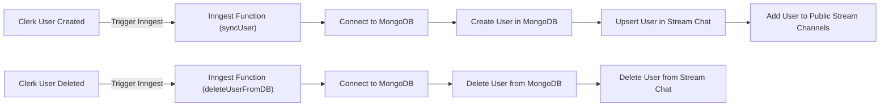
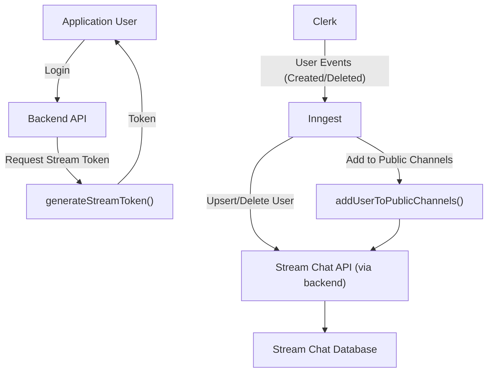

 # Database and External Integrations

This document provides a comprehensive overview of how the backend handles database connectivity and integrates with critical external services. We'll explore the setup for MongoDB, the role of Inngest for event-driven workflows, and the integration with Stream Chat for real-time communication features. Understanding these components is crucial for grasping the data flow and user lifecycle management within the application.

## Database Connectivity (MongoDB)

The application utilizes MongoDB as its primary data store. The connection logic is encapsulated within `backend/src/config/db.js`, ensuring a centralized and robust way to establish and manage the database connection. This setup guarantees that all database operations are performed against an active and healthy connection, with proper error handling in case of connection failures.

The `connectDB` function is responsible for initiating the connection to MongoDB using Mongoose. It leverages an environment variable `ENV.MONGO_URI` to configure the database endpoint, promoting flexibility and secure credential management.

```javascript
// backend/src/config/db.js
import mongoose from "mongoose";
import { ENV } from "./env.js";

export const connectDB = async () => {
  try {
    await mongoose.connect(ENV.MONGO_URI);
    console.log("Connected to MongoDB");
  } catch (error) {
    console.log("Error connecting to MongoDB: ", error);
    process.exit(1)     
  }
};
```
[View on GitHub](https://github.com/santrupt29/zync/blob/main/backend/src/config/db.js)

Upon successful connection, a confirmation message is logged. In the event of a connection failure, an error message is logged, and the process exits, preventing the application from running in a disconnected state.

## User Model

The `User` model defines the schema for user data stored in MongoDB. This schema, located at `backend/src/models/user.model.js`, is fundamental for managing user profiles and their associated information. It includes critical fields such as `clerkId`, `email`, `name`, and `image`, which are synchronized with external authentication providers like Clerk.

```javascript
// backend/src/models/user.model.js
import mongoose from "mongoose";

const userSchema = new mongoose.Schema({
    clerkId: {type: String, required: true, unique: true},
    email: {type: String, required: true, unique: true},
    name: {type: String, required: true},
    image: {type:String, required:true}
}, {timestamps:true});

export const User = mongoose.model("User", userSchema);
```
[View on GitHub](https://github.com/santrupt29/zync/blob/main/backend/src/models/user.model.js)

The `clerkId` and `email` fields are marked as unique, ensuring data integrity and preventing duplicate user entries. The `timestamps: true` option automatically adds `createdAt` and `updatedAt` fields, useful for tracking record creation and modification times.

## External Integration: Inngest

Inngest is utilized as an event-driven serverless platform to orchestrate background jobs and synchronize user data across different services. The `backend/src/config/inngest.js` file defines the Inngest client and the functions that respond to specific events, primarily related to the user lifecycle managed by Clerk.

The `inngest` instance is initialized with a unique ID, "zync".

```javascript
// backend/src/config/inngest.js
import { Inngest } from "inngest";
// ... other imports

export const inngest = new Inngest({
  id: "zync",
});

// ... functions
```
[View on GitHub](https://github.com/santrupt29/zync/blob/main/backend/src/config/inngest.js#L7-L9)

### User Synchronization (`syncUser`)

The `syncUser` function is triggered by the `clerk/user.created` event. This function ensures that whenever a new user is created in Clerk, their data is synchronized with the local MongoDB database and the Stream Chat service. It connects to the database, extracts user details from the Clerk event payload, creates a new `User` document in MongoDB, and then calls helper functions to upsert the user in Stream Chat and add them to public channels.

```javascript
// backend/src/config/inngest.js
// ... imports

const syncUser = inngest.createFunction(
    { id: "sync-user" },
    { event: "clerk/user.created" },
    async ({ event }) => {
      await connectDB();
  
      const { id, email_addresses, first_name, last_name, image_url } = event.data;
  
      const newUser = {
        clerkId: id,
        email: email_addresses[0]?.email_address,
        name: `${first_name || ""} ${last_name || ""}`,
        image: image_url,
      };
  
      await User.create(newUser);
  
      await upsertStreamUser({
        id: newUser.clerkId.toString(),
        name: newUser.name,
        image: newUser.image,
      });
  
      await addUserToPublicChannels(newUser.clerkId.toString());
    }
  );
```
[View on GitHub](https://github.com/santrupt29/zync/blob/main/backend/src/config/inngest.js#L26-L53)

### User Deletion (`deleteUserFromDB`)

Conversely, the `deleteUserFromDB` function handles user deletion. It listens for the `clerk/user.deleted` event. When triggered, it connects to the database, deletes the corresponding user document from MongoDB based on their `clerkId`, and then calls `deleteStreamUser` to remove the user from Stream Chat.

```javascript
// backend/src/config/inngest.js
// ... imports

const deleteUserFromDB = inngest.createFunction(
    {id: "delete-user-from-db"},
    {event: "clerk/user.deleted"},
    async({event}) => {
        await connectDB()
        const {id} = event.data;
        await User.deleteOne({clerkId:id})

        await deleteStreamUser(id.toString())
    }
)

export const functions = [syncUser, deleteUserFromDB]
```
[View on GitHub](https://github.com/santrupt29/zync/blob/main/backend/src/config/inngest.js#L56-L66)

The `functions` array exports all defined Inngest functions, making them discoverable by the Inngest runtime.

Here's a simplified view of the Inngest-driven user lifecycle:





## External Integration: Stream Chat

Stream Chat provides real-time messaging capabilities for the application. The `backend/src/config/stream.js` file handles all interactions with the Stream Chat API, including user management and token generation. It initializes the `StreamChat` client using API keys from environment variables, ensuring secure access.

```javascript
// backend/src/config/stream.js
import {StreamChat} from "stream-chat"
import { ENV } from "../config/env.js"

const streamClient = StreamChat.getInstance(ENV.STREAM_API_KEY, ENV.STREAM_API_SECRET)

// ... functions
```
[View on GitHub](https://github.com/santrupt29/zync/blob/main/backend/src/config/stream.js#L1-L4)

### User Management Functions

*   **`upsertStreamUser(userData)`**: This function creates or updates a user in Stream Chat. It's invoked by the Inngest `syncUser` function to ensure that new users from Clerk are available in Stream.
    ```javascript
    // backend/src/config/stream.js
    // ... imports

    export const upsertStreamUser = async (userData) => {
      try {
        await streamClient.upsertUser(userData)
        console.log("Stream user upserted successfully:", userData.name)
        return userData;
      } catch (error) {
        console.log("Error upserting stream user:", error)
      }
    }
    ```
    [View on GitHub](https://github.com/santrupt29/zync/blob/main/backend/src/config/stream.js#L6-L15)
*   **`deleteStreamUser(userId)`**: Deletes a user from Stream Chat. This is called by the Inngest `deleteUserFromDB` function when a user is removed from Clerk.
*   **`generateStreamToken(userId)`**: Generates a client-side token for a given user, allowing them to authenticate with the Stream Chat frontend SDKs securely.
*   **`addUserToPublicChannels(newUserId)`**: Automatically adds a newly created user to all discoverable public channels within Stream Chat, facilitating immediate engagement. This function queries for channels marked as `discoverable: true` and adds the user to each of them.

Here's a high-level overview of the Stream Chat integration:





## Key Integration Points

The integration architecture highlights a robust, event-driven approach to managing user data across multiple services:

1.  **Centralized Database**: MongoDB serves as the primary data store for user profiles, ensuring consistent and persistent storage.
2.  **Event-Driven User Lifecycle**: Clerk acts as the source of truth for user authentication. User creation and deletion events from Clerk trigger Inngest functions, which then orchestrate data synchronization.
3.  **Cross-Service Synchronization**: Inngest functions bridge the gap between Clerk, MongoDB, and Stream Chat. This ensures that a user's presence and profile information are consistent across all critical platforms.
4.  **Secure Communication**: Stream Chat integrations prioritize security, utilizing API keys for backend communication and generating temporary, user-specific tokens for client-side authentication.
5.  **Automated Onboarding**: New users are automatically added to public Stream channels, improving the initial user experience and fostering community engagement.

This structured integration approach ensures data integrity, automates tedious synchronization tasks, and provides a scalable foundation for managing user identities and interactions within the application.