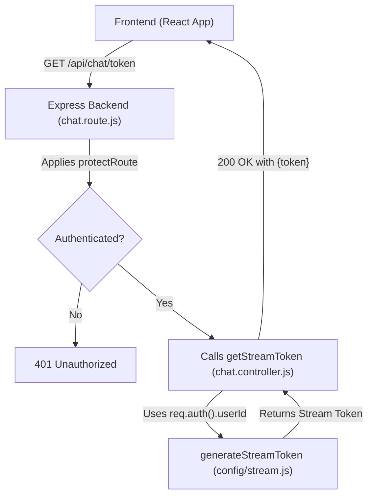

 # API Endpoints and Business Logic

This document details the core API endpoints, controller logic, and essential middleware that manage user authentication and facilitate real-time chat functionalities within the application. The backend architecture is designed to be robust, secure, and scalable, leveraging Stream.io for chat services and Clerk for user authentication.

## API Endpoint: Stream Token Generation

The primary function documented here is the secure generation of a Stream.io token for authenticated users. This token is crucial for initializing and interacting with the Stream Chat client-side, enabling real-time messaging features.

### Route Definition

The `/api/chat` route group handles chat-related API calls. Specifically, the `/token` endpoint is used to retrieve a user's Stream token. This endpoint is protected by an authentication middleware to ensure only logged-in users can access it.

```javascript
// backend/src/routes/chat.route.js
import express from "express";
import { getStreamToken } from "../controllers/chat.controller.js";
import { protectRoute } from "../middleware/auth.middleware.js";

const router = express.Router();

// Defines a GET endpoint at /api/chat/token.
// It first passes through 'protectRoute' middleware, then 'getStreamToken' controller.
router.get("/token", protectRoute, getStreamToken);

export default router;
```
This snippet from [backend/src/routes/chat.route.js](https://github.com/santrupt29/zync/blob/main/backend/src/routes/chat.route.js) illustrates how the `/token` endpoint is registered within the Express router. The `protectRoute` middleware is applied before `getStreamToken`, enforcing authentication for this specific route. This design ensures that only authenticated users can request a Stream token, preventing unauthorized access to the chat system.

### Controller Logic

The `getStreamToken` controller is responsible for generating the actual Stream token. It interacts with a utility function, `generateStreamToken`, which encapsulates the logic for creating a user-specific token using the Stream.io SDK.

```javascript
// backend/src/controllers/chat.controller.js
import { generateStreamToken } from "../config/stream.js";

export const getStreamToken = async (req, res) => {
  try {
    // Calls a utility function to generate a Stream token for the authenticated user.
    // req.auth().userId is expected to be populated by authentication middleware.
    const token = await generateStreamToken(req.auth().userId);
    res.status(200).json({token});
  } catch (error) {
    console.log("Error generating stream token:", error);
    res.status(500).json({message: "Failed to generate stream token"});
  }
};
```
Found in [backend/src/controllers/chat.controller.js](https://github.com/santrupt29/zync/blob/main/backend/src/controllers/chat.controller.js), the `getStreamToken` function handles the request to issue a Stream token. It retrieves the `userId` from `req.auth()` (a property expected to be added by the authentication middleware, likely Clerk integration). This `userId` is then used by `generateStreamToken` to create a unique and secure token for the user, which is then sent back to the client. Error handling is included to catch and report issues during token generation, ensuring a robust API experience.

### Authentication Middleware

Security is paramount for any application handling user data. The `protectRoute` middleware serves as a gatekeeper, ensuring that only authenticated users can access protected routes.

```javascript
// backend/src/middleware/auth.middleware.js
export const protectRoute = (req, res, next) => {
  // Checks if the user is authenticated based on information provided by `req.auth()`.
  if (!req.auth().isAuthenticated) {
    return res.status(401).json({ message: "Unauthorized - You must be logged in to access this route" });
  }
  // If authenticated, proceeds to the next middleware or route handler.
  next();
};
```
This snippet from [backend/src/middleware/auth.middleware.js](https://github.com/santrupt29/zync/blob/main/backend/src/middleware/auth.middleware.js) defines the `protectRoute` middleware. It checks the `isAuthenticated` property of `req.auth()`, which is typically populated by a Clerk-based authentication setup. If the user is not authenticated, a 401 Unauthorized response is returned, preventing further execution of the request. This middleware is crucial for securing endpoints like `/api/chat/token`.

## User Model

While the direct manipulation of the `User` model isn't shown in the provided controller logic, it's fundamental to the application's user management and often underpins the authentication process by storing user details linked to external authentication providers like Clerk.

```javascript
// backend/src/models/user.model.js
import mongoose from "mongoose";

const userSchema = new mongoose.Schema({
    clerkId: {type: String, required: true, unique: true},
    email: {type: String, required: true, unique: true},
    name: {type: String, required: true},
    image: {type:String, required:true}
}, {timestamps:true});

export const User = mongoose.model("User", userSchema);
```
This Mongoose schema, defined in [backend/src/models/user.model.js](https://github.com/santrupt29/zync/blob/main/backend/src/models/user.model.js), outlines the structure for storing user information in the MongoDB database. Key fields include `clerkId` (a unique identifier from Clerk), `email`, `name`, and `image`. The `timestamps: true` option automatically adds `createdAt` and `updatedAt` fields, useful for tracking user record changes. This model is essential for linking application-specific data to users authenticated via Clerk.

## Request Flow for Stream Token Generation

The following diagram illustrates the typical request flow from a client application to the backend for obtaining a Stream token.





This `graph TD` Mermaid diagram visually represents the flow of a client request for a Stream token. It highlights the sequential execution from the frontend, through the Express router, the `protectRoute` middleware for authentication, and finally to the `getStreamToken` controller and `generateStreamToken` utility, before returning the token to the client. This clarifies the critical role of authentication in accessing the token generation logic.

## Key Integration Points

The discussed components form a cohesive system for user authentication and chat functionality, emphasizing security and a clear separation of concerns.

1.  **Clerk Integration:** The `req.auth()` object, frequently referenced in `auth.middleware.js` and `chat.controller.js`, is the linchpin of authentication. It's expected to be populated by a Clerk middleware, providing user identity (`userId`, `isAuthenticated`) after successful authentication. This external service handles user sign-up, sign-in, and session management, reducing the backend's complexity. The `user.model.js` schema directly references `clerkId`, indicating the database's reliance on Clerk for primary user identification.

2.  **Stream.io Integration:** The `generateStreamToken` utility (imported in `chat.controller.js`) is the bridge to Stream.io's services. It takes the authenticated `userId` and uses it to create a secure, client-side token that allows the user to connect to Stream Chat. This token-based authentication ensures that only known and authenticated users can access and send messages through Stream.io.

3.  **Middleware as a Security Gate:** The `protectRoute` middleware is strategically placed on the `/api/chat/token` route. This is a best practice for API security, ensuring that sensitive operations (like generating tokens for a chat service) are only accessible to authenticated users. It prevents anonymous or unauthorized requests from consuming resources or potentially exploiting the chat system.

4.  **Modular Design:** The separation of concerns into routes (`chat.route.js`), controllers (`chat.controller.js`), middleware (`auth.middleware.js`), and models (`user.model.js`) is a hallmark of good backend architecture. This modularity makes the codebase easier to understand, test, and maintain. For example, the authentication logic is encapsulated in `auth.middleware.js`, meaning it can be reused across different protected routes without duplication.

By understanding these integration points, developers can effectively extend the application's functionality while maintaining security and architectural integrity. The flow ensures that a user's journey from authentication to active chat participation is seamless and secure.