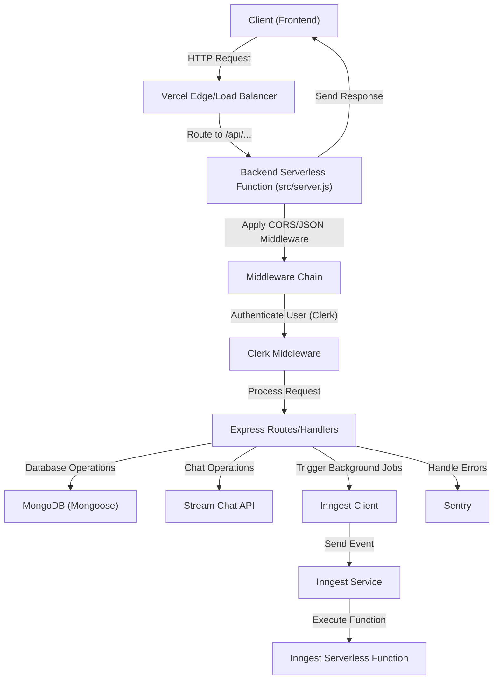

 # Backend Architecture and Services

This document provides an in-depth exploration of the backend architecture, outlining its core services, configurations, and key integration points. The backend is designed to be scalable and maintainable, leveraging modern JavaScript features and a robust set of libraries to handle various functionalities from user authentication to real-time chat and background job processing.

## Core Technologies and Dependencies

The backend is built primarily with Node.js and Express.js, providing a flexible and performant foundation for API development. It integrates with several third-party services for specific functionalities, as detailed in the `package.json`.

### Dependencies Overview

The `package.json` file lists all the dependencies required for the backend application, categorizing them into core functionalities, authentication, background tasks, and monitoring.

```json
{
  "name": "backend",
  "version": "1.0.0",
  "main": "src/server.js",
  "scripts": {
    "dev": "NODE_OPTIONS='--import ./instrument.mjs' node --watch src/server.js",
    "start": "NODE_OPTIONS='--import ./instrument.mjs'node src/server.js"
  },
  "type": "module",
  "dependencies": {
    "@clerk/express": "^1.7.4",
    "@sentry/node": "^10.1.0",
    "cors": "^2.8.5",
    "dotenv": "^17.2.1",
    "express": "^5.1.0",
    "inngest": "^3.40.1",
    "mongoose": "^8.16.5",
    "stream-chat": "^8.60.0"
  }
}
```
[View on GitHub](https://github.com/santrupt29/zync/blob/main/backend/package.json)

Key dependencies include:
*   **`express`**: The core web framework for building APIs.
*   **`mongoose`**: An ODM (Object Data Modeling) library for MongoDB, simplifying database interactions.
*   **`@clerk/express`**: Integration for Clerk, a powerful user authentication and management service.
*   **`stream-chat`**: Client library for Stream, enabling real-time chat functionalities.
*   **`inngest`**: A serverless function platform for background jobs, scheduled tasks, and event-driven workflows.
*   **`@sentry/node`**: Error tracking and performance monitoring for production environments.
*   **`cors`**: Middleware to enable Cross-Origin Resource Sharing.
*   **`dotenv`**: For loading environment variables from a `.env` file.

## Environment Configuration

Environment variables are crucial for configuring the application based on the deployment environment (development, production, etc.). The `backend/src/config/env.js` file centralizes the loading and access of these variables, ensuring sensitive information is kept out of the codebase and managed externally.

```javascript
import "dotenv/config";

export const ENV = {
  PORT: process.env.PORT || 3000,
  MONGO_URI: process.env.MONGO_URI,
  NODE_ENV: process.env.NODE_ENV || "development",
  CLERK_PUBLISHABLE_KEY: process.env.CLERK_PUBLISHABLE_KEY,
  CLERK_SECRET_KEY: process.env.CLERK_SECRET_KEY,
  STREAM_API_KEY: process.env.STREAM_API_KEY,
  STREAM_API_SECRET: process.env.STREAM_API_SECRET,
  SENTRY_DSN: process.env.SENTRY_DSN,
  INNGEST_EVENT_KEY: process.env.INNGEST_EVENT_KEY,
  INNGEST_SIGNING_KEY: process.env.INNGEST_SIGNING_KEY,
  CLIENT_URL: process.env.CLIENT_URL,
};
```
[View on GitHub](https://github.com/santrupt29/zync/blob/main/backend/src/config/env.js)

This configuration ensures that parameters like database connection strings (`MONGO_URI`), API keys (`CLERK_SECRET_KEY`, `STREAM_API_SECRET`), and the client URL for CORS (`CLIENT_URL`) are loaded securely. `dotenv/config` automatically loads variables from a `.env` file into `process.env`.

## Server Initialization and Core Services

The `backend/src/server.js` file is the entry point of the backend application, responsible for setting up the Express server, connecting to the database, and integrating various middleware and routes.

```javascript
import "../instrument.mjs"
import express from "express";
import { ENV } from "./config/env.js";
import { connectDB } from "./config/db.js";
import { clerkMiddleware } from "@clerk/express";
import { functions, inngest } from "./config/inngest.js";
import {serve} from "inngest/express";
import chatRoutes from "./routes/chat.route.js";
import * as Sentry from "@sentry/node";

import cors from "cors";

const app = express();
app.use(cors({ origin: ENV.CLIENT_URL, credentials: true }));
const PORT = ENV.PORT || 3000;

app.use(express.json());
app.use(clerkMiddleware()); // req.auth will be available in req object

Sentry.setupExpressErrorHandler(app);

app.get("/debug-sentry", (req, res) => {
  throw new Error("This is a test error");
});

app.get("/", (req, res) => {
  res.send("Hello World 123");
});


app.use("/api/inngest", serve({client: inngest, functions}))
app.use("/api/chat", chatRoutes)


const startServer = async() => {
  try {
    await connectDB();
    if (ENV.NODE_ENV !== 'production') {
      app.listen(ENV.PORT, ()=> {
        console.log("Server started on Port", ENV.PORT);
      })
    }
  } catch (error) {
    console.log("Error starting server:", error)
    process.exit(1);
  }
}

startServer();
export default app;
```
[View on GitHub](https://github.com/santrupt29/zync/blob/main/backend/src/server.js)

### Middleware and Routers

*   **CORS**: Configured to allow requests only from `ENV.CLIENT_URL`, ensuring secure cross-origin communication.
*   **`express.json()`**: Parses incoming requests with JSON payloads.
*   **`clerkMiddleware()`**: Integrates Clerk for authentication. This middleware populates the `req.auth` object, making user authentication data available to subsequent route handlers.
*   **Sentry**: Error tracking is initialized with `Sentry.setupExpressErrorHandler(app)` to catch and report errors effectively.
*   **Inngest**: A dedicated endpoint `/api/inngest` is set up using `serve` from `inngest/express` to handle incoming Inngest events and serve defined functions. This enables powerful background job processing.
*   **Chat Routes**: `app.use("/api/chat", chatRoutes)` integrates specific routes for chat-related functionalities, likely interacting with the Stream Chat API.

### Server Startup Logic

The `startServer` function asynchronously connects to MongoDB via `connectDB()`. Once the database connection is established, the Express app starts listening on the port defined in `ENV.PORT`. In production environments, the `app.listen` call is often handled by the hosting platform (e.g., Vercel), so the explicit call is conditional.

## Deployment with Vercel

The `vercel.json` file defines the deployment configuration for Vercel, a platform for frontend frameworks and static sites, and serverless functions.

```json
{
    "version": 2,
    "builds": [
      {
        "src": "src/server.js",
        "use": "@vercel/node"
      }
    ],
    "routes": [
      {
        "src": "/(.*)",
        "dest": "src/server.js"
      }
    ],
    "env": {
      "NODE_ENV": "production"
    }
  }
```
[View on GitHub](https://github.com/santrupt29/zync/blob/main/backend/vercel.json)

*   **`builds`**: Specifies how the `src/server.js` file should be built and deployed. The `@vercel/node` builder treats `server.js` as a Node.js serverless function.
*   **`routes`**: Directs all incoming requests (`/(.*)`) to the deployed `src/server.js` function, effectively making the entire backend available as a single serverless endpoint.
*   **`env`**: Sets `NODE_ENV` to `"production"` specifically for the Vercel deployment, optimizing build and runtime behaviors for a production environment.

## Backend Service Interaction Flow

The backend orchestrates interactions between various services to fulfill user requests and perform background tasks.





## Key Integration Points

### User Authentication with Clerk

Clerk is integrated early in the request lifecycle through `clerkMiddleware()`. This is a critical integration point as it secures all subsequent API routes. After this middleware, `req.auth` contains the authenticated user's session and claims, which can be used for authorization checks and personalized data retrieval. This provides a robust and scalable authentication system without managing user identities directly within the application.

### Real-time Chat with Stream

The `stream-chat` library, along with dedicated chat routes (`chatRoutes`), manages real-time communication. This integration offloads the complexity of real-time infrastructure to Stream, allowing the backend to focus on business logic. Operations typically involve generating user tokens for Stream, creating channels, and handling message events.

### Background Jobs with Inngest

Inngest is utilized for event-driven background processing. By serving Inngest functions at `/api/inngest`, the backend can trigger asynchronous tasks such as sending notifications, processing data, or any long-running operation that shouldn't block the main request thread. This enhances responsiveness and scalability by decoupling execution from immediate user requests. The `package.json` scripts (`dev`, `start`) explicitly include `NODE_OPTIONS='--import ./instrument.mjs'` which is often used for tracing or instrumentation (e.g., Sentry, OpenTelemetry) in ESM modules, ensuring these background processes are also monitored.

### Error Tracking with Sentry

Sentry is integrated as an error handler `Sentry.setupExpressErrorHandler(app)`, ensuring that any unhandled exceptions or errors occurring within the Express application are automatically captured and reported. This is vital for maintaining application health in production by providing real-time insights into issues. The `/debug-sentry` endpoint serves as a useful diagnostic tool to verify Sentry's integration.

### Database Management with Mongoose and MongoDB

`mongoose` simplifies interactions with MongoDB, providing schema definition, validation, and powerful query capabilities. The `connectDB()` function, called during server startup, establishes the crucial connection to the database. This pattern ensures that the application has a reliable data persistence layer before it starts handling requests.

By leveraging these integrations, the backend forms a comprehensive and resilient system, handling various aspects of modern web application development from user management and real-time features to background processing and error monitoring.