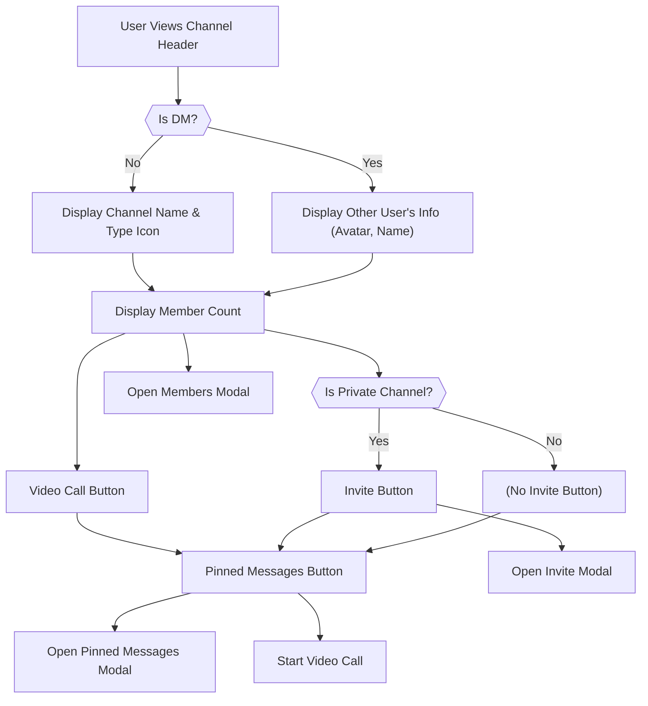

 # User Interface Components

The Zync application leverages a modular approach for its user interface, breaking down complex functionalities into reusable React components. This section details some of the core UI components, their purpose, key features, and how they integrate into the overall application flow.

## CreateChannelModal

The `CreateChannelModal` component is responsible for providing users with an interface to create new chat channels within the Zync application. It supports both public and private channel types, allowing users to define channel names, descriptions, and select members.

### Features

*   **Channel Name Input**: A dedicated input field for the channel name with real-time validation and a preview of the generated channel ID.
*   **Channel Type Selection**: Radio buttons to choose between "Public" (anyone can join) and "Private" (only invited members can join).
*   **Member Selection (for Private Channels)**: A dynamic list of available users from which the creator can select members to invite. Includes options to "Select Everyone" and displays the count of selected members.
*   **Description Field**: An optional textarea for adding a description to the channel.
*   **Form Validation**: Client-side validation for the channel name (required, length constraints).
*   **State Management**: Uses React's `useState` for managing form inputs, loading states, and errors. `useEffect` is utilized for fetching users and automatically selecting members for public channels.
*   **Stream Chat Integration**: Interacts with the `stream-chat-react` library to create and activate channels.

### Key Functionality

The `CreateChannelModal` handles the entire process of channel creation, from user input to API calls. A critical part is the `handleSubmit` function which orchestrates the channel creation logic.

```javascript
// frontend/src/components/CreateChannelModal.jsx
const handleSubmit = async (e) => {
  e.preventDefault();
  const validationError = validateChannelName(channelName);
  if (validationError) return setError(validationError);

  if (isCreating || !client?.user) return;

  setIsCreating(true);
  setError("");

  try {
    const channelId = channelName
      .toLowerCase()
      .trim()
      .replace(/\s+/g, "-")
      .replace(/[^a-z0-9-_]/g, "")
      .slice(0, 20);

    const channelData = {
      name: channelName.trim(),
      created_by_id: client.user.id,
      members: [client.user.id, ...selectedMembers],
    };

    if (description) channelData.description = description;

    if (channelType === "private") {
      channelData.private = true;
      channelData.visibility = "private";
    } else {
      channelData.visibility = "public";
      channelData.discoverable = true;
    }

    const channel = client.channel("messaging", channelId, channelData);

    await channel.watch();

    setActiveChannel(channel);
    setSearchParams({ channel: channelId });

    toast.success(`Channel "${channelName}" created successfully!`);
    onClose();
  } catch (error) {
    console.log("Error creating the channel", error);
  } finally {
    setIsCreating(false);
  }
};
```
This snippet from [lines 101-149](https://github.com/santrupt29/zync/blob/main/frontend/src/components/CreateChannelModal.jsx#L101-L149) demonstrates the core logic for channel creation. It generates a URL-friendly `channelId`, prepares `channelData` based on user inputs (name, type, description, members), and then uses the `stream-chat` client to create and watch the new channel. Upon successful creation, it sets the new channel as active and updates the URL.

The process of fetching users for selection in private channels is handled by a `useEffect` hook:

```javascript
// frontend/src/components/CreateChannelModal.jsx
useEffect(() => {
  const fetchUsers = async () => {
    if (!client?.user) return;
    setLoadingUsers(true);

    try {
      const response = await client.queryUsers(
        { id: { $ne: client.user.id } }, // to exclude myself from all the users
        { name: 1 },
        { limit: 100 }
      );

      const usersOnly = response.users.filter(
        (user) => !user.id.startsWith("deleted-") && user.id !== "santrupt"
      );

      setUsers(usersOnly || []);
    } catch (error) {
      console.log("Error fetching users");
      Sentry.captureException(error, {
        tags: { component: "CreateChannelModal" },
        extra: { context: "fetch_users_for_channel" },
      });
      setUsers([]);
    } finally {
      setLoadingUsers(false);
    }
  };

  fetchUsers();
}, [client]);
```
This `useEffect` hook, visible on [lines 31-60](https://github.com/santrupt29/zync/blob/main/frontend/src/components/CreateChannelModal.jsx#L31-L60), fetches a list of users (excluding the current user and deleted/specific test users) when the component mounts or `client` changes, populating the `users` state for member selection.

## CustomChannelHeader

The `CustomChannelHeader` component provides a customized header for the active chat channel, displaying channel information and actions. It dynamically adapts its content based on whether the channel is a direct message (DM) or a group/public channel.

### Features

*   **Channel Type Icon**: Displays a hash (`#`) for public channels and a lock (`🔒`) for private channels or DMs.
*   **Channel Name/DM User Info**: Shows the channel ID for group channels or the other user's name/ID and avatar for direct messages.
*   **Member Count**: Displays the number of members in the current channel.
*   **Video Call Button**: Initiates a video call by sending a message with a call link into the channel.
*   **Invite Button (for Private Channels)**: Allows users to invite new members to private channels.
*   **Pinned Messages Button**: Opens a modal to view messages that have been pinned in the channel.
*   **Modal Integration**: Renders `MembersModal`, `PinnedMessagesModal`, and `InviteModal` as needed.

### Interaction Flow

The `CustomChannelHeader` serves as a central point for channel-specific interactions.





The `handleVideoCall` function demonstrates how the component can interact with the `Stream` API to initiate actions:

```javascript
// frontend/src/components/CustomChannelHeader.jsx
const handleVideoCall = async () => {
  if (channel) {
    const callUrl = `${window.location.origin}/call/${channel.id}`;
    await channel.sendMessage({
      text: `I've started a video call. Join me here: ${callUrl}`,
    });
  }
};
```
This snippet from [lines 34-40](https://github.com/santrupt29/zync/blob/main/frontend/src/components/CustomChannelHeader.jsx#L34-L40) shows the functionality behind the video call button. It constructs a dynamic call URL and sends it as a message into the current channel, informing other members of the ongoing call.

## Navbar

The `Navbar` component is the main navigation bar for the Zync application's landing page. It provides quick access to different sections of the page and a login button. It also includes responsive design for mobile devices.

### Features

*   **Logo and Brand Name**: Displays the Zync logo and brand name.
*   **Desktop Navigation Links**: Links to "Features" and "Reviews" sections.
*   **Login Button**: Navigates the user to the authentication page.
*   **Responsive Mobile Menu**: A hamburger menu icon for smaller screens that toggles a mobile-friendly navigation overlay.
*   **Smooth Transitions**: CSS transitions for mobile menu open/close.

### Structure

The `Navbar` is designed to be sticky at the top, ensuring it's always accessible.

```javascript
// frontend/src/components/Navbar.jsx
<nav className="fixed top-0 left-0 right-0 bg-gray-900/95 backdrop-blur-md border-b border-gray-800 z-50 py-4">
  <div className="max-w-6xl mx-auto flex justify-between items-center px-8">
    {/* Logo */}
    <div className="flex items-center gap-3 font-bold text-2xl">
      
      <span className="bg-gradient-to-r from-purple-400 to-pink-400 bg-clip-text text-transparent">
        ZYNC
      </span>
    </div>

    {/* Desktop Navigation */}
    <div className="hidden md:flex items-center gap-8">
      <a href="#features" className="text-gray-300 font-medium hover:text-purple-400 transition-colors">
        Features
      </a>
      <a href="#testimonials" className="text-gray-300 font-medium hover:text-purple-400 transition-colors">
        Reviews
      </a>
      <button
        onClick={handleLogin}
        className="bg-gradient-to-r from-purple-600 to-pink-600 text-white px-6 py-3 rounded-full font-semibold hover:-translate-y-1 transition-all duration-300 shadow-lg hover:shadow-xl"
      >
        Login
      </button>
    </div>

    {/* Mobile Hamburger Button */}
    <button
      onClick={toggleMobileMenu}
      className="md:hidden text-gray-300 hover:text-purple-400 transition-colors focus:outline-none"
    >
      <svg
        className="w-6 h-6"
        fill="none"
        stroke="currentColor"
        viewBox="0 0 24 24"
        xmlns="http://www.w3.org/2000/svg"
      >
        {isMobileMenuOpen ? (
          <path strokeLinecap="round" strokeLinejoin="round" strokeWidth={2} d="M6 18L18 6M6 6l12 12" />
        ) : (
          <path strokeLinecap="round" strokeLinejoin="round" strokeWidth={2} d="M4 6h16M4 12h16M4 18h16" />
        )}
      </svg>
    </button>
  </div>

  {/* Mobile Menu */}
  <div className={`md:hidden transition-all duration-300 ease-in-out ${
    isMobileMenuOpen
      ? 'max-h-64 opacity-100'
      : 'max-h-0 opacity-0 overflow-hidden'
  }`}>
    <div className="px-8 py-4 bg-gray-800/95 backdrop-blur-md border-t border-gray-700">
      <div className="flex flex-col space-y-4">
        <a
          href="#features"
          onClick={() => setIsMobileMenuOpen(false)}
          className="text-gray-300 font-medium hover:text-purple-400 transition-colors py-2"
        >
          Features
        </a>
        <a
          href="#testimonials"
          onClick={() => setIsMobileMenuOpen(false)}
          className="text-gray-300 font-medium hover:text-purple-400 transition-colors py-2"
        >
          Reviews
        </a>
        <button
          onClick={() => {
            handleLogin();
            setIsMobileMenuOpen(false);
          }}
          className="bg-gradient-to-r from-purple-600 to-pink-600 text-white px-6 py-3 rounded-full font-semibold hover:-translate-y-1 transition-all duration-300 shadow-lg hover:shadow-xl w-full mt-2"
        >
          Login
        </button>
      </div>
    </div>
  </div>
</nav>
```
This full `Navbar` JSX from [lines 16-90](https://github.com/santrupt29/zync/blob/main/frontend/src/components/Navbar.jsx#L16-L90) highlights its structure, including the desktop navigation, mobile hamburger button, and the conditional rendering of the mobile menu. Tailwind CSS classes are extensively used for styling and responsiveness.

## UsersList

The `UsersList` component displays a list of available users, primarily for initiating direct messages (DMs). It fetches users from the Stream Chat API and allows users to quickly start a conversation with any listed user.

### Features

*   **User Fetching**: Uses `@tanstack/react-query` to fetch and cache a list of users (excluding the current user).
*   **User Information**: Displays each user's avatar (or a placeholder), name/ID, and online status.
*   **DM Initiation**: Clicking on a user starts a direct message channel with that user.
*   **Unread Message Count**: Shows an unread message badge for DMs with unread messages.
*   **Active Channel Indicator**: Highlights the current active DM channel.
*   **Loading and Error States**: Provides clear feedback for loading users or encountering errors.

### DM Initiation Logic

The core functionality of `UsersList` is the `startDirectMessage` function, which creates or activates a DM channel:

```javascript
// frontend/src/components/UsersList.jsx
const startDirectMessage = async (targetUser) => {
  if (!targetUser || !client?.user) return;

  try {
    const channelId = [client.user.id, targetUser.id].sort().join("-").slice(0, 64);
    const channel = client.channel("messaging", channelId, {
      members: [client.user.id, targetUser.id],
    });
    await channel.watch();
    setSearchParams({ channel: channel.id });
  } catch (error) {
    console.log("Error creating DM", error),
      Sentry.captureException(error, {
        tags: { component: "UsersList" },
        extra: {
          context: "create_direct_message",
          targetUserId: targetUser?.id,
        },
      });
  }
};
```
This snippet from [lines 46-65](https://github.com/santrupt29/zync/blob/main/frontend/src/components/UsersList.jsx#L46-L65) demonstrates how a DM channel ID is constructed by sorting and joining the two user IDs, ensuring a consistent and unique ID for each pair. It then creates (if it doesn't exist) and watches the messaging channel, finally setting it as the active channel in the UI.

The fetching of users is handled by `react-query` for efficient data management:

```javascript
// frontend/src/components/UsersList.jsx
const fetchUsers = useCallback(async () => {
  if (!client?.user) return;

  const response = await client.queryUsers(
    { id: { $ne: client.user.id } },
    { name: 1 },
    { limit: 20 }
  );

  const usersOnly = response.users.filter(
    (user) => !user.id.startsWith("deleted-") && user.id !== "santrupt"
  );

  return usersOnly;
}, [client]);

const {
  data: users = [],
  isLoading,
  isError,
} = useQuery({
  queryKey: ["users-list", client?.user?.id],
  queryFn: fetchUsers,
  enabled: !!client?.user,
  staleTime: 1000 * 60 * 5, // 5 mins
});
```
This code block from [lines 11-44](https://github.com/santrupt29/zync/blob/main/frontend/src/components/UsersList.jsx#L11-L44) illustrates the `useQuery` hook for fetching users. It defines a `queryKey` for caching and sets a `staleTime` of 5 minutes to prevent unnecessary refetches, optimizing performance.

## Key Integration Points

These UI components are crucial for Zync's chat functionality and overall user experience.

*   **Stream Chat SDK**: All components (`CreateChannelModal`, `CustomChannelHeader`, `UsersList`) heavily rely on the `stream-chat-react` library to interact with the Stream Chat API. This includes querying users, creating channels, sending messages, and managing channel states.
*   **React Router**: `Navbar` uses `useNavigate` for routing, while `CreateChannelModal` and `UsersList` use `useSearchParams` to update the URL with the active channel ID, enabling deep linking and consistent navigation.
*   **State Management (React Hooks)**: `useState` and `useEffect` are fundamental for managing component-specific states (e.g., form inputs, loading indicators, modal visibility) and side effects (e.g., data fetching).
*   **Error Reporting (Sentry)**: Components like `CreateChannelModal` and `UsersList` integrate Sentry for capturing and reporting exceptions, which is vital for monitoring application health and debugging.
*   **Notification (react-hot-toast)**: `CreateChannelModal` uses `react-hot-toast` to provide users with immediate feedback on the success or failure of actions, such as channel creation.
*   **Clerk Authentication**: `CustomChannelHeader` uses `useUser` from `@clerk/clerk-react` to access current user information, essential for displaying personalized content or determining DM partners.
*   **Styling (Tailwind CSS)**: The components are styled using Tailwind CSS classes directly within the JSX, promoting a utility-first approach to styling and maintaining consistency.
*   **Icon Library (Lucide React)**: Icons from `lucide-react` enhance the visual clarity and user experience across all components, providing intuitive visual cues for actions and channel types.